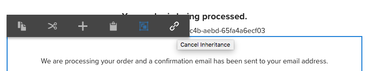
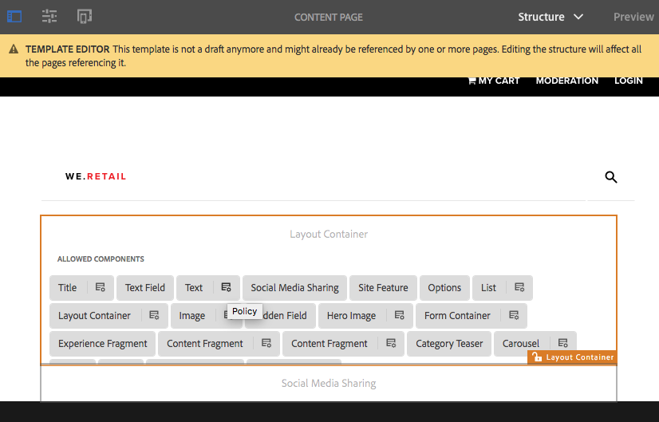

# Experimentar os Componentes principais no We.Retail{#trying-out-core-components-in-we-retail}

Os componentes principais são componentes modernos e flexíveis, com fácil extensibilidade e permitindo uma integração simples em seus projetos. Os componentes principais foram criados com base em vários princípios principais de design, como HTL, usabilidade pronta para uso, configurabilidade, controle de versão e extensibilidade. O We.Retail foi criado com base em componentes principais.

## Experimentando {#trying-it-out}

1. Inicie o Adobe Experience Manager (AEM) com o conteúdo de amostra We.Retail e abra o [Console de componentes](/help/sites-authoring/default-components-console.md).

   **Navegação global -> Ferramentas -> Componentes**

1. Ao abrir o painel no console Componentes, você pode filtrar por um grupo de componentes específico. Os componentes principais podem ser encontrados em

   * `.core-wcm`: os componentes principais padrão
   * `.core-wcm-form`: os componentes principais do envio de formulário

   Escolher `.core-wcm`.

   

1. Todos os componentes principais são nomeados como **v1**, refletindo que esta é a primeira versão desse componente principal. As versões regulares serão lançadas a partir de agora, que serão compatíveis com a versão do AEM e permitirão uma atualização fácil para que você possa aproveitar os recursos mais recentes.
1. Clique em **Texto (v1)**.

   Veja que a variável **Tipo de recurso** do componente é `/apps/core/wcm/components/text/v1/text`. Os componentes principais são encontrados em `/apps/core/wcm/components` e têm versão por componente.

   

1. Clique em **Documentação** para ver a documentação do desenvolvedor do componente.

   

1. Retorne ao console Componentes. Filtro para o grupo **We.Retail** e selecione o **Texto** componente.
1. Veja que a variável **Tipo de recurso** aponta para um componente, conforme esperado em `/apps/weretail` mas o **Supertipo do recurso** aponta de volta para o componente principal `/apps/core/wcm/components/text/v1/text`.

   

1. Clique em **Uso em tempo real** para ver em quais páginas esse componente está sendo usado. Clique no primeiro **Obrigado** página para editar a página.

   

1. Na página Obrigado, selecione o componente de texto e, no menu de edição do componente, clique no ícone Cancelar herança.

   [O We.Retail tem uma estrutura de site globalizada](/help/sites-developing/we-retail-globalized-site-structure.md) onde o conteúdo é enviado dos idiomas principais para [live copies por meio de um mecanismo chamado herança](/help/sites-administering/msm.md). Por esse motivo, a herança deve ser cancelada para permitir que um usuário edite o texto manualmente.

   

1. Confirme o cancelamento clicando em **Sim**.

   

1. Quando a herança for cancelada e você selecionar os componentes de texto, muitas outras opções estarão disponíveis. Clique em **Editar**.

   

1. Agora você pode ver quais opções de edição estão disponíveis para o componente de texto.

   

1. No **Informações da página** selecione **Editar modelo**.
1. No Editor de modelo da página, clique na guia **Política** ícone do componente de Texto na **Contêiner de layout** da página.

   

1. Os componentes principais permitem que um autor do modelo configure quais Propriedades estão disponíveis para os autores da página. Isso inclui recursos como fontes de colagem permitidas, opções de formatação e estilos de parágrafo disponíveis.

   Essas caixas de diálogo de design estão disponíveis para muitos componentes principais e funcionam lado a lado com o editor de modelo. Depois de ativadas, elas ficam disponíveis para o autor por meio dos editores de componentes.

   

## Informações adicionais {#further-information}

Para obter mais informações sobre os Componentes principais, consulte o documento de criação [Componentes principais](https://experienceleague.adobe.com/docs/experience-manager-core-components/using/introduction.html?lang=pt-BR) para obter uma visão geral dos recursos dos componentes principais e o documento do desenvolvedor [Desenvolvimento dos Componentes principais](https://experienceleague.adobe.com/docs/experience-manager-core-components/using/developing/overview.html?lang=pt-BR) para obter uma visão geral técnica.

Além disso, talvez você queira investigar mais detalhadamente [modelos editáveis](/help/sites-developing/we-retail-editable-templates.md). Consulte o documento de criação [Criação de modelos de página](/help/sites-authoring/templates.md) ou a página do documento do desenvolvedor [Modelos - Editáveis](/help/sites-developing/page-templates-editable.md) para obter detalhes completos sobre modelos editáveis.
