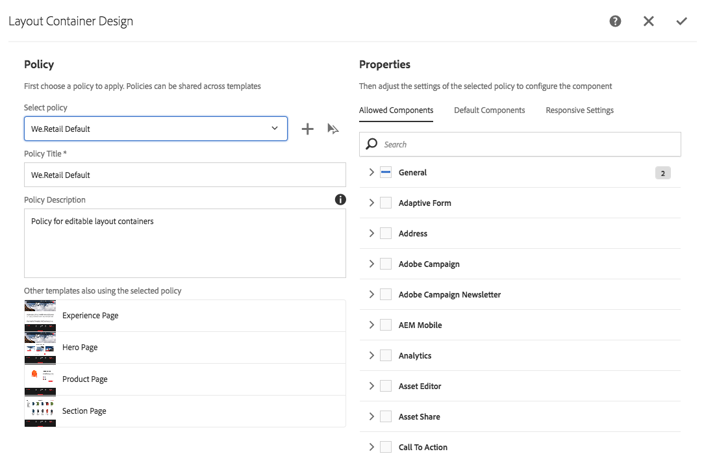

# Tentando modelos editáveis no We.Retail{#trying-out-editable-templates-in-we-retail}

Com os modelos editáveis, criar e manter modelos não é mais uma tarefa somente para desenvolvedores. Um tipo de usuário avançado, chamado de autor de modelo, agora pode criar modelos. Os desenvolvedores ainda são necessários para configurar o ambiente, criar bibliotecas de clientes e criar os componentes a serem usados, mas uma vez que essas noções básicas estejam em vigor, o autor do modelo terá a flexibilidade de criar e configurar modelos sem um projeto de desenvolvimento.

Todas as páginas no We.Retail são baseadas em modelos editáveis, permitindo que não desenvolvedores adaptem e personalizem os modelos.

## Tentando sair {#trying-it-out}

1. Edite a página Equipamento da ramificação de idioma principal.

   http://localhost:4502/editor.html/content/we-retail/language-masters/pt/equipment.html

1. Observe que o seletor de modo não oferece mais um modo Design. Todas as páginas do We.Retail são baseadas em modelos editáveis e, para alterar o design de modelos editáveis, elas devem ser editadas no editor de modelos.
1. No menu **Page information** selecione **Edit Template**.
1. Agora você está editando o modelo Página inicial .

   O modo de estrutura da página permite modificar a estrutura do modelo. Isso inclui, por exemplo, os componentes permitidos no contêiner de layout.

   

1. Configure as políticas para o Contêiner de layout para definir quais componentes são permitidos no contêiner.

   As políticas são o equivalente das configurações de design.

   

1. Na caixa de diálogo de design do contêiner de layout, é possível

   * Selecione uma política existente ou crie uma nova política para o contêiner
   * Selecionar quais componentes são permitidos no contêiner
   * Definir os componentes padrão a serem inseridos quando um ativo for arrastado para o contêiner

   

1. De volta ao editor de modelo, é possível editar a política do componente de texto no contêiner de layout.

   Isso permite:

   * Selecione uma política existente ou crie uma nova política para o contêiner
   * Defina os recursos disponíveis para o autor da página ao usar esse componente, como

      * Fontes de colagem permitidas
      * Opções de formatação
      * Estilos de parágrafo permitidos
      * Caracteres especiais permitidos

   Muitos componentes baseados nos componentes principais permitem a configuração de opções no nível do componente por meio dos modelos editáveis, removendo a necessidade de personalização pelos desenvolvedores.

   

1. De volta ao editor de modelo, você pode usar o seletor de modo para alterar para o modo **Conteúdo inicial** para definir qual conteúdo é necessário na página.

   **** O modo Layout pode ser usado como em uma página normal para definir o layout do modelo.

## Mais informações {#more-information}

Para obter mais informações, consulte o documento de criação [Criação de modelos de página](/help/sites-authoring/templates.md) ou o documento do desenvolvedor Página [Modelos - Editável](/help/sites-developing/page-templates-editable.md) para obter detalhes técnicos completos sobre modelos editáveis.

Você também pode querer investigar [componentes principais](/help/sites-developing/we-retail-core-components.md). Consulte o documento de criação [Componentes principais](https://docs.adobe.com/content/help/pt-BR/experience-manager-core-components/using/introduction.html) para obter uma visão geral dos recursos dos componentes principais e o documento do desenvolvedor [Desenvolvimento de componentes principais](https://helpx.adobe.com/experience-manager/core-components/using/developing.html) para obter uma visão geral técnica.

