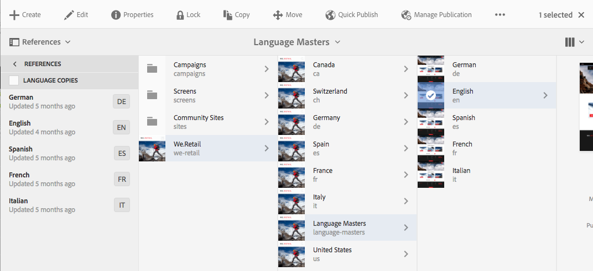

# Tentando a Estrutura do Site Globalizado em We.Retail{#trying-out-the-globalized-site-structure-in-we-retail}

We.Retail foi construído com uma estrutura de site globalizada que oferece mestres de idioma que podem ser copiados ao vivo para sites específicos de cada país. Tudo está pronto para o teste para permitir que você experimente esta estrutura e os recursos de tradução integrados.

## Tentando sair {#trying-it-out}

1. Abra o console de sites de **Navegação global -> Sites**.
1. Alterne para a visualização da coluna (se ainda não estiver ativa) e selecione We.Retail. Observe o exemplo da estrutura do país com a Suíça, os Estados Unidos, a França, etc., ao lado dos Mestres em Linguagem.

   

1. Selecione a Suíça e veja as raízes de idioma para os idiomas daquele país. Observe que ainda não há nenhum conteúdo abaixo dessas raízes.

   

1. Mude para a visualização da lista e veja que as cópias de idioma para os países são todas cópias ao vivo.

   

1. Retorne à visualização da coluna e clique no Idioma Principal e veja o idioma principal raiz com conteúdo. Observe que somente o inglês tem conteúdo.

   We.Retail não vem com nenhum conteúdo traduzido, mas a estrutura e configuração estão em vigor para permitir que você demonstre os serviços de tradução.

   

1. Com o idioma Principal selecionado, abra o trilho **Referências** no console de sites e selecione **Cópias de idiomas**.

   

1. Marque a caixa de seleção ao lado do rótulo **Cópias de idioma** para selecionar todas as cópias de idioma. Na seção **Atualizar cópias de idioma** do painel, selecione a opção para **Criar um novo projeto de tradução**. Forneça um nome para o projeto e clique em **Atualizar**.

   

1. Um projeto é criado para cada tradução de idioma. Visualização-os em **Navegação -> Projetos**.

   

1. Clique em alemão para ver os detalhes do projeto de tradução. Observe que o status está em **Draft**. Para start da tradução com o serviço de tradução da Microsoft, clique na divisa ao lado do cabeçalho **Trabalho de Tradução** e selecione **Start**.

   

1. Os start do projeto de tradução. Clique nas reticências na parte inferior do cartão rotulado Trabalho de tradução para ver os detalhes. As páginas com o estado **Pronto para revisão** já foram traduzidas pelo serviço de tradução.

   

1. Selecionar uma das páginas na lista e, em seguida, **Pré-visualização em Sites** na barra de ferramentas abre a página traduzida no editor de páginas.

   

>[!NOTE]
>
>Este procedimento demonstrou a integração integrada com a tradução automática da Microsoft. Usando a [AEM Estrutura de integração de tradução](/help/sites-administering/translation.md), você pode se integrar a muitos serviços de tradução padrão para orquestrar a tradução da AEM.

## Informações adicionais {#further-information}

Para obter mais informações, consulte o documento de criação [Traduzindo conteúdo para sites multilíngues](/help/sites-administering/translation.md) para obter detalhes técnicos completos.
