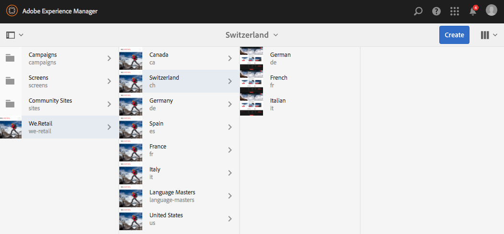
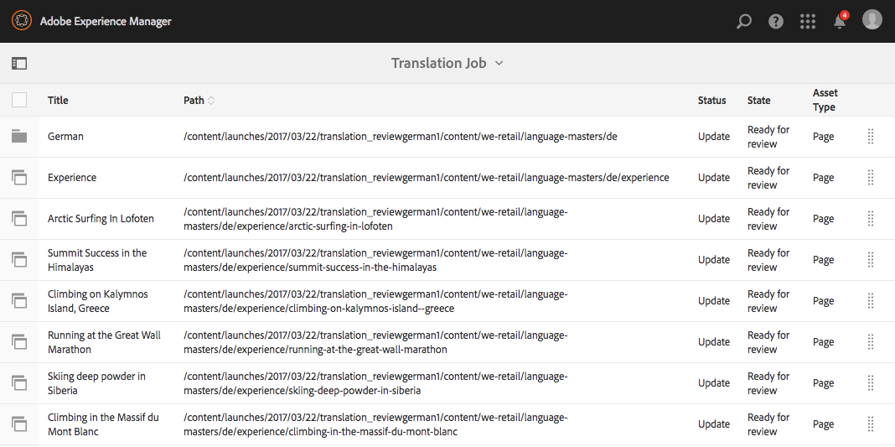

# Tentar a estrutura do site globalizado em We.Retail{#trying-out-the-globalized-site-structure-in-we-retail}

O We.Retail foi criado com uma estrutura de site globalizada que oferece mestres de idioma que podem ser copiados em tempo real para sites específicos do país. Tudo está pronto para uso para permitir que você experimente essa estrutura e os recursos incorporados de tradução.

## Tentando sair {#trying-it-out}

1. Abra o console Sites de **Navegação global -> Sites**.
1. Alterne para a exibição de coluna (se ainda não estiver ativa) e selecione We.Retail. Observe a estrutura de país de exemplo com a Suíça, os Estados Unidos, a França, etc., ao lado dos Mestrados em Idioma.

   

1. Selecione a Suíça e veja as raízes de idioma para os idiomas desse país. Observe que ainda não há conteúdo abaixo dessas raízes.

   

1. Alterne para a exibição de lista e veja que as cópias de idioma dos países são todas cópias em tempo real.

   

1. Retorne à exibição de coluna e clique no Idioma Principal e veja o idioma principal raiz com conteúdo. Observe que somente o inglês tem conteúdo.

   We.Retail não vem com nenhum conteúdo traduzido, mas a estrutura e a configuração estão em vigor para permitir que você demonstre os serviços de tradução.

   

1. Com o idioma inglês Principal selecionado, abra o painel **Referências** no console de sites e selecione **Cópias de idioma**.

   

1. Marque a caixa de seleção ao lado do rótulo **Cópias de idioma** para selecionar todas as cópias de idioma. Na seção **Update language copies** do painel, selecione a opção **Create a new translation project**. Forneça um nome para o projeto e clique em **Atualizar**.

   

1. Um projeto é criado para cada tradução de idioma. Exiba-os em **Navegação -> Projetos**.

   

1. Clique em alemão para ver os detalhes do projeto de tradução. Observe que o status está em **Rascunho**. Para iniciar a tradução com o serviço de tradução da Microsoft, clique na divisa ao lado do cabeçalho **Tarefa de Tradução** e selecione **Iniciar**.

   

1. O projeto de tradução é iniciado. Clique nas reticências na parte inferior do cartão denominado Tarefa de tradução para ver os detalhes. As páginas com o estado **Pronto para revisão** já foram traduzidas pelo serviço de tradução.

   

1. Selecionar uma das páginas na lista e, em seguida, **Visualizar nos sites** na barra de ferramentas abre a página traduzida no editor de páginas.

   

>[!NOTE]
>
>Este procedimento demonstrou a integração interna com a tradução automática da Microsoft. Usando a [AEM Estrutura de integração de tradução](/help/sites-administering/translation.md), você pode se integrar a muitos serviços de tradução padrão para orquestrar a tradução de AEM.

## Informações adicionais {#further-information}

Para obter mais informações, consulte o documento de criação [Tradução de conteúdo para sites multilíngues](/help/sites-administering/translation.md) para obter detalhes técnicos completos.
