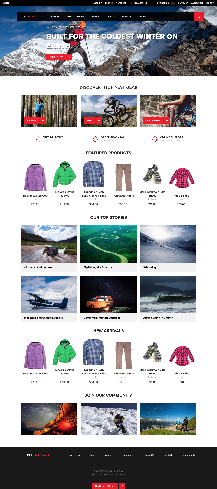

# Implementação de referência We.Retail{#we-retail-reference-implementation}

## Introdução {#introduction}

We.Retail é uma implementação de referência e um conteúdo de amostra que ilustra a maneira recomendada de configurar uma presença online com a Adobe Experience Manager.

We.Retail utiliza as mais recentes tecnologias AEM, como HTL, layouts responsivos, modelos editáveis, componentes principais e muito mais.

Embora ilustre uma vertical de varejo, a forma como o site é configurado pode ser aplicada a qualquer vertical, e somente o catálogo de produtos e os recursos do carrinho são específicos do varejo.

## Recursos {#features}

AEM implementação de referência padrão, We.Retail apresenta alguns dos recursos mais avançados da AEM.

| **Recurso** | **Descrição** | **Interessado?** |
|---|---|---|
| [Estrutura do site globalizada](/help/sites-administering/tc-bp.md) | We.Retail inclui mestres de idioma que são copiados ao vivo em sites específicos do país. | [Experimente!](/help/sites-developing/we-retail-globalized-site-structure.md) |
| [Layout responsivo](/help/sites-authoring/responsive-layout.md) | Todas as páginas apresentam um layout responsivo para se adaptarem dinamicamente à tela e ao tamanho do dispositivo. | [Experimente!](/help/sites-developing/we-retail-responsive-layout.md) |
| [Modelos editáveis](/help/sites-developing/page-templates-editable.md) | Todas as páginas são baseadas em modelos editáveis, permitindo que não desenvolvedores adaptem e personalizem os modelos. | [Experimente!](/help/sites-developing/we-retail-editable-templates.md) |
| [Linguagem de modelo HTML](https://docs.adobe.com/content/help/pt-BR/experience-manager-htl/using/overview.html) | Todos os componentes são baseados em HTL |  |
| [Recursos de eCommerce](/help/sites-developing/ecommerce.md) | Possui um catálogo de produtos |  |
| [Sites de comunidades](/help/communities/overview.md) | Permitir que visitantes participem de discussões da comunidade, leiam blogs e muito mais |  |
| [Componentes principais](https://docs.adobe.com/content/help/pt-BR/experience-manager-core-components/using/introduction.html) | Todos os componentes são baseados nos novos componentes principais e são mais utilizáveis e configuráveis pelo usuário prontamente | [Experimente!](/help/sites-developing/we-retail-core-components.md) |
| [Fragmentos de conteúdo](/help/assets/content-fragments/content-fragments.md) | A seção Experiências We.Retail mostra o poder de reutilizar o conteúdo por meio de fragmentos de conteúdo. | [Experimente-os!](/help/sites-developing/we-retail-content-fragments.md) |
| [Fragmentos de experiência](/help/sites-authoring/experience-fragments.md) | Um Fragmento de experiência é um grupo de um ou mais componentes, incluindo o conteúdo e o layout que podem ser referenciados nas páginas. | [Experimente-os!](/help/sites-developing/we-retail-experience-fragments.md) |

## Introdução {#getting-started}

We.Retail é entregue como AEM conteúdo de amostra. Para usar, basta [start AEM como normalmente usaria](/help/sites-deploying/deploy.md#getting-started), certificando-se de que o conteúdo de amostra não esteja desativado.

>[!CAUTION]
>
>We.Retail não deve ser instalado em instâncias de produção. As instâncias de produção devem ser iniciadas em `nosamplecontent` [runmode](/help/sites-deploying/configure-runmodes.md).

>[!CAUTION]
>
>We.Retail é baseado na tecnologia AEM mais recente e, portanto, não suporta [criação clássica de interface do usuário](/help/sites-classic-ui-authoring/home.md).

### Versão mais recente {#latest-version}

Embora We.Retail seja distribuído com a versão AEM, as atualizações do conteúdo e seus recursos podem ser feitas após o lançamento. Portanto, é possível [baixar a versão mais recente do GitHub](https://github.com/Adobe-Marketing-Cloud/aem-sample-we-retail/releases) e, em seguida, [fazer upload](/help/sites-administering/package-manager.md#uploading-packages-from-your-file-system) e [instalá](/help/sites-administering/package-manager.md#installing-packages) como um pacote em sua instância AEM.

### Primeiras etapas {#first-steps}

1. Quando AEM é iniciado (e/ou We.Retail é instalado), o site **We.Retail** está disponível no [console de sites](/help/sites-authoring/basic-handling.md#global-navigation).
1. Por exemplo, a página a seguir pode ser aberta e deve ser exibida como mostrado no [apêndice](#appendix) abaixo:

   `https://<server name>:<port number>/editor.html/content/we-retail/language-masters/en.html`

## We.Retail &amp; Geometrixx {#we-retail-geometrixx}

Geometrixx e suas muitas encarnações serviram como conteúdo de amostra em versões anteriores do AEM. Desde a versão 6.3, We.Retail é o conteúdo de amostra fornecido com AEM e serve como a nova implementação de referência padrão.

We.Retail é tecnicamente mais robusto e utiliza a mais recente tecnologia AEM para ser mais flexível e escalável, além de demonstrar os mais novos recursos do produto.

### Comparação de recursos {#feature-comparison}

A tabela a seguir fornece uma visão geral dos principais recursos disponíveis no We.Retail em comparação ao Geometrixx.

* **Disponível** significa que exemplos do recurso são encontrados no conteúdo de amostra.
* **Não** disponível significa que os exemplos do recurso não estão disponíveis no conteúdo de amostra, mas não significa que o recurso em si não esteja disponível.

| **Recurso** | **We.Retail** | **Geometrixx** |
|---|---|---|
| Estrutura do site globalizada | Mestres de idioma copiados ao vivo em sites específicos do país | Não disponível |
| Fragmentos de conteúdo | Disponível | Não disponível |
| Fragmentos de experiência | Disponível | Não disponível |
| Layout responsivo   | Para todas as páginas | Somente Geometrixx Media |
| Modelos editáveis | Para todas as páginas | Não disponível |
| HTL | Todos os componentes | Limitado |
| Direcionar | Para todas as páginas | Somente Geometrixx Outdoors |
| Screens | Disponível | Não disponível |
| Móvel | Não disponível | Disponível |
| Manuscritos | Não disponível | Disponível |
| Carrossel, download, componentes de gráficos | Não disponível | Disponível |
| Controle de coluna | Substituído pelo container de layout | Disponível |
| Forms | Não disponível | Disponível |
| Campanha | Nenhuma amostra de email | Disponível |

>[!NOTE]
>
>Essa lista se esforça para ser completa, mas não deve ser considerada exaustiva.

## Contribute {#contribute}

We.Retail foi lançado como um projeto de código aberto e a versão mais recente do código de origem pode ser baixada do GitHub.

CÓDIGO NO GITHUB

Você pode encontrar o código desta página no GitHub

* [Abrir projeto aem-sample-we-retail no GitHub](https://github.com/Adobe-Marketing-Cloud/aem-sample-we-retail)
* Baixe o projeto como [um arquivo ZIP](https://github.com/Adobe-Marketing-Cloud/aem-sample-we-retail/archive/master.zip)

A versão mais recente também pode ser [baixada diretamente](https://github.com/Adobe-Marketing-Cloud/aem-sample-we-retail/releases/latest) como um pacote instalável.

Se encontrar problemas, registre [problemas do GitHub](https://github.com/Adobe-Marketing-Cloud/aem-sample-we-retail/issues).

Sinta-se à vontade para bifurcar ou para contribuir com [solicitações](https://github.com/Adobe-Marketing-Cloud/aem-sample-we-retail/pulls).

## Visualizar {#preview}

Pré-visualização da página de boas-vindas We.Retail:

