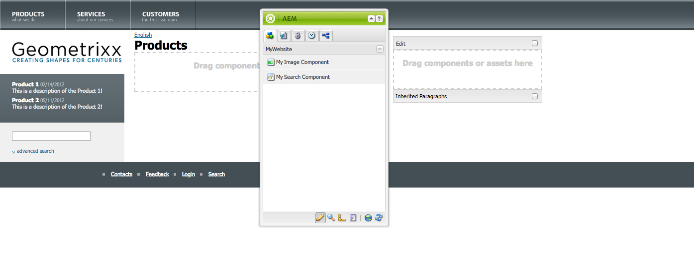
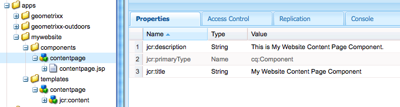

# Criar um site completo (JSP){#create-a-fully-featured-website-jsp}

>[!NOTE]
>
>Este artigo descreve como criar um site usando JSP e com base na interface clássica. A Adobe recomenda usar as tecnologias mais recentes do Adobe Experience Manager (AEM) para seus sites, conforme descrito detalhadamente no artigo [Introdução ao desenvolvimento do AEM Sites](/help/sites-developing/getting-started.md).

Este tutorial permite criar um site completo com o AEM. O site será baseado em um site genérico e destina-se principalmente a desenvolvedores da Web. Todo o desenvolvimento ocorre em um ambiente de criação.

Este tutorial descreve como:

1. Instale o AEM.
1. Acessar o CRXDE Lite (o ambiente de desenvolvimento).
1. Configure a estrutura do projeto no CRXDE Lite.
1. Crie o modelo, o componente e os scripts usados como base para a criação de páginas de conteúdo.
1. Crie a página raiz para o seu site e, em seguida, as páginas de conteúdo.
1. Crie os seguintes componentes para usar em suas páginas:

   * Navegação superior
   * Listar filhos
   * Logotipo
   * Imagem
   * Texto-imagem
   * Pesquisar

1. Incluir vários componentes de base.

Depois de executar todas as etapas, as páginas serão assim:



**Baixar o resultado final**

Para seguir o tutorial em vez de executar os exercícios, baixe o site-1.0.zip. Este arquivo é um pacote de conteúdo do AEM que contém os resultados deste tutorial. Use o [Gerenciador de Pacotes](/help/sites-administering/package-manager.md) para instalar o pacote na instância do autor.

**OBSERVAÇÃO:** a instalação deste pacote substitui todos os recursos na instância de criação que você criou usando este tutorial.

Pacote de conteúdo do site

[Obter arquivo](assets/website-1_0.zip)

## Instalação do Adobe Experience Manager {#installing-adobe-experience-manager}

Para instalar uma instância do AEM para desenvolver seu site, siga as instruções para configurar um [ambiente de implantação com instâncias de autor e publicação](/help/sites-deploying/deploy.md#author-and-publish-installs) ou execute uma [instalação genérica](/help/sites-deploying/deploy.md#default-local-install). A instalação genérica envolve o download do arquivo JAR do AEM Quickstart, a colocação do arquivo license.properties no mesmo diretório do arquivo JAR e o clique duplo no arquivo JAR.

Depois de instalar o AEM, acesse o ambiente de desenvolvimento do CRXDE Lite clicando no link CRXDE Lite na página Bem-vindo:


>[!NOTE]
>
>A URL do CRXDE Lite para uma instância de criação do AEM instalada localmente usando a porta padrão é [https://localhost:4502/crx/de/](https://localhost:4502/crx/de/).

### Configuração da estrutura do projeto no CRXDE Lite {#setting-up-the-project-structure-in-crxde-lite}

Use o CRXDE Lite para criar a estrutura do aplicativo mywebsite no repositório:

1. Na árvore no lado esquerdo do CRXDE Lite, clique com o botão direito na pasta **`/apps`** e clique em **Criar** > **Criar** **Pasta**. Na caixa de diálogo **Criar Pasta**, digite `mywebsite` como o nome da pasta e clique em **OK**.
1. Clique com o botão direito do mouse na pasta **`/apps/mywebsite`** e clique em **Criar** > **Criar Pasta**. Na caixa de diálogo **Criar Pasta**, digite `components` como o nome da pasta e clique em **OK**.
1. Clique com o botão direito do mouse na pasta **`/apps/mywebsite`** e clique em **Criar** > **Criar Pasta**. Na caixa de diálogo **Criar Pasta**, digite `templates` como o nome da pasta e clique em **OK**.

   A estrutura da árvore agora deve ser semelhante a esta:

   

1. Clique em **Salvar tudo**.

### Configuração do design {#setting-up-the-design}

Nesta seção, você cria o design do aplicativo usando a ferramenta Designer. O design do fornece recursos de CSS e imagem para o site.

>[!NOTE]
>
>Clique no link a seguir para baixar mywebsite.zip. O arquivo contém os arquivos static.css e de imagem para o seu design.

Arquivo static.css de amostra e imagens

[Obter arquivo](assets/mywebsite.zip)

1. Na página de boas-vindas do AEM, clique em **Ferramentas**. ([https://localhost:4502/libs/cq/core/content/welcome.html](https://localhost:4502/libs/cq/core/content/welcome.html))

   

1. Na árvore de pastas, selecione a pasta **Designs** e clique em **Nova** > **Nova Página**. Digite `mywebsite` como título e clique em **Criar**.

1. Se o item mywebsite não aparecer na tabela, atualize a árvore ou a tabela.

1. [Usando o acesso WebDAV](/help/sites-administering/webdav-access.md) à URL em https://localhost:4502, copie o arquivo de amostra `static.css` e a pasta `images` do arquivo mywebsite.zip baixado na pasta `/etc/designs/mywebsite`.

   

### Criação do modelo, componente e script da página de conteúdo {#creating-the-contentpage-template-component-and-script}

Nesta seção, você cria o seguinte:

* O modelo de página de conteúdo usado para criar páginas de conteúdo no site de exemplo.
* O componente contentpage usado para renderizar páginas de conteúdo.
* O script contentpage.

#### Criação do modelo Contentpage {#creating-the-contentpage-template}

Crie um modelo para usar como a base das páginas da Web do site.

Um modelo define o conteúdo padrão de uma nova página. Sites complexos podem usar vários modelos para criar os diferentes tipos de páginas no site. Neste exercício, todas as páginas se baseiam em um modelo simples.

1. Na árvore de pastas do CRXDE Lite, clique com o botão direito do mouse em `/apps/mywebsite/templates` e clique em **Criar** > **Criar modelo**.

1. Na caixa de diálogo Criar Modelo, digite os seguintes valores e clique em **Avançar**:

   * **Rótulo**: contentpage
   * **Título**: Modelo da Página de Conteúdo do Meu Site
   * **Descrição**: este é meu Modelo de Página de Conteúdo de Site
   * **Tipo de Recurso:** mywebsite/components/contentpage

   Use o valor padrão para a propriedade Ranking.

   

   O tipo de recurso identifica o componente que renderiza a página. Nesse caso, todas as páginas criadas usando o modelo contentpage são renderizadas pelo componente `mywebsite/components/contentpage`.

1. Para especificar os caminhos das páginas que podem usar esse modelo, clique no botão de adição e digite `/content(/.*)?` na caixa de texto exibida. Em seguida, clique em **Avançar**.

   

   O valor da propriedade de caminho permitida é uma expressão regular *.* As páginas com um caminho correspondente à expressão podem usar o modelo. Nesse caso, a expressão regular corresponde ao caminho da pasta **/conteúdo** e de todas as subpáginas.

   Quando um autor cria uma página abaixo de /content, o modelo **contentpage** aparece em uma lista de modelos disponíveis para uso.

1. Clique em **Avançar** nos painéis **Pais permitidos** e **Filhos permitidos** e clique em **OK**. No CRXDE Lite, clique em **Salvar tudo**.

   

#### Criação do componente Contentpage {#creating-the-contentpage-component}

Crie o *componente* que define o conteúdo e renderiza as páginas que usam o modelo contentpage. O local do componente deve corresponder ao valor da propriedade Resource Type do modelo contentpage.

1. No CRXDE Lite, clique com o botão direito do mouse em `/apps/mywebsite/components` e clique em **Criar** > **Componente**.
1. Na caixa de diálogo **Criar Componente**, digite os seguintes valores de propriedade:

   * **Rótulo**: contentpage
   * **Título**: Componente da Página de Conteúdo do Meu Site
   * **Descrição**: este é o Componente da Página de Conteúdo do Meu Site

   

   O local do novo componente é `/apps/mywebsite/components/contentpage`. Esse caminho corresponde ao tipo de recurso do modelo contentpage (menos a parte **`/apps/`** inicial do caminho).

   Essa correspondência conecta o modelo ao componente e é essencial para o funcionamento correto do site.

1. Clique em **Avançar** até que o painel Filhos permitidos da caixa de diálogo seja exibido e clique em **OK**. No CRXDE Lite, clique em **Salvar tudo**.

   A estrutura agora se parece com o seguinte:

   

#### Desenvolvimento do script do componente Contentpage {#developing-the-contentpage-component-script}

Adicione código ao script contentpage.jsp para definir o conteúdo da página.

1. No CRXDE Lite, abra o arquivo `contentpage.jsp` em `/apps/mywebsite/components/contentpage`. O arquivo contém o seguinte código por padrão:

   ```java
   <%--
   
     My Website Content Page Component component.
   
     This is My Website Content Page Component.
   
   --%><%
   %><%@include file="/libs/foundation/global.jsp"%><%
   %><%@page session="false" %><%
   %><%
       /* TODO add you code here */
   %>
   ```

1. Copie o código a seguir e cole-o em contentpage.jsp após o código padrão:

   ```java
   <%@ page language="java" contentType="text/html; charset=ISO-8859-1"
       pageEncoding="ISO-8859-1"%>
   <!DOCTYPE html PUBLIC "-//W3C//DTD HTML 4.01 Transitional//EN"
   "https://www.w3.org/TR/html4/loose.dtd">
   <html>
   <head>
   <meta http-equiv="Content-Type" content="text/html; charset=ISO-8859-1">
   <title>My title</title>
   </head>
   <body>
   <div>My body</div>
   </body>
   </html>
   ```

1. Clique em **Salvar tudo** para salvar as alterações.

### Criação da página do seu site e das páginas de conteúdo {#creating-your-website-page-and-content-pages}

Nesta seção, você cria as seguintes páginas, todas usando o modelo de página de conteúdo: Meu site, Inglês, Produtos, Serviços e Clientes.

1. Na página de Boas-vindas do AEM ([https://localhost:4502/libs/cq/core/content/welcome.html](https://localhost:4502/libs/cq/core/content/welcome.html)), clique em Sites.

   

1. Na árvore de pastas, selecione a pasta **Sites** e clique em **Nova** > **Nova Página**.
1. Na janela **Criar página**, digite o seguinte:

   * Título: `My Website`
   * Nome: `mywebsite`
   * Selecione o `My Website Content Page Template`

   

1. Clique em **Criar**. Na árvore de pastas, selecione a página **/Sites/Meu Site** e clique em **Nova** > **Nova Página**.
1. Na caixa de diálogo Criar página, digite os seguintes valores de propriedade e clique em Criar:

   * Título: inglês
   * Nome: en
   * Selecionar o Modelo da Página de Conteúdo do Meu Site

1. Na árvore de pastas, selecione a página **/Sites/Meu Site/Inglês** e clique em **Nova**> **Nova Página**.
1. Na caixa de diálogo **Criar página**, insira os seguintes valores de propriedade e clique em **Criar**:

   * Título: Produtos
   * Selecionar o Modelo da Página de Conteúdo do Meu Site

1. Na árvore de pastas, selecione a página **/Sites/Meu Site/Inglês** e clique em **Nova** > **Nova Página**.
1. Na caixa de diálogo **Criar página**, insira os seguintes valores de propriedade e clique em **Criar**:

   * Título: Serviços
   * Selecionar o Modelo da Página de Conteúdo do Meu Site

1. Na árvore de pastas, selecione a página **/Sites/Meu Site/Inglês** e clique em **Nova** > **Nova Página**.
1. Na caixa de diálogo **Criar página**, insira os seguintes valores de propriedade e clique em **Criar**:

   * Título: Clientes
   * Selecionar o Modelo da Página de Conteúdo do Meu Site

   Sua estrutura tem a seguinte aparência:

   

1. Para vincular suas páginas ao design do meu site, no CRXDE Lite, selecione o nó `/content/mywebsite/en/jcr:content`. Na guia Propriedades, digite os seguintes valores para uma nova propriedade e clique em Adicionar:

   * Nome: cq:designPath
   * Tipo: String
   * Valor: /etc/designs/mywebsite

   

1. Em uma nova guia ou janela do navegador da Web, abra [https://localhost:4502/content/mywebsite/en/products.html](https://localhost:4502/content/mywebsite/en/products.html) para ver a página Produtos:

   

### Aprimoramento do script Contentpage {#enhancing-the-contentpage-script}

Esta seção descreve como aprimorar o script de página de conteúdo usando os scripts de componente do AEM Foundation e escrevendo seus próprios scripts.

Quando você terminar, a página **Produtos** deverá ter a seguinte aparência:


#### Uso dos Scripts de Página de Base {#using-the-foundation-page-scripts}

Neste exercício, você configura o componente Conteúdo da página para que o supertipo seja o componente Página do AEM. Como os componentes herdam os recursos do supertipo, o conteúdo da página herda os scripts e as propriedades do componente Página.

Por exemplo, no código JSP do componente, você pode fazer referência aos scripts que o componente de supertipo fornece como se estivessem incluídos em seu componente.

1. No CRXDE Lite, adicione uma propriedade ao nó `/apps/mywebsite/components/contentpage`.

   1. Selecione o nó `/apps/mywebsite/components/contentpage`.
   1. Na parte inferior da guia Propriedades, digite os seguintes valores de propriedade e clique em Adicionar:

      * **Nome:** sling:resourceSuperType
      * **Tipo:** Cadeia de Caracteres
      * **Valor:** foundation/components/page

   1. Clique em Salvar tudo.

1. Abra o arquivo `contentpage.jsp` em `/apps/mywebsite/components/contentpage` e substitua o código existente pelo seguinte código:

   ```xml
   <%@include file="/libs/foundation/global.jsp"%><%
   %><%@page session="false" contentType="text/html; charset=utf-8" %><%
   %><!DOCTYPE HTML PUBLIC "-//W3C//DTD HTML 4.01//EN" "https://www.w3.org/TR/html4/strict.dtd">
   <html>
   <cq:include script="head.jsp"/>
   <cq:include script="body.jsp"/>
   </html>
   ```

1. Salve as alterações.
1. No navegador, recarregue a página Produtos. Ela tem a seguinte aparência:

   

   Abra a fonte de página para ver os elementos do JavaScript e do HTML gerados pelos scripts head.jsp e body.jsp. O trecho de script a seguir abre o Sidekick quando você abre a página:

   ```java
   CQ.WCM.launchSidekick("/content/mywebsite/en/products",
               {propsDialog: "/libs/foundation/components/page/dialog",
                  locked: false locked: false
                });
   ```

#### Usar seus próprios scripts {#using-your-own-scripts}

Nesta seção, você cria vários scripts que geram, cada um, uma parte do corpo da página. Em seguida, crie o arquivo body.jsp no componente pagecontent para substituir o body.jsp do componente Página do AEM. No arquivo body.jsp, você inclui os scripts que geram as diferentes partes do corpo da página.

**Dica:** quando um componente inclui um arquivo com o mesmo nome e local relativo de um arquivo no supertipo do componente, ele é chamado de *sobreposição*.

1. No CRXDE Lite, crie o arquivo `left.jsp` em `/apps/mywebsite/components/contentpage`:

   1. Clique com o botão direito do mouse no nó `/apps/mywebsite/components/contentpage` e selecione **Criar **depois **Criar arquivo**.

   1. Na janela, digite `left.jsp` como o **Nome** e clique em **OK**.

1. Edite o arquivo `left.jsp` para remover o conteúdo existente e substituir pelo seguinte código:

   ```java
   <%@include file="/libs/foundation/global.jsp"%><%
   %><div class="left">
   <div>logo</div>
   <div>newslist</div>
   <div>search</div>
   </div>
   ```

1. Salve as alterações.
1. No CRXDE Lite, crie o arquivo `center.jsp` em `/apps/mywebsite/components/contentpage`:

   1. Clique com o botão direito do mouse no nó `/apps/mywebsite/components/contentpage`, selecione **Criar** e **Criar arquivo**.

   1. Na caixa de diálogo, digite `center.jsp` como **Nome** e clique em **OK**.

1. Edite o arquivo `center.jsp` para remover o conteúdo existente e substituí-lo pelo seguinte código:

   ```java
   <%@include file="/libs/foundation/global.jsp"%><%
   %><div class="center">
   <div>trail</div>
   <div>title</div>
   <div>parsys</div>
   </div>
   ```

1. Salve as alterações.
1. No CRXDE Lite, crie o arquivo `right.jsp` em `/apps/mywebsite/components/contentpage`:

   1. Clique com o botão direito do mouse no nó `/apps/mywebsite/components/contentpage`, selecione **Criar** e **Criar arquivo**.

   1. Na caixa de diálogo, digite `right.jsp` como **Nome** e clique em **OK**.

1. Edite o arquivo `right.jsp` para remover o conteúdo existente e substituir pelo seguinte código:

   ```java
   <%@include file="/libs/foundation/global.jsp"%><%
   %><div class="right">
   <div>iparsys</div>
   </div>
   ```

1. Salve as alterações.
1. No CRXDE Lite, crie o arquivo `body.jsp` em `/apps/mywebsite/components/contentpage`:
1. Edite o arquivo `body.jsp` para remover o conteúdo existente e substituir pelo seguinte código:

   ```java
   <%@include file="/libs/foundation/global.jsp"%><%
   %><body>
   <div id="CQ">
   <div class="topnav">topnav</div>
   <div class="content">
   <cq:include script="left.jsp" />
   <cq:include script="center.jsp" />
   <cq:include script="right.jsp" />
   </div>
   <div class="footer">
   <div class="toolbar">toolbar</div>
   </div>
   </div>
   </body>
   ```

1. Salve as alterações.
1. No navegador, recarregue a página Produtos. Ela tem a seguinte aparência:

   

### Criação do componente de Navegação superior {#creating-the-top-navigation-component}

Nesta seção, você cria um componente que exibe links para todas as páginas de nível superior do site para facilitar a navegação. Esse conteúdo do componente aparece na parte superior de todas as páginas criadas usando o modelo de página de conteúdo.

Na primeira versão do componente de navegação superior (navegação superior), os itens de navegação são somente links de texto. Na segunda versão, você implementa o topnav com links de navegação de imagem.

Quando terminar, sua navegação superior deverá ter a seguinte aparência:


#### Criação do componente de Navegação superior {#creating-the-top-navigation-component-1}

1. No CRXDE Lite, clique com o botão direito do mouse em `/apps/mywebsite/components`, selecione **Criar** e **Criar Componente**.
1. Na janela **Criar Componente**, digite o seguinte:

   * **Rótulo**: `topnav`

   * **Título**: `My Top Navigation Component`

   * **Descrição**: `This is My Top Navigation Component`

1. Clique em **Avançar** até chegar à última janela onde você clique em **OK**. Salve as alterações.

#### Criação do script de navegação superior com links textuais {#creating-the-top-navigation-script-with-textual-links}

Adicione o script de renderização à navegação superior para gerar links de texto para páginas secundárias:

1. No CRXDE Lite, abra o arquivo `topnav.jsp` em `/apps/mywebsite/components/topnav`.
1. Substitua o código que está lá copiando e colando o seguinte código:

   ```xml
   <%@include file="/libs/foundation/global.jsp"%><%
   %><%@ page import="java.util.Iterator,
           com.day.text.Text,
           com.day.cq.wcm.api.PageFilter, com.day.cq.wcm.api.Page" %><%
       /* get starting point of navigation */
       Page navRootPage = currentPage.getAbsoluteParent(2);
       if (navRootPage == null && currentPage != null) {
       navRootPage = currentPage;
       }
       if (navRootPage != null) {
           Iterator<Page> children = navRootPage.listChildren(new PageFilter(request));
           while (children.hasNext()) {
               Page child = children.next();
               %><a href="<%= child.getPath() %>.html"><%=child.getTitle() %></a><%
           }
       }
   %>
   ```

#### Inclusão da navegação superior no componente Contentpage {#including-top-navigation-in-the-contentpage-component}

Para incluir topnav no componente de página de conteúdo:

1. No CRXDE Lite, abra o `body.jsp` em `/apps/mywebsite/components/contentpage` e substitua:

   ```xml
   <div class="topnav">topnav</div>
   ```

   com:

   ```xml
   <cq:include path="topnav" resourceType="mywebsite/components/topnav" />
   ```

1. Salve as alterações.
1. No navegador, recarregue a página Produtos. A navegação superior é exibida da seguinte maneira:

   

#### Aprimoramento de páginas com legendas {#enhancing-pages-with-subtitles}

O componente de Página define propriedades que permitem fornecer legendas para páginas. Adicione legendas que forneçam informações sobre o conteúdo da página.

1. No navegador, abra a página **Produtos**.
1. Na guia **Página** do Sidekick, clique em **Propriedades da Página**.
1. Na guia Básico da caixa de diálogo, expanda **Mais Títulos e Descrição** e, para a propriedade **Subtítulo**, digite **o que fazemos**. Clique em **OK**.
1. Repita as etapas anteriores para adicionar o subtítulo **sobre nossos serviços** à página **Serviços**.
1. Repita as etapas anteriores para adicionar o subtítulo **a confiança que recebemos** à página **Clientes**.

   **Dica:** no CRXDE Lite, selecione o nó /content/mywebsite/en/products/jcr:content para ver se a propriedade de subtítulo foi adicionada.

#### Melhorar a navegação superior usando links de imagem {#enhance-top-navigation-by-using-image-links}

Aprimore o script de renderização do componente de navegação superior para usar links de imagem em vez de hipertexto para os controles de navegação. A imagem inclui o título e o subtítulo do destino do link.

Este exercício demonstra [processamento de solicitação do Sling](/help/sites-developing/the-basics.md#sling-request-processing). O script topnav.jsp é modificado para chamar um script que gera dinamicamente imagens para serem usadas nos links de navegação da página. Neste exercício, o Sling analisa o URL dos arquivos de origem de imagem para determinar o script a ser usado para renderizar as imagens.

Por exemplo, a origem do link de imagem para a página Produtos pode ser https://localhost:4502/content/mywebsite/en/products.navimage.png. O Sling analisa esse URL para determinar o tipo de recurso e o script a ser usado para renderizar o recurso:

1. O Sling determina o caminho do recurso a ser `/content/mwebysite/en/products.png.`
1. O Sling corresponde este caminho com o nó `/content/mywebsite/en/products`.
1. O Sling determina que `sling:resourceType` deste nó seja `mywebsite/components/contentpage`.

1. O Sling encontra o script neste componente que melhor corresponde ao seletor de URL ( `navimage`) e à extensão de nome de arquivo ( `png`).

Neste exercício, o Sling corresponde esses URLs ao script /apps/mywebsite/components/contentpage/navimage.png.java que você cria.

1. No CRXDE Lite, abra o `topnav.jsp` em `/apps/mywebsite/components/topnav.`Localize o conteúdo do elemento âncora (linha 14):

   ```xml
   <%=child.getTitle() %>
   ```

1. Substitua o conteúdo de âncora pelo seguinte código:

   ```xml
   " src="<%= child.getPath() %>.navimage.png">
   ```

1. Salve as alterações.
1. Clique com o botão direito do mouse no nó `/apps/mywebsite/components/contentpage` e clique em **Criar** > **Criar arquivo**.
1. Na janela **Criar Arquivo**, como **Nome**, digite `navimage.png.java`.

   A extensão de nome de arquivo .java indica ao Sling que o suporte ao Apache Sling Scripting Java™ deve ser usado para compilar o script e criar um servlet.

1. Copie o código a seguir em `navimage.png.java.`O código estende a classe AbstractImageServlet:

   * [AbstractImageServlet](https://developer.adobe.com/experience-manager/reference-materials/6-5/javadoc/com/day/cq/wcm/commons/AbstractImageServlet.html) cria um objeto ImageContext que armazena as propriedades do recurso atual.
   * A página principal do recurso é extraída do objeto ImageContext. O título da página e o subtítulo são obtidos.
   * O [ImageHelper](https://developer.adobe.com/experience-manager/reference-materials/6-5/javadoc/com/day/cq/commons/ImageHelper.html) é usado para gerar a imagem do arquivo navimage_bg.jpg do design do site, do título da página e do subtítulo da página.

   ```java
   package apps.mywebsite.components.contentpage;
   
   import java.awt.Color;
   import java.awt.Paint;
   import java.awt.geom.Rectangle2D;
   
   import java.io.IOException;
   import javax.jcr.RepositoryException;
   
   import com.day.cq.wcm.api.Page;
   import com.day.cq.wcm.api.PageManager;
   import com.day.cq.wcm.api.components.Component;
   import com.day.cq.wcm.api.designer.Designer;
   
   import com.day.cq.commons.SlingRepositoryException;
   import com.day.cq.wcm.commons.WCMUtils;
   import com.day.cq.wcm.commons.AbstractImageServlet;
   import com.day.cq.commons.ImageHelper;
   
   import com.day.image.Font;
   import com.day.image.Layer;
   
   import org.apache.sling.api.SlingHttpServletRequest;
   import org.apache.sling.api.SlingHttpServletResponse;
   import org.apache.sling.api.resource.Resource;
   import org.apache.sling.api.servlets.SlingSafeMethodsServlet;
   
   /**
     * Renders the navigation image
     */
   public class navimage_png extends AbstractImageServlet {
   
         protected Layer createLayer(ImageContext ctx)
                throws RepositoryException, IOException {
            PageManager pageManager = ctx.resolver.adaptTo(PageManager.class);
            Page currentPage = pageManager.getContainingPage(ctx.resource);
   
            /* constants for image appearance */
            int scale = 6;
            int paddingX = 24;
            int paddingY = 24;
            Color bgColor = new Color(0x004a565c, true);
   
            /* obtain the page title */
            String title = currentPage.getTitle();
            if (title == null) {
                title = currentPage.getName();
            }
   
            /* format the title text */
            title = title.toUpperCase();
            Paint titleColor = Color.WHITE;
            Font titleFont = new Font("Myriad Pro", 10 * scale, Font.BOLD);
            int titleBase = 10 * scale;
   
            /* obtain and format the page subtitle */
            String subtitle = currentPage.getProperties().get("subtitle", "");
            Paint subtitleColor = new Color(0xffa9afb1, true);
            Font subTitleFont = new Font("Tahoma", 7);
            int subTitleBase = 20;
   
            /* create a layer that contains the background image from the mywebsite design */
            Designer dg = ctx.resolver.adaptTo(Designer.class);
            String imgPath = new String(dg.getDesignPath(currentPage)+"/images/navimage_bg.jpg");
            Layer bg = ImageHelper.createLayer(ctx.resolver.resolve(imgPath));
   
            /* draw the title text (4 times bigger) */
            Rectangle2D titleExtent = titleFont.getTextExtent(0, 0, 0, 0, title, Font.ALIGN_LEFT, 0, 0);
            Rectangle2D subtitleExtent = subTitleFont.getTextExtent(0, 0, 0, 0, subtitle, Font.ALIGN_LEFT, 0, 0);
   
            /* ensure subtitleExtent is wide enough */
            if ( subtitle.length() > 0 ) {
                int titleWidth = (int)titleExtent.getWidth() / scale;
                if ( subtitleExtent.getWidth() > titleWidth && subtitleExtent.getWidth() + 2 * paddingX >
    bg.getWidth() ) {
                    int charWidth = (int)subtitleExtent.getWidth() / subtitle.length();
                    int maxWidth = (bg.getWidth() > titleWidth + 2  * paddingX ? bg.getWidth() - 2 * paddingX : titleWidth);
                    int len = (maxWidth - ( 2 * charWidth) ) / charWidth;
                    subtitle = subtitle.substring(0, len) + "...";
                    subtitleExtent = subTitleFont.getTextExtent(0, 0, 0, 0, subtitle, Font.ALIGN_LEFT, 0, 0);
                }
            }
            int width = Math.max((int) titleExtent.getWidth(), (int) subtitleExtent.getWidth());
           /* create the text layer */
            Layer text = new Layer(width, (int) titleExtent.getHeight() + 40, new Color(0x01ffffff, true));
            text.setPaint(titleColor);
            text.drawText(0, titleBase, 0, 0, title, titleFont, Font.ALIGN_LEFT | Font.ALIGN_BASE, 0, 0);
            text.resize(text.getWidth() / scale, text.getHeight() / scale);
            text.setX(0);
            text.setY(0);
   
            if (subtitle.length() > 0) {
                /* draw the subtitle normal sized */
                text.setPaint(subtitleColor);
                text.drawText(0, subTitleBase, 0, 0, subtitle, subTitleFont, Font.ALIGN_LEFT | Font.ALIGN_BASE, 0, 0);
            }
   
            /* merge the image and text layers */
            text.setY(paddingY);
            text.setX(paddingX);
            text.setBackgroundColor(bgColor);
   
            int bgWidth = bg.getWidth();
            if ( text.getWidth() + 2 * paddingX > bgWidth ) {
                bgWidth = text.getWidth() + 2 * paddingX;
                bg.resize(bgWidth, bg.getHeight());
            }
            bg.merge(text);
   
            return bg;
        }
    }
   ```

1. Salve as alterações.
1. No navegador, recarregue a página Produtos. A navegação superior agora é exibida da seguinte maneira:

   

### Criação do componente List Children {#creating-the-list-children-component}

Crie o componente listchildren que gera uma lista de links de página que incluem o título, a descrição e a data das páginas (por exemplo, páginas de produtos). Os links têm como alvo as páginas secundárias da página atual ou de uma página raiz especificada na caixa de diálogo do componente.


#### Criação de páginas de produto {#creating-product-pages}

Crie duas páginas localizadas abaixo da página Produtos. Para cada página que descreve dois produtos específicos, você define um título, uma descrição e uma data.

1. Na árvore de pastas da página Sites, selecione o item Sites/Meu site/Inglês/Produtos e clique em Novo > Nova página.
1. Na caixa de diálogo, insira os seguintes valores de propriedade e clique em Criar:

   * Título: Produto 1.
   * Nome: product1.
   * Selecionar Modelo de Página de Conteúdo do Meu Site

1. Crie outra página abaixo de Produtos usando os seguintes valores de propriedade:

   * Título: Produto 2
   * Nome: product2
   * Selecionar Modelo de Página de Conteúdo do Meu Site

1. No CRXDE Lite, defina uma descrição e uma data para a página Produto 1:

   1. Selecione o nó `/content/mywebsite/en/products/product1/jcr:content`.
   1. Na guia **Propriedades**, insira os seguintes valores:

      * Nome: `jcr:description`
      * Tipo: `String`
      * Valor: `This is a description of the Product 1!.`

   1. Clique em **Adicionar**.
   1. Na guia **Propriedades**, crie outra propriedade usando os seguintes valores:

      * Nome: data
      * Tipo: String
      * Valor: 14/02/2008
      * Clique em Adicionar.

   1. Clique em Salvar tudo.

1. No CRXDE Lite, defina uma descrição e uma data para a página Produto 2:

   1. Selecione o nó /content/mywebsite/en/products/product2/jcr:content.
   1. Na guia **Propriedades**, insira os seguintes valores:

      * Nome: jcr:description
      * Tipo: String
      * Valor: esta é uma descrição do Produto 2!.

   1. Clique em **Adicionar**.
   1. Nas mesmas caixas de texto, substitua os valores anteriores pelos seguintes valores:

      * Nome: data
      * Tipo: String
      * Valor: 11/05/2012
      * Clique em Adicionar.

   1. Clique em Salvar tudo.

#### Criação do componente List Children {#creating-the-list-children-component-1}

Para criar o componente listchildren:

1. No CRXDE Lite, clique com o botão direito do mouse em `/apps/mywebsite/components`, selecione **Criar** e **Criar Componente**.
1. Na caixa de diálogo, insira os seguintes valores de propriedade e clique em Próximo:

   * Label: listchildren.
   * Título: Componente Minhas listas e filhos.
   * Descrição: Este é o Componente Minhas listas e filhos.

1. Continue a clicar em Avançar até que o painel Filhos permitidos seja exibido e, em seguida, clique em OK.

#### Criação do script List Children {#creating-the-list-children-script}

Desenvolva o script para o componente listchildren.

1. No CRXDE Lite, abra o arquivo `listchildren.jsp` em `/apps/mywebsite/components/listchildren`.
1. Substitua o código padrão pelo seguinte código:

   ```xml
   <%@include file="/libs/foundation/global.jsp"%><%
   %><%@ page import="java.util.Iterator,
            com.day.cq.wcm.api.PageFilter"%><%
        /* Create a Page object using the path of the current page */
         String listroot = properties.get("listroot", currentPage.getPath());
        Page rootPage = pageManager.getPage(listroot);
        /* iterate through the child pages and gather properties */
        if (rootPage != null) {
            Iterator<Page> children = rootPage.listChildren(new PageFilter(request));
            while (children.hasNext()) {
                Page child = children.next();
                String title = child.getTitle() == null ? child.getName() : child.getTitle();
                String date = child.getProperties().get("date","");
                %><div class="item">
                <a href="<%= child.getPath() %>.html"><b><%= title %></b></a>
                <span><%= date %></code><br>
                <%= child.getProperties().get("jcr:description","") %><br>
                </div><%
            }
        }
    %>
   ```

1. Salve as alterações.

#### Criando a caixa de diálogo Listar filhos {#creating-the-list-children-dialog}

Crie a caixa de diálogo usada para configurar as propriedades do componente listchildren.

1. Crie o nó da caixa de diálogo sob o componente listchildren:

   1. No CRXDE Lite, clique com o botão direito do mouse no nó `/apps/mywebsite/components/listchildren`e clique em **Criar** > **Criar caixa de diálogo**.

   1. Na caixa de diálogo, insira os seguintes valores de propriedade e clique em OK

      * **Rótulo**: `dialog`

      * **Título**: `Edit Component` e clique em **OK**.

   

   Com as seguintes propriedades:

   

1. Selecione o nó `/apps/mywebsite/components/listchildren/dialog/items/items/tab1`.
1. Na guia Propriedades, altere o valor da propriedade **title** para `List Children`

   

1. Selecione o nó tab1, clique em Criar > Criar nó, insira os seguintes valores de propriedade e clique em OK:

   * Nome: itens
   * Tipo: cq:WidgetCollection

   

1. Crie um nó abaixo do nó items usando os seguintes valores de propriedade:

   * Nome: listroot
   * Tipo: cq:Widget

   

1. Adicione propriedades para o nó listroot para configurá-lo como um campo de texto. Cada linha na tabela a seguir representa uma propriedade. Quando terminar, clique em Salvar tudo.

   | Nome | Tipo | Valor |
   |---|---|---|
   | fieldLabel | String | Caminho da raiz da lista |
   | name | String | ./listroot |
   | xtype | String | textfield |

   

#### Inclusão de Filhos de Lista no Componente Contentpage {#including-list-children-in-the-contentpage-component}

Para incluir o componente listchildren no componente contentpage, proceda da seguinte maneira:

1. No CRXDE Lite, abra o arquivo `left.jsp` em `/apps/mywebsite/components/contentpage` e localize o seguinte código (linha 4):

   ```xml
   <div>newslist</div>
   ```

1. Substitua esse código pelo seguinte código:

   ```xml
   <cq:include path="newslist" resourceType="mywebsite/components/listchildren" />
   ```

1. Salve as alterações.

#### Exibir filhos da lista em uma página {#viewing-list-children-in-a-page}

Para ver a operação completa desse componente, é possível visualizar a página Produtos:

* quando a página principal (&quot;Caminho da raiz da lista&quot;) não está definida.
* quando a página principal (&quot;Caminho da raiz da lista&quot;) é definida.

1. No navegador, recarregue a página Produtos. O componente listchildren é exibido da seguinte maneira:

   

1. 

1. Como Caminho da raiz da lista, insira: `/content/mywebsite/en`. Clique em OK. O componente listchildren na sua página agora tem a seguinte aparência:

   

### Criação do componente de Logotipo {#creating-the-logo-component}

Crie um componente que exiba o logotipo da empresa e forneça um link para a página inicial do site. O componente contém uma caixa de diálogo no modo de design para que os valores de propriedade sejam armazenados no design do site (/etc/designs/mywebsite):

* Os valores de propriedade se aplicam a todas as instâncias do componente que são adicionadas às páginas que usam o design.
* As propriedades podem ser configuradas usando qualquer instância do componente que esteja em uma página que usa o design.

Sua caixa de diálogo de modo de design contém propriedades para configurar a imagem e o caminho do link. O componente de logotipo é colocado no lado superior esquerdo de todas as páginas do site.

Quando você terminar, a aparência deverá ser a seguinte:


>[!NOTE]
>
>A Adobe Experience Manager fornece um componente de logotipo com mais recursos ( `/libs/foundation/components/logo`).

#### Criação do nó do componente de Logotipo {#creating-the-logo-component-node}

Para criar o componente de logotipo, siga as etapas:

1. No CRXDE Lite, clique com o botão direito do mouse em /apps/mywebsite/components, selecione **Criar** e depois **Criar componente**.
1. Na caixa de diálogo Criar componente, insira os seguintes valores de propriedade e clique em Próximo:

   * Etiqueta: `logo`.
   * Título: `My Logo Component`.
   * Descrição: `This is My Logo Component`.

1. Clique em Avançar até chegar ao painel final da caixa de diálogo e, em seguida, clique em **OK**.

#### Criação do script de logotipo {#creating-the-logo-script}

Esta seção descreve como criar o script para exibir a imagem de logotipo com um link para a página inicial.

1. No CRXDE Lite, abra o arquivo `logo.jsp` em `/apps/mywebsite/components/logo`.
1. O código a seguir cria o link para a página inicial do site e adiciona uma referência à imagem do logotipo. Copiar o código para `logo.jsp`:

   ```xml
   <%@include file="/libs/foundation/global.jsp"%><%
   %><%@ page import="com.day.text.Text,
                      com.day.cq.wcm.foundation.Image,
                      com.day.cq.commons.Doctype" %><%
       /* obtain the path for home */
       long absParent = currentStyle.get("absParent", 2L);
       String home = Text.getAbsoluteParent(currentPage.getPath(), (int) absParent);
       /* obtain the image */
       Resource res = currentStyle.getDefiningResource("imageReference");
       if (res == null) {
           res = currentStyle.getDefiningResource("image");
       }
       /* if no image use text link, otherwise draw the image */
       %>
   <a href="<%= home %>.html"><%
       if (res == null) {
           %>Home<%
       } else {
           Image img = new Image(res);
           img.setItemName(Image.NN_FILE, "image");
           img.setItemName(Image.PN_REFERENCE, "imageReference");
           img.setSelector("img");
           img.setDoctype(Doctype.fromRequest(request));
           img.setAlt("Home");
           img.draw(out);
       }
       %></a>
   ```

1. Salve as alterações.

#### Criando a caixa de diálogo Design do logotipo {#creating-the-logo-design-dialog}

Crie a caixa de diálogo para configurar o componente de logotipo no modo Design. Os nós de diálogo do modo de design devem ser nomeados como `design_dialog`.

1. Crie o nó da caixa de diálogo sob o componente de logotipo:

   1. Clique com o botão direito do mouse no nó `/apps/mywebsite/components/logo` e clique em **Criar** > **Criar caixa de diálogo**.

   1. Digite os seguintes valores de propriedade e clique em OK:

      * **Rótulo:** `design_dialog`

      * **Título:** `Logo (Design)`

1. Clique com o botão direito do mouse no nó tab1 na ramificação design_dialog e clique em Excluir. Clique em Salvar tudo.
1. No nó `design_dialog/items/items`, crie um nó chamado `img` do tipo `cq:Widget`. Adicione as seguintes propriedades e clique em Salvar tudo:

   | Nome | Tipo | Valor |
   |---|---|---|
   | fileNameParameter | String | ./imageName |
   | fileReferenceParameter | String | ./imageReference |
   | name | String | ./image |
   | cargo | String | Imagem |
   | xtype | String | html5smartimage |

   

#### Criação do script de renderização do logotipo {#creating-the-logo-render-script}

Crie o script que recupera a imagem do logotipo e a grava na página.

1. Clique com o botão direito do mouse no nó do componente do logotipo e clique em Criar > Criar arquivo para criar o arquivo de script chamado img.GET.java.
1. Abra o arquivo, copie o código a seguir no arquivo e clique em Salvar tudo:

```java
package apps.mywebsite.components.logo;

import java.io.IOException;
import java.io.InputStream;

import javax.jcr.RepositoryException;
import javax.jcr.Property;
import javax.servlet.http.HttpServletResponse;

import com.day.cq.wcm.foundation.Image;
import com.day.cq.wcm.commons.RequestHelper;
import com.day.cq.wcm.commons.WCMUtils;
import com.day.cq.wcm.commons.AbstractImageServlet;
import com.day.cq.commons.SlingRepositoryException;
import com.day.image.Layer;
import org.apache.commons.io.IOUtils;
import org.apache.sling.api.SlingHttpServletRequest;
import org.apache.sling.api.SlingHttpServletResponse;
import org.apache.sling.api.resource.Resource;
import org.apache.sling.api.resource.ValueMap;
import org.apache.sling.api.servlets.SlingSafeMethodsServlet;

/**
 * Renders an image
 */
public class img_GET extends AbstractImageServlet {

    protected Layer createLayer(ImageContext c)
            throws RepositoryException, IOException {
        /* do not create the layer yet. handle everything later */
        return null;
    }

    protected void writeLayer(SlingHttpServletRequest req,
                              SlingHttpServletResponse resp,
                              ImageContext c, Layer layer)
            throws IOException, RepositoryException {

        Image image = new Image(c.resource);
        image.setItemName(Image.NN_FILE, "image");
        image.setItemName(Image.PN_REFERENCE, "imageReference");
        if (!image.hasContent()) {
            resp.sendError(HttpServletResponse.SC_NOT_FOUND);
            return;
        }
        /* get pure layer */
        layer = image.getLayer(false, false, false);

        /* do not re-encode layer, just spool */
        Property data = image.getData();
        InputStream in = data.getStream();
        resp.setContentLength((int) data.getLength());
        String contentType = image.getMimeType();
        if (contentType.equals("application/octet-stream")) {
            contentType=c.requestImageType;
        }
        resp.setContentType(contentType);
        IOUtils.copy(in, resp.getOutputStream());
        in.close();

        resp.flushBuffer();
    }
}
```

#### Adicionar o componente de Logotipo ao componente de página de conteúdo {#adding-the-logo-component-to-the-contentpage-component}

1. No CRXDE Lite, abra o `left.jsp` em `/apps/mywebsite/components/contentpage file` e localize a seguinte linha de código:

   ```xml
   <div>logo</div>
   ```

1. Substitua esse código pela seguinte linha de código:

   ```xml
   <cq:include path="logo" resourceType="mywebsite/components/logo" />
   ```

1. Salve as alterações.
1. No navegador, recarregue a página Produtos. O logotipo tem a seguinte aparência, embora atualmente mostre apenas o link subjacente:

   

#### Configuração da imagem de logotipo em uma página {#setting-the-logo-image-in-a-page}

Esta seção descreve como definir uma imagem como seu logotipo usando a caixa de diálogo do modo de design.

1. Com a página Produtos aberta no navegador, clique no botão Design na parte inferior do Sidekick para entrar no modo de design.

   

1. Na barra Design do logotipo, clique em Editar para usar a caixa de diálogo para editar as configurações do componente de logotipo.
1. Na caixa de diálogo, clique no painel da guia Imagem, procure a imagem logo.png extraída do arquivo mywebsite.zip e clique em OK.

   

1. Clique no triângulo na barra de título do Sidekick para retornar ao modo de Edição.

   

1. No CRXDE Lite, vá para o seguinte nó para ver os valores de propriedade armazenados:

   `/etc/designs/mywebsite/jcr:content/contentpage/logo`

### Inclusão do componente de Navegação estrutural {#including-the-breadcrumb-component}

Nesta seção, você inclui o componente de navegação estrutural (trilha), que é um dos componentes de base.

1. No CRXDE Lite, navegue até `/apps/mywebsite/components/contentpage`, abra o arquivo `center.jsp` e substitua:

   ```java
   <div>trail</div>
   ```

   com:

   ```xml
   <cq:include path="trail" resourceType="foundation/components/breadcrumb" />
   ```

1. Salve as alterações.
1. No navegador, recarregue a página **Produtos 1**. O componente de trilha tem a seguinte aparência:

   

### Inclusão do componente de Título {#including-the-title-component}

Nesta seção, você inclui o componente de título, que é um dos componentes de base.

1. No CRXDE Lite, navegue até `/apps/mywebsite/components/contentpage`, abra o arquivo `center.jsp` e substitua:

   ```xml
   <div>title</div>
   ```

   com:

   ```xml
   <cq:include path="title" resourceType="foundation/components/title" />
   ```

1. Salve as alterações.
1. No navegador, recarregue a página Produtos. O componente de título tem a seguinte aparência:

   

   **Observação**: você pode definir um Título diferente e o Tipo/Tamanho no modo de edição.

### Incluindo o componente de sistema do parágrafo {#including-the-paragraph-system-component}

O sistema de parágrafos (parsys) é uma parte significativa de um site, pois gerencia uma lista de parágrafos. Ela permite que os autores adicionem componentes de parágrafo à página e fornece estrutura.

Adicione o componente parsys (um dos componentes de base) ao componente contentpage.

1. No CRXDE Lite, navegue até `/apps/mywebsite/components/contentpage`, abra o arquivo `center.jsp` e localize a seguinte linha de código:

   ```xml
   <div>parsys</div>
   ```

1. Substitua essa linha de código pelo seguinte código e salve as alterações:

   ```xml
   <cq:include path="par" resourceType="foundation/components/parsys" />
   ```

1. No navegador, atualize a página Produtos. Agora ele tem o componente parsys, que é visto da seguinte maneira:

   

### Criação do componente de Imagem {#creating-the-image-component}

Crie um componente que exiba uma imagem no sistema de parágrafos. Para economizar tempo, o componente de imagem é criado como uma cópia do componente de logotipo com algumas alterações de propriedade.

>[!NOTE]
>
>O Adobe Experience Manager fornece um componente de imagem com mais recursos ( `/libs/foundation/components/image`).

#### Criação do componente de Imagem {#creating-the-image-component-1}

1. Clique com o botão direito no nó `/apps/mywebsite/components/logo` e clique em Copiar.
1. Clique com o botão direito do mouse no nó `/apps/mywebsite/components` e clique em Colar.
1. Clique com o botão direito no nó `Copy of logo`, clique em Renomear, exclua o texto existente e digite `image`.

1. Selecione o nó do componente `image` e altere os seguintes valores de propriedade:

   * `jcr:title:` Meu Componente de Imagem.
   * `jcr:description`: Este é Meu Componente de Imagem.

1. Adicione uma propriedade ao nó `image` com os seguintes valores de propriedade:

   * Nome: componentGroup
   * Tipo: String
   * Valor: MyWebsite

1. Abaixo do nó `image`, renomeie o nó `design_dialog` como `dialog`.

1. Renomear `logo.jsp` para `image.jsp.`

1. Abra img.GET.java e altere o pacote para `apps.mywebsite.components.image`.


#### Criação do script de imagem {#creating-the-image-script}

Esta seção descreve como criar o script de imagem.

1. Abrir `/apps/mywebsite/components/image/` `image.jsp`
1. Substitua o código existente pelo seguinte código e salve as alterações:

   ```xml
   <%@include file="/libs/foundation/global.jsp"%><%
   %><%@ page import="com.day.cq.commons.Doctype,
                       com.day.cq.wcm.foundation.Image,
                       com.day.cq.wcm.api.components.DropTarget,
                       com.day.cq.wcm.api.components.EditConfig,
                       com.day.cq.wcm.commons.WCMUtils" %><%
    /* global.jsp provides access to the current resource through the resource object */
           Image img = new Image(resource);
           img.setItemName(Image.NN_FILE, "image");
           img.setItemName(Image.PN_REFERENCE, "imageReference");
           img.setSelector("img");
           img.setDoctype(Doctype.fromRequest(request));
           img.setAlt("Home");
           img.draw(out); %>
   ```

1. Salve as alterações.

#### Criando o Nó da Imagem cq:editConfig {#creating-the-image-cq-editconfig-node}

O tipo de nó `cq:editConfig` permite configurar determinados comportamentos de componentes ao editar suas propriedades.

Nesta seção, você usa um nó cq:editConfig para permitir que você arraste ativos do Localizador de conteúdo para o componente de imagem.

1. No CRXDE Lite, no nó /apps/mywebsite/components/image, crie um nó da seguinte maneira:

   * Nome: cq:editConfig.
   * Tipo: cq:EditConfig.

1. No nó cq:editConfig, crie um nó da seguinte maneira:

   * Nome: cq:dropTargets.
   * Tipo: cq:DropTargetConfig.

1. No nó cq:dropTargets, crie um nó da seguinte maneira:

   * Nome: imagem.
   * Tipo: nt:unstructured.

1. No CRXDE, defina as propriedades da seguinte maneira:

| Nome | Tipo | Valor |
|---|---|---|
| Aceitar | String | image/(gif\|jpeg\|png) |
| grupos | String | mídia |
| propertyName | String | ./imageReference |


#### Adição do ícone {#adding-the-icon}

Nesta seção, você adiciona o ícone para aparecer ao lado do componente de imagem quando ele for listado no Sidekick:

1. No CRXDE Lite, clique com o botão direito no arquivo `/libs/foundation/components/image/icon.png` e selecione **Copiar.**
1. Clique com o botão direito do mouse no nó `/apps/mywebsite/components/image`, clique em **Colar** e em **Salvar tudo**.

#### Uso do Componente de imagem {#using-the-image-component}

Nesta seção, você visualiza a página **Produtos** e adiciona seu componente de imagem ao sistema de parágrafo.

1. No navegador, recarregue a página **Produtos**.
1. Na Sidekick, clique no ícone **modo de design**.
1. Clique no botão Editar para editar a caixa de diálogo de design do par.
1. Na caixa de diálogo, uma lista de **Componentes Permitidos** é exibida; navegue até **MeuSite**, selecione o **Meu Componente de Imagem** e clique em **OK.**
1. Retornar ao modo de edição **.**
1. Clique duas vezes no quadro parsys (em **Arraste componentes ou ativos aqui**). Os seletores **Inserir novo componente** e **Sidekick** têm a seguinte aparência:

   

### Inclusão do componente da barra de ferramentas {#including-the-toolbar-component}

Nesta seção, você inclui o componente Barra de ferramentas, que é um dos componentes de base.

Há várias opções, no modo de edição e no modo de design.

1. No CRXDE Lite, navegue até `/apps/mywebsite/components/contentpage`, abra o arquivo `body.jsp` e localize o seguinte código:

   ```java
   <div class="toolbar">toolbar</div>
   ```

1. Substitua esse código pelo código a seguir e salve as alterações.

   ```java
   <cq:include path="toolbar" resourceType="foundation/components/toolbar"/>
   ```

1. Na árvore de pastas da página Sites da AEM, selecione Sites/Meu site/Inglês e clique em Novo > Nova página. Especifique os seguintes valores de propriedade e clique em Criar:

   * Título: Barra de ferramentas
   * Selecionar Modelo de Página de Conteúdo do Meu Site

1. Na lista de páginas, clique com o botão direito do mouse na página Barra de ferramentas e clique em Propriedades. Selecione Ocultar na navegação e clique em OK.

   A opção Ocultar na navegação impede que a página apareça em componentes de navegação, como navegação superior e listchildren.

1. Na Barra de ferramentas, crie as seguintes páginas:

   * Contatos
   * Feedback
   * Logon
   * Pesquisar

1. No navegador, recarregue a página Produtos. Ela tem a seguinte aparência:

   

### Criação do componente de Pesquisa {#creating-the-search-component}

Nesta seção, você cria o componente para pesquisar conteúdo no site. Esse componente de pesquisa pode ser colocado no sistema de parágrafo de qualquer página (por exemplo, em uma página de resultados de pesquisa especializada).

Quando terminar, sua caixa de entrada de pesquisa deverá ter a seguinte aparência na página **Inglês**:


#### Criação do componente de Pesquisa {#creating-the-search-component-1}

1. No CRXDE Lite, clique com o botão direito do mouse em `/apps/mywebsite/components`, selecione **Criar** e **Criar Componente**.
1. Use a caixa de diálogo para configurar o componente:

   1. Em um primeiro painel, especifique os seguintes valores de propriedade:

      * Rótulo: pesquisa
      * Título: Meu componente de pesquisa
      * Descrição: Este é meu componente de pesquisa
      * Grupo: MeuSite

   1. Clique em Avançar e, em seguida, clique em Avançar novamente.
   1. No painel Pais permitidos, clique no botão + e digite `*/parsys`.
   1. Clique em Avançar e em OK.

1. Clique em Salvar tudo.
1. Copie os nós a seguir e cole-os no nó apps/mywebsite/components/search:

   * `/libs/foundation/components/search/dialog`
   * &quot;`/libs/foundation/components/search/i18n`

   * `/libs/foundation/components/search/icon.png`

1. Clique em Salvar tudo.

#### Criação do script de pesquisa {#creating-the-search-script}

Esta seção descreve como criar o script de pesquisa:

1. Abra o arquivo `/apps/mywebsite/components/search/search.jsp`.
1. Copiar o código a seguir para `search.jsp`:

   ```java
   <%@ page import="com.day.cq.wcm.foundation.Search,com.day.cq.tagging.TagManager" %>
   <%@include file="/libs/foundation/global.jsp" %><%
   %><cq:setContentBundle/><%
       Search search = new Search(slingRequest);
   
       String searchIn = (String) properties.get("searchIn");
       String requestSearchPath = request.getParameter("path");
       if (searchIn != null) {
           /* only allow the "path" request parameter to be used if it
            is within the searchIn path configured */
           if (requestSearchPath != null && requestSearchPath.startsWith(searchIn)) {
               search.setSearchIn(requestSearchPath);
           } else {
               search.setSearchIn(searchIn);
           }
       } else if (requestSearchPath != null) {
           search.setSearchIn(requestSearchPath);
       }
   
       pageContext.setAttribute("search", search);
       TagManager tm = resourceResolver.adaptTo(TagManager.class);
   %><c:set var="trends" value="${search.trends}"/><%
   %><center>
     <form action="${currentPage.path}.html">
       <input size="41" maxlength="2048" name="q" value="${fn:escapeXml(search.query)}"/>
       <input value="<fmt:message key="searchButtonText"/>" type="submit" />
     </form>
   </center>
   <br/>
   <c:set var="result" value="${search.result}"/>
   <c:choose>
     <c:when test="${empty result && empty search.query}">
     </c:when>
     <c:when test="${empty result.hits}">
       <c:if test="${result.spellcheck != null}">
         <p><fmt:message key="spellcheckText"/> <a href="<c:url value="${currentPage.path}.html"><c:param name="q" value="${result.spellcheck}"/></c:url>"><b><c:out value="${result.spellcheck}"/></b></a></p>
       </c:if>
       <fmt:message key="noResultsText">
         <fmt:param value="${fn:escapeXml(search.query)}"/>
       </fmt:message>
     </c:when>
     <c:otherwise>
       <p class="searchmeta">Results ${result.startIndex + 1} - ${result.startIndex + fn:length(result.hits)} of ${result.totalMatches} for <b>${fn:escapeXml(search.query)}</b>. (${result.executionTime} seconds)</p>
      <br/>
   
     <div class="searchresults">
       <div class="results">
         <c:forEach var="hit" items="${result.hits}" varStatus="status">
           <div class="hit">
           <a href="${hit.URL}">${hit.title}</a>
           <div class="excerpt">${hit.excerpt}</div>
          <div class="hiturl"> ${hit.URL}<c:if test="${!empty hit.properties['cq:lastModified']}"> - <c:catch><fmt:formatDate value="${hit.properties['cq:lastModified'].time}" dateStyle="medium"/></c:catch></c:if> - <a href="${hit.similarURL}"><fmt:message key="similarPagesText"/></a>
           </div></div>
         </c:forEach>
       </div>
         <br/>
   
        <div class="searchRight">
             <c:if test="${fn:length(trends.queries) > 0}">
                 <p><fmt:message key="searchTrendsText"/></p>
                 <div class="searchTrends">
                     <c:forEach var="query" items="${trends.queries}">
                         <a href="<c:url value="${currentPage.path}.html"><c:param name="q" value="${query.query}"/></c:url>"><span style="font-size:${query.size}px"><c:out value="${query.query}"/></code></a>
                     </c:forEach>
                 </div>
             </c:if>
             <c:if test="${result.facets.languages.containsHit}">
                 <p>Languages</p>
                 <c:forEach var="bucket" items="${result.facets.languages.buckets}">
                     <c:set var="bucketValue" value="${bucket.value}"/>
                     <c:set var="label" value='<%= new java.util.Locale((String) pageContext.getAttribute("bucketValue")).getDisplayLanguage(request.getLocale()) %>'/>
                     <c:choose>
                         <c:when test="${param.language != null}">${label} (${bucket.count}) - <a href="<cq:requestURL><cq:removeParam name="language"/></cq:requestURL>">remove filter</a></c:when>
                         <c:otherwise><a title="filter results" href="<cq:requestURL><cq:addParam name="language" value="${bucket.value}"/></cq:requestURL>">${label} (${bucket.count})</a></c:otherwise>
                     </c:choose><br/>
                 </c:forEach>
             </c:if>
             <c:if test="${result.facets.tags.containsHit}">
                 <p>Tags</p>
                 <c:forEach var="bucket" items="${result.facets.tags.buckets}">
                     <c:set var="bucketValue" value="${bucket.value}"/>
                     <c:set var="tag" value="<%= tm.resolve((String) pageContext.getAttribute("bucketValue")) %>"/>
                     <c:if test="${tag != null}">
                         <c:set var="label" value="${tag.title}"/>
                         <c:choose>
                             <c:when test="<%= request.getParameter("tag") != null && java.util.Arrays.asList(request.getParameterValues("tag")).contains(pageContext.getAttribute("bucketValue")) %>">${label} (${bucket.count}) - <a href="<cq:requestURL><cq:removeParam name="tag" value="${bucket.value}"/></cq:requestURL>">remove filter</a></c:when>
                             <c:otherwise><a title="filter results" href="<cq:requestURL><cq:addParam name="tag" value="${bucket.value}"/></cq:requestURL>">${label} (${bucket.count})</a></c:otherwise>
                         </c:choose><br/>
                     </c:if>
                 </c:forEach>
             </c:if>
             <c:if test="${result.facets.mimeTypes.containsHit}">
                 <jsp:useBean id="fileTypes" class="com.day.cq.wcm.foundation.FileTypes"/>
                 <p>File types</p>
                 <c:forEach var="bucket" items="${result.facets.mimeTypes.buckets}">
                     <c:set var="bucketValue" value="${bucket.value}"/>
                     <c:set var="label" value="${fileTypes[bucket.value]}"/>
                     <c:choose>
                         <c:when test="<%= request.getParameter("mimeType") != null && java.util.Arrays.asList(request.getParameterValues("mimeType")).contains(pageContext.getAttribute("bucketValue")) %>">${label} (${bucket.count}) - <a href="<cq:requestURL><cq:removeParam name="mimeType" value="${bucket.value}"/></cq:requestURL>">remove filter</a></c:when>
                         <c:otherwise><a title="filter results" href="<cq:requestURL><cq:addParam name="mimeType" value="${bucket.value}"/></cq:requestURL>">${label} (${bucket.count})</a></c:otherwise>
                     </c:choose><br/>
                 </c:forEach>
             </c:if>
             <c:if test="${result.facets.lastModified.containsHit}">
                 <p>Last Modified</p>
                 <c:forEach var="bucket" items="${result.facets.lastModified.buckets}">
                     <c:choose>
                         <c:when test="${param.from == bucket.from && param.to == bucket.to}">${bucket.value} (${bucket.count}) - <a href="<cq:requestURL><cq:removeParam name="from"/><cq:removeParam name="to"/></cq:requestURL>">remove filter</a></c:when>
                         <c:otherwise><a title="filter results" href="<cq:requestURL><cq:removeParam name="from"/><cq:removeParam name="to"/><c:if test="${bucket.from != null}"><cq:addParam name="from" value="${bucket.from}"/></c:if><c:if test="${bucket.to != null}"><cq:addParam name="to" value="${bucket.to}"/></c:if></cq:requestURL>">${bucket.value} (${bucket.count})</a></c:otherwise>
                     </c:choose><br/>
                 </c:forEach>
             </c:if>
   
         <c:if test="${fn:length(search.relatedQueries) > 0}">
   
          <br/><br/><div class="related">
           <fmt:message key="relatedSearchesText"/>
           <c:forEach var="rq" items="${search.relatedQueries}">
               <a href="${currentPage.path}.html?q=${rq}"><c:out value="${rq}"/></a>
           </c:forEach></div>
         </c:if>
         </div>
   
         <c:if test="${fn:length(result.resultPages) > 1}">
           <div class="pagination">
               <fmt:message key="resultPagesText"/>
           <c:if test="${result.previousPage != null}">
             <a href="${result.previousPage.URL}"><fmt:message key="previousText"/></a>
           </c:if>
           <c:forEach var="page" items="${result.resultPages}">
             <c:choose>
               <c:when test="${page.currentPage}">${page.index + 1}</c:when>
               <c:otherwise>
                 <a href="${page.URL}">${page.index + 1}</a>
               </c:otherwise>
             </c:choose>
           </c:forEach>
           <c:if test="${result.nextPage != null}">
             <a href="${result.nextPage.URL}"><fmt:message key="nextText"/></a>
           </c:if>
           </div>
         </c:if>
         </div>
   
     </c:otherwise>
   </c:choose>
   ```

1. Salve as alterações.

#### Inclusão de uma caixa de pesquisa no componente Contentpage {#including-a-search-box-in-the-contentpage-component}

Para incluir uma caixa de entrada de pesquisa na seção esquerda da página de conteúdo, proceda da seguinte maneira:

1. No CRXDE Lite, abra o arquivo `left.jsp` em `/apps/mywebsite/components/contentpage` e localize o seguinte código (linha 2):

   ```xml
   %><div class="left">
   ```

1. Insira o seguinte código **antes** dessa linha:

   ```java
   %><%@ page import="com.day.text.Text"%><%
   %><% String docroot = currentDesign.getPath();
   String home = Text.getAbsoluteParent(currentPage.getPath(), 2);%><%
   ```

1. Localize a seguinte linha de código:

   ```xml
   <div>search</div>
   ```

1. Substitua esse código pelo código a seguir e salve as alterações.

   ```java
   <div class="form_1">
        <form class="geo" action="<%= home %>/toolbar/search.html" id="form" >
             <p>
                  <input class="geo" type="text" name="q"><br>
                  <a href="<%= home %>/toolbar/search.html" class="link_1">advanced search</a>
             </p>
        </form>
   </div>
   ```

1. No navegador, recarregue a página Produtos. O componente de pesquisa tem a seguinte aparência:

   

#### Inclusão do componente de Pesquisa na página de Pesquisa {#including-the-search-component-in-the-search-page}

Nesta seção, você adiciona o componente de pesquisa ao sistema de parágrafos.

1. No navegador, abra a página Pesquisar.
1. No Sidekick, clique no ícone do modo de design.
1. No bloco Design de par (abaixo do título Pesquisar), clique em Editar.
1. Na caixa de diálogo, role até o grupo **Meus Sites**, selecione **Meu Componente de Pesquisa** e clique em **OK**.
1. No Sidekick, clique no triângulo para retornar ao modo de edição.
1. Arraste o Componente Minha pesquisa do Sidekick para o quadro parsys. Ela tem a seguinte aparência:

   

1. Navegue até a página Produtos. Procure por clientes na caixa de entrada e pressione Enter. Você é redirecionado para a página Pesquisar. Alternar para modo de visualização: a saída está em um formato semelhante ao seguinte:

   

### Inclusão do componente Iparsys {#including-the-iparsys-component}

Nesta seção, você inclui o componente Sistema de parágrafo de herança (iparsys), que é um dos componentes de base. Esse componente permite criar uma estrutura de parágrafos em uma página principal e fazer com que as páginas secundárias herdem os parágrafos.

Para este componente, você pode definir vários parâmetros nos modos de edição e design.

1. No CRXDE Lite, navegue até `/apps/mywebsite/components/contentpage`, abra o arquivo `right.jsp` e substitua:

   ```java
   <div>iparsys</div>
   ```

   com:

   ```java
   <cq:include path="rightpar" resourceType="foundation/components/iparsys" />
   ```

1. Salve as alterações.
1. No navegador, recarregue a página ** Produtos **. A página inteira se parece com o seguinte:

   
