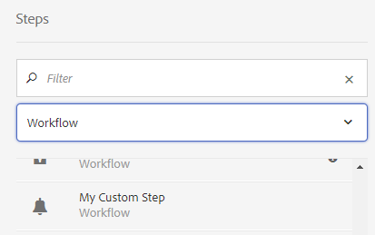

# Ampliação da funcionalidade do fluxo de trabalho{#extending-workflow-functionality}

Este tópico descreve como desenvolver componentes de etapa personalizados para seus workflows e, em seguida, como interagir programaticamente com workflows.

A criação de uma etapa de fluxo de trabalho personalizado envolve as seguintes atividades:

* Desenvolva o componente de etapa do fluxo de trabalho.
* Implemente a funcionalidade Step como um serviço OSGi ou um script ECMA.

Você também pode [interagir com seus workflows de seus programas e scripts](/help/sites-developing/workflows-program-interaction.md).

## Componentes da Etapa do Fluxo de Trabalho - Noções básicas {#workflow-step-components-the-basics}

Um componente de etapa de fluxo de trabalho define a aparência e o comportamento da etapa ao criar modelos de fluxo de trabalho:

* O nome da categoria e da etapa no sidekick do fluxo de trabalho.
* A aparência da etapa em modelos de fluxo de trabalho.
* A caixa de diálogo de edição para configurar as propriedades do componente.
* O serviço ou script executado em tempo de execução.

Como em [todos os componentes](/help/sites-developing/components.md), os componentes da etapa do fluxo de trabalho herdam do componente especificado para a `sling:resourceSuperType` propriedade. O diagrama a seguir mostra a hierarquia de `cq:component` nós que formam a base de todos os componentes da etapa do fluxo de trabalho. O diagrama também inclui os componentes Etapa **do** processo, Etapa **do** participante e Etapa **do participante** dinâmico, já que esses são os pontos de partida mais comuns (e básicos) para o desenvolvimento de componentes de etapa personalizados.


>[!CAUTION]
>
>Você não ***deve*** alterar nada no `/libs` caminho.
>
>Isso ocorre porque o conteúdo do é substituído na próxima vez que você atualizar sua instância (e pode muito bem ser substituído quando você aplicar uma correção ou um pacote de recursos). `/libs`
>
>O método recomendado para configuração e outras alterações é:
>
>1. Recriar o item desejado (isto é, como ele existe em `/libs` abaixo) `/apps`
>2. Faça quaisquer alterações em `/apps`


O `/libs/cq/workflow/components/model/step` componente é o ancestral comum mais próximo da Etapa **do** processo, Etapa **do** participante e Etapa **do participante** dinâmico, que herdam os seguintes itens:

* `step.jsp`

   O `step.jsp` script renderiza o título do componente Step quando ele é adicionado a um modelo.

   

* [cq:diálogo](/help/sites-developing/developing-components.md#creating-and-configuring-a-dialog)

   Uma caixa de diálogo com as seguintes guias:

   * **Frequentes**: para editar o título e a descrição.
   * **Avançado**: para editar as propriedades de notificação por email.
    

   >[!NOTE]
   >
   >Quando as guias da caixa de diálogo de edição de um componente de etapa não correspondem a essa aparência padrão, o componente Step tem scripts definidos, propriedades de nó ou guias de diálogo que substituem essas guias herdadas.

### Scripts ECMA {#ecma-scripts}

Os seguintes objetos estão disponíveis (dependendo do tipo de etapa) nos scripts ECMA:

* [WorkItem](https://helpx.adobe.com/experience-manager/6-5/sites/developing/using/reference-materials/javadoc/com/day/cq/workflow/exec/WorkItem.html) workItem
* [WorkflowSession](https://helpx.adobe.com/experience-manager/6-5/sites/developing/using/reference-materials/javadoc/com/day/cq/workflow/WorkflowSession.html) workflowSession
* [WorkflowData](https://helpx.adobe.com/experience-manager/6-5/sites/developing/using/reference-materials/javadoc/com/day/cq/workflow/exec/WorkflowData.html) workflowData
* `args`: com os argumentos do processo.

* `sling`: para acessar outros serviços osgi.
* `jcrSession`

### MetadadosMaps {#metadatamaps}

Você pode usar metadados de fluxo de trabalho para persistir as informações necessárias durante a vida útil do fluxo de trabalho. Um requisito comum das etapas do fluxo de trabalho é manter os dados para uso futuro no fluxo de trabalho ou recuperar os dados persistentes.

Há três tipos de objetos MetaDataMap - para `Workflow`objetos, `WorkflowData` e `WorkItem` . Todos eles têm o mesmo objetivo pretendido - armazenar metadados.

Um WorkItem tem seu próprio MetaDataMap que só pode ser usado enquanto o item de trabalho (por exemplo, etapa) estiver em execução.

Os mapas de metadados `Workflow` e `WorkflowData` metadados são compartilhados em todo o fluxo de trabalho. Nesses casos, é recomendável usar apenas o mapa de `WorkflowData` metadados.

## Criando Componentes de Etapa de Fluxo de Trabalho Personalizado {#creating-custom-workflow-step-components}

Os componentes da etapa do fluxo de trabalho podem ser [criados da mesma forma que qualquer outro componente](/help/sites-developing/components.md).

Para herdar de um dos componentes de etapa base (existentes), adicione a seguinte propriedade ao `cq:Component` nó:

* Nome: `sling:resourceSuperType`
* Tipo: `String`
* Valor: Um dos seguintes caminhos que são resolvidos para um componente básico:

   * `cq/workflow/components/model/process`
   * `cq/workflow/components/model/participant`
   * `cq/workflow/components/model/dynamic_participant`

### Especificação do título padrão e da descrição para instâncias de etapa {#specifying-the-default-title-and-description-for-step-instances}

Use o procedimento a seguir para especificar valores padrão para os campos **Título** e **Descrição** na guia **Comum** .

>[!NOTE]
>
>Os valores de campo são exibidos na instância da etapa quando ambos os requisitos são atendidos:
>
>* A caixa de diálogo de edição da etapa armazena o título e a descrição nos seguintes locais: >
>* `./jcr:title`
>* `./jcr:description` localizações
>
>  
Esse requisito é atendido quando a caixa de diálogo de edição usa a guia Comum implementada pelo `/libs/cq/flow/components/step/step` componente.
>
>* O componente Step ou um ancestral do componente não substitui o `step.jsp` script que o `/libs/cq/flow/components/step/step` componente implementa.


1. Abaixo do `cq:Component` nó, adicione o seguinte nó:

   * Nome: `cq:editConfig`
   * Tipo: `cq:EditConfig`
   >[!NOTE]
   >
   >Para obter mais informações sobre o nó cq:editConfig, consulte [Configuração do comportamento de edição de um componente](/help/sites-developing/developing-components.md#configuring-the-edit-behavior).

1. Abaixo do `cq:EditConfig` nó, adicione o seguinte nó:

   * Nome: `cq:formParameters`
   * Tipo: `nt:unstructured`

1. Adicione `String` as propriedades dos seguintes nomes ao `cq:formParameters` nó:

   * `jcr:title`: O valor preenche o campo **Título** da guia **Comum** .
   * `jcr:description`: O valor preenche o campo **Descrição** da guia **Comum** .

### Salvando valores de propriedade em metadados de fluxo de trabalho {#saving-property-values-in-workflow-metadata}

>[!NOTE]
>
>Consulte [Persistência e acesso a dados](#persisting-and-accessing-data). Especificamente, para obter informações sobre como acessar o valor da propriedade em tempo de execução, consulte [Acessar valores de propriedade da caixa de diálogo em tempo de execução](#accessing-dialog-property-values-at-runtime).

A propriedade name dos `cq:Widget` itens especifica o nó JCR que armazena o valor do widget. Quando os widgets na caixa de diálogo dos componentes da etapa do fluxo de trabalho armazenam valores abaixo do `./metaData` nó, o valor é adicionado ao fluxo de trabalho `MetaDataMap`.

Por exemplo, um campo de texto em uma caixa de diálogo é um `cq:Widget` nó que tem as seguintes propriedades:

| Nome | Tipo | Valor |
|---|---|---|
| `xtype` | `String` | `textarea` |
| `name` | `String` | `./metaData/subject` |
| `fieldLabel` | `String` | `Email Subject` |

O valor especificado nesse campo de texto é adicionado ao ` [MetaDataMap](#metadatamaps)` objeto da instância do fluxo de trabalho e associado à `subject` chave.

>[!NOTE]
>
>Quando a chave estiver disponível, `PROCESS_ARGS`o valor estará prontamente disponível nas implementações de script ECMA por meio da `args` variável. Nesse caso, o valor da propriedade name é `./metaData/PROCESS_ARGS.`

### Substituição da implementação da etapa {#overriding-the-step-implementation}

Cada componente básico permite que desenvolvedores de modelo de fluxo de trabalho configurem os seguintes recursos principais no momento do projeto:

* Etapa do processo: O serviço ou script ECMA a ser executado em tempo de execução.
* Etapa do participante: A ID do usuário que recebe o item de trabalho gerado.
* Etapa dinâmica do participante: O serviço ou script ECMA que seleciona a ID do usuário que recebe o item de trabalho.

Para focalizar o componente para uso em um cenário de fluxo de trabalho específico, configure o recurso principal no design e remova a capacidade dos desenvolvedores de modelo de alterá-lo.

1. Abaixo do nó cq:component, adicione o seguinte nó:

   * Nome: `cq:editConfig`
   * Tipo: `cq:EditConfig`
   Para obter mais informações sobre o nó cq:editConfig, consulte [Configuração do comportamento de edição de um componente](/help/sites-developing/developing-components.md#configuring-the-edit-behavior).

1. Abaixo do nó cq:EditConfig, adicione o seguinte nó:

   * Nome: `cq:formParameters`
   * Tipo: `nt:unstructured`

1. Adicione uma `String` propriedade ao `cq:formParameters` nó. O supertipo de componente determina o nome da propriedade:

   * Etapa do processo: `PROCESS`
   * Etapa do participante: `PARTICIPANT`
   * Etapa dinâmica do participante: `DYNAMIC_PARTICIPANT`

1. Especifique o valor da propriedade:

   * `PROCESS`: O caminho para o script ECMA ou o PID do serviço que implementa o comportamento da etapa.
   * `PARTICIPANT`: A ID do usuário que recebe o item de trabalho.
   * `DYNAMIC_PARTICIPANT`: O caminho para o script ECMA ou o PID do serviço que seleciona o usuário para atribuir o item de trabalho.

1. Para remover a capacidade dos desenvolvedores de modelo de alterar seus valores de propriedade, substitua a caixa de diálogo do supertipo de componente.

### Adicionar formulários e caixas de diálogo às etapas do participante {#adding-forms-and-dialogs-to-participant-steps}

Personalize o componente de etapa do participante para fornecer os recursos encontrados nos componentes Etapa [do participante do](/help/sites-developing/workflows-step-ref.md#form-participant-step) formulário e Etapa [do participante da](/help/sites-developing/workflows-step-ref.md#dialog-participant-step) caixa de diálogo:

* Apresentar um formulário ao usuário quando ele abrir o item de trabalho gerado.
* Apresentar uma caixa de diálogo personalizada ao usuário quando ele concluir o item de trabalho gerado.

Execute o seguinte procedimento em seu novo componente (consulte [Criação de componentes](#creating-custom-workflow-step-components)de etapa de fluxo de trabalho personalizados):

1. Abaixo do `cq:Component` nó, adicione o seguinte nó:

   * Nome: `cq:editConfig`
   * Tipo: `cq:EditConfig`
   Para obter mais informações sobre o nó cq:editConfig, consulte [Configuração do comportamento de edição de um componente](/help/sites-developing/components-basics.md#edit-behavior).

1. Abaixo do nó cq:EditConfig, adicione o seguinte nó:

   * Nome: `cq:formParameters`
   * Tipo: `nt:unstructured`

1. Para apresentar um formulário quando o usuário abrir o item de trabalho, adicione a seguinte propriedade ao `cq:formParameters` nó:

   * Nome: `FORM_PATH`
   * Tipo: `String`
   * Valor: O caminho que é resolvido para o formulário

1. Para apresentar uma caixa de diálogo personalizada quando o usuário concluir o item de trabalho, adicione a seguinte propriedade ao `cq:formParameters` nó

   * Nome: `DIALOG_PATH`
   * Tipo: `String`
   * Valor: O caminho que resolve a caixa de diálogo

### Configuração do comportamento de tempo de execução da etapa do fluxo de trabalho {#configuring-the-workflow-step-runtime-behavior}

Abaixo do `cq:Component` nó, adicione um `cq:EditConfig` nó. Abaixo, você pode adicionar um `nt:unstructured` nó (deve ser nomeado `cq:formParameters`) e, nesse nó, adicionar as seguintes propriedades:

* Nome: `PROCESS_AUTO_ADVANCE`

   * Tipo: `Boolean`
   * Valor:

      * quando definido como `true` o fluxo de trabalho executará essa etapa e continuará - isso é padrão e também recomendado
      * quando `false`, o fluxo de trabalho será executado e interrompido; isso precisa de manuseio extra, então `true` é recomendado

* Nome: `DO_NOTIFY`

   * Tipo: `Boolean`
   * Valor: indica se as notificações por email devem ser enviadas para as etapas de participação do usuário (e assume que o servidor de email está configurado corretamente)

## Persistência e acesso a dados {#persisting-and-accessing-data}

### Dados Persistentes para Etapas de Fluxo de Trabalho Subsequentes {#persisting-data-for-subsequent-workflow-steps}

Você pode usar metadados de fluxo de trabalho para persistir as informações necessárias durante a vida útil do fluxo de trabalho - e entre as etapas. Um requisito comum das etapas do fluxo de trabalho é manter os dados para uso futuro ou recuperar os dados persistentes de etapas anteriores.

Os metadados do fluxo de trabalho são armazenados em um [`MetaDataMap`](#metadatamaps) objeto. A API Java fornece o [`Workflow.getWorkflowData`](https://helpx.adobe.com/experience-manager/6-5/sites/developing/using/reference-materials/javadoc/com/adobe/granite/workflow/exec/Workflow.html) método para retornar um [`WorkflowData`](https://helpx.adobe.com/experience-manager/6-5/sites/developing/using/reference-materials/javadoc/com/adobe/granite/workflow/exec/WorkflowData.html) objeto que fornece o `MetaDataMap` objeto apropriado. Esse `WorkflowData` `MetaDataMap` objeto está disponível para o serviço OSGi ou o script ECMA de um componente de etapa.

#### Java {#java}

O método execute da `WorkflowProcess` implementação é transmitido ao `WorkItem` objeto. Use esse objeto para obter o `WorkflowData` objeto para a instância de fluxo de trabalho atual. O exemplo a seguir adiciona um item ao `MetaDataMap` objeto de fluxo de trabalho e, em seguida, registra cada item. O item (&quot;mykey&quot;, &quot;My Step Value&quot;) está disponível para as etapas subsequentes no fluxo de trabalho.

```java
public void execute(WorkItem item, WorkflowSession session, MetaDataMap args) throws WorkflowException {

    MetaDataMap wfd = item.getWorkflow().getWorkflowData().getMetaDataMap();

    wfd.put("mykey", "My Step Value");

    Set<String> keyset = wfd.keySet();
    Iterator<String> i = keyset.iterator();
    while (i.hasNext()){
     Object key = i.next();
     log.info("The workflow medata includes key {} and value {}",key.toString(),wfd.get(key).toString());
    }
}
```

#### Script ECMA {#ecma-script}

A `graniteWorkItem` `WorkItem` variável é a representação de script ECMA do objeto Java atual. Portanto, você pode usar a `graniteWorkItem` variável para obter os metadados do fluxo de trabalho. O script ECMA a seguir pode ser usado para implementar uma Etapa **do** processo para adicionar um item ao `MetaDataMap` objeto de fluxo de trabalho e, em seguida, registrar cada item. Esses itens ficam disponíveis para as etapas subsequentes no fluxo de trabalho.

>[!NOTE]
>
>A `metaData` variável imediatamente disponível para o script Step é os metadados da etapa. Os metadados da etapa são diferentes dos metadados do fluxo de trabalho.

```
var currentDateInMillis = new Date().getTime();

graniteWorkItem.getWorkflowData().getMetaDataMap().put("hardcodedKey","theKey");

graniteWorkItem.getWorkflowData().getMetaDataMap().put("currentDateInMillisKey",currentDateInMillis);

var iterator = graniteWorkItem.getWorkflowData().getMetaDataMap().keySet().iterator();
while (iterator.hasNext()){
    var key = iterator.next();
    log.info("Workflow metadata key, value = " + key.toString() + ", " + graniteWorkItem.getWorkflowData().getMetaDataMap().get(key));
}
```

### Acessar valores de propriedade da caixa de diálogo em tempo de execução {#accessing-dialog-property-values-at-runtime}

O `MetaDataMap` objeto de instâncias de fluxo de trabalho é útil para armazenar e recuperar dados durante toda a vida do fluxo de trabalho. Para implementações de componentes de etapa de fluxo de trabalho, o `MetaDataMap` é especialmente útil para recuperar valores de propriedade de componente em tempo de execução.

>[!NOTE]
>
>Para obter informações sobre como configurar a caixa de diálogo do componente para armazenar propriedades como metadados do fluxo de trabalho, consulte [Salvando valores de propriedade nos metadados](#saving-property-values-in-workflow-metadata)do fluxo de trabalho.

O fluxo de trabalho `MetaDataMap` está disponível para implementações de processos de script Java e ECMA:

* Em implementações Java da interface WorkflowProcess, o `args` parâmetro é o `MetaDataMap` objeto do fluxo de trabalho.

* Em implementações de script ECMA, o valor está disponível usando as variáveis `args` e `metadata` .

### Exemplo: Recuperando os Argumentos do Componente Etapa do Processo {#example-retrieving-the-arguments-of-the-process-step-component}

A caixa de diálogo de edição do componente Etapa **do** processo inclui a propriedade **Argumentos** . O valor da propriedade **Arguments** é armazenado nos metadados do fluxo de trabalho e está associado à `PROCESS_ARGS` chave.

No diagrama a seguir, o valor da propriedade **Arguments** é `argument1, argument2`:


#### Java {#java-1}

O código Java a seguir é o `execute` método para uma `WorkflowProcess` implementação. O método registra o valor no `args` que está associado à `MetaDataMap` `PROCESS_ARGS` chave.

```java
public void execute(WorkItem item, WorkflowSession session, MetaDataMap args) throws WorkflowException {
     if (args.containsKey("PROCESS_ARGS")){
      log.info("workflow metadata for key PROCESS_ARGS and value {}",args.get("PROCESS_ARGS","string").toString());
     }
    }
```

Quando uma etapa do processo que usa essa implementação Java é executada, o log contém a seguinte entrada:

```xml
16.02.2018 12:07:39.566 *INFO* [JobHandler: /var/workflow/instances/server0/2018-02-16/model_855140139900189:/content/we-retail/de] com.adobe.example.workflow.impl.process.LogArguments workflow metadata for key PROCESS_ARGS and value argument1, argument2
```

#### Script ECMA {#ecma-script-1}

O script ECMA a seguir é usado como o processo para a Etapa **do** processo. Registra o número de argumentos e os valores do argumento:

```
var iterator = graniteWorkItem.getWorkflowData().getMetaDataMap().keySet().iterator();
while (iterator.hasNext()){
    var key = iterator.next();
    log.info("Workflow metadata key, value = " + key.toString() + ", " + graniteWorkItem.getWorkflowData().getMetaDataMap().get(key));
}
log.info("hardcodedKey "+ graniteWorkItem.getWorkflowData().getMetaDataMap().get("hardcodedKey"));
log.info("currentDateInMillisKey "+ graniteWorkItem.getWorkflowData().getMetaDataMap().get("currentDateInMillisKey"));
```

>[!NOTE]
>
>Esta seção descreve como trabalhar com argumentos para etapas do processo. A informação também se aplica aos selecionadores de participantes dinâmicos.

>[!NOTE]
>Para obter outro exemplo de armazenamento de propriedades de componentes em metadados de fluxo de trabalho, consulte Exemplo: Criar uma Etapa do Fluxo de Trabalho do Logger. Este exemplo apresenta um diálogo que associa o valor de metadados a uma chave diferente de PROCESS_ARGS.

### Scripts e argumentos de processamento {#scripts-and-process-arguments}

Em um script para um componente Etapa **do** processo, os argumentos estão disponíveis por meio do `args` objeto.

Ao criar um componente de etapa personalizado, o objeto `metaData` está disponível em um script. Esse objeto é limitado a um único argumento de string.

## Implementações de Etapas do Processo de Desenvolvimento {#developing-process-step-implementations}

Quando as etapas do processo são iniciadas durante o processo de um fluxo de trabalho, as etapas enviam uma solicitação para um serviço OSGi ou executam um script ECMA. Desenvolva o serviço ou o script ECMA que executa as ações que seu fluxo de trabalho requer.

>[!NOTE]
>
>Para obter informações sobre como associar o componente Etapa do processo ao serviço ou script, consulte Etapa [do](/help/sites-developing/workflows-step-ref.md#process-step) processo ou [Substituição da implementação](#overriding-the-step-implementation)da etapa.

### Implementação de uma etapa do processo com uma classe Java {#implementing-a-process-step-with-a-java-class}

Para definir uma etapa do processo como um componente de serviço OSGI (pacote Java):

1. Crie o pacote e implante-o no container OSGI. Consulte a documentação sobre como criar um pacote com o [CRXDE Lite](/help/sites-developing/developing-with-crxde-lite.md) ou o [Eclipse](/help/sites-developing/howto-projects-eclipse.md).

   >[!NOTE]
   >
   >O componente OSGI precisa implementar a `WorkflowProcess` interface com seu `execute()` método. Consulte o código de exemplo abaixo.

   >[!NOTE]
   >
   >O nome do pacote precisa ser adicionado à `<*Private-Package*>` seção da `maven-bundle-plugin` configuração.

1. Adicione a propriedade SCR `process.label` e defina o valor conforme necessário. Esse será o nome que sua etapa do processo será listada ao usar o componente genérico Etapa **do** processo. Consulte o exemplo abaixo.
1. No editor de **Modelos** , adicione a etapa do processo ao fluxo de trabalho usando o componente genérico Etapa **do** processo.
1. Na caixa de diálogo Editar (da Etapa **do** Processo), vá para a guia **Processo** e selecione a implementação do processo.
1. Se você usar argumentos em seu código, defina os Argumentos **de Processo**. Por exemplo: false.
1. Salve as alterações, tanto para a etapa quanto para o modelo de fluxo de trabalho (canto superior esquerdo do editor de modelo).

Os métodos java, respectivamente, as classes que implementam o método Java executável são registradas como serviços OSGI, permitindo que você adicione métodos a qualquer momento durante o tempo de execução.

O seguinte componente OSGI adiciona a propriedade `approved` ao nó de conteúdo da página quando a carga é uma página:

```java
package com.adobe.example.workflow.impl.process;

import com.adobe.granite.workflow.WorkflowException;
import com.adobe.granite.workflow.WorkflowSession;
import com.adobe.granite.workflow.exec.WorkItem;
import com.adobe.granite.workflow.exec.WorkflowData;
import com.adobe.granite.workflow.exec.WorkflowProcess;
import com.adobe.granite.workflow.metadata.MetaDataMap;

import org.apache.felix.scr.annotations.Component;
import org.apache.felix.scr.annotations.Property;
import org.apache.felix.scr.annotations.Service;

import org.osgi.framework.Constants;

import javax.jcr.Node;
import javax.jcr.RepositoryException;
import javax.jcr.Session;

/**
 * Sample workflow process that sets an <code>approve</code> property to the payload based on the process argument value.
 */
@Component
@Service
public class MyProcess implements WorkflowProcess {

 @Property(value = "An example workflow process implementation.")
 static final String DESCRIPTION = Constants.SERVICE_DESCRIPTION;
 @Property(value = "Adobe")
 static final String VENDOR = Constants.SERVICE_VENDOR;
 @Property(value = "My Sample Workflow Process")
 static final String LABEL="process.label";

 private static final String TYPE_JCR_PATH = "JCR_PATH";

 public void execute(WorkItem item, WorkflowSession session, MetaDataMap args) throws WorkflowException {
  WorkflowData workflowData = item.getWorkflowData();
  if (workflowData.getPayloadType().equals(TYPE_JCR_PATH)) {
   String path = workflowData.getPayload().toString() + "/jcr:content";
   try {
    Session jcrSession = session.adaptTo(Session.class);
    Node node = (Node) jcrSession.getItem(path);
    if (node != null) {
     node.setProperty("approved", readArgument(args));
     jcrSession.save();
    }
   } catch (RepositoryException e) {
    throw new WorkflowException(e.getMessage(), e);
   }
  }
 }

 private boolean readArgument(MetaDataMap args) {
  String argument = args.get("PROCESS_ARGS", "false");
  return argument.equalsIgnoreCase("true");
 }
}
```

>[!NOTE]
>
>Se o processo falhar três vezes seguidas, um item será colocado na Caixa de entrada do administrador do fluxo de trabalho.

### Uso do ECMAScript {#using-ecmascript}

Os scripts ECMA permitem que desenvolvedores de scripts implementem etapas do processo. Os scripts estão localizados no repositório JCR e são executados a partir daí.

A tabela a seguir lista as variáveis que estão imediatamente disponíveis para processar scripts, fornecendo acesso a objetos da API Java do fluxo de trabalho.

| Classe Java | Nome da variável de script | Descrição |
|---|---|---|
| `com.adobe.granite.workflow.exec.WorkItem` | `graniteWorkItem` | A instância da etapa atual. |
| `com.adobe.granite.workflow.WorkflowSession` | `graniteWorkflowSession` | A sessão de fluxo de trabalho da instância da etapa atual. |
| `String[]` (contém argumentos de processo) | `args` | Os argumentos Step. |
| `com.adobe.granite.workflow.metadata.MetaDataMap` | `metaData` | Os metadados da instância de etapa atual. |
| `org.apache.sling.scripting.core.impl.InternalScriptHelper` | `sling` | Fornece acesso ao ambiente de tempo de execução Sling. |

O script de exemplo a seguir demonstra como acessar o nó JCR que representa a carga do fluxo de trabalho. A `graniteWorkflowSession` variável é adaptada a uma variável de sessão JCR, que é usada para obter o nó do caminho de carga.

```
var workflowData = graniteWorkItem.getWorkflowData();
if (workflowData.getPayloadType() == "JCR_PATH") {
    var path = workflowData.getPayload().toString();
    var jcrsession = graniteWorkflowSession.adaptTo(Packages.javax.jcr.Session);
    var node = jcrsession.getNode(path);
    if (node.hasProperty("approved")){
     node.setProperty("approved", args[0] == "true" ? true : false);
     node.save();
 }
}
```

O script a seguir verifica se a carga é uma imagem ( `.png` arquivo), cria uma imagem em preto-e-branco e a salva como um nó irmão.

```
var workflowData = graniteWorkItem.getWorkflowData();
if (workflowData.getPayloadType() == "JCR_PATH") {
    var path = workflowData.getPayload().toString();
    var jcrsession = graniteWorkflowSession.adaptTo(Packages.javax.jcr.Session);
    var node = jcrsession.getRootNode().getNode(path.substring(1));
     if (node.isNodeType("nt:file") && node.getProperty("jcr:content/jcr:mimeType").getString().indexOf("image/") == 0) {
        var is = node.getProperty("jcr:content/jcr:data").getStream();
        var layer = new Packages.com.day.image.Layer(is);
        layer.grayscale();
                var parent = node.getParent();
                var gn = parent.addNode("grey" + node.getName(), "nt:file");
        var content = gn.addNode("jcr:content", "nt:resource");
                content.setProperty("jcr:mimeType","image/png");
                var cal = Packages.java.util.Calendar.getInstance();
                content.setProperty("jcr:lastModified",cal);
                var f = Packages.java.io.File.createTempFile("test",".png");
        var tout = new Packages.java.io.FileOutputStream(f);
        layer.write("image/png", 1.0, tout);
        var fis = new Packages.java.io.FileInputStream(f);
                content.setProperty("jcr:data", fis);
                parent.save();
        tout.close();
        fis.close();
        is.close();
        f.deleteOnExit();
    }
}
```

Para usar o script:

1. Crie o script (por exemplo, com o CRXDE Lite) e salve-o no repositório abaixo `/apps/myapp/workflow/scripts`
1. Para especificar um título que identifique o script na caixa de diálogo de edição Etapa **do** processo, adicione as seguintes propriedades ao `jcr:content` nó do script:

   | Nome | Tipo | Valor |
   |---|---|---|
   | `jcr:mixinTypes` | `Name[]` | `mix:title` |
   | `jcr:title` | `String` | O nome a ser exibido na caixa de diálogo de edição. |

1. Edite a instância Etapa **do** processo e especifique o script a ser usado.

## Desenvolvendo seletores de participantes {#developing-participant-choosers}

Você pode desenvolver selecionadores de participantes para componentes da Etapa **do participante** dinâmico.

Quando um componente Etapa **do participante** dinâmico é iniciado durante um fluxo de trabalho, a etapa precisa determinar o participante ao qual o item de trabalho gerado pode ser atribuído. Para fazer isso, execute o seguinte procedimento:

* envia uma solicitação para um serviço OSGi
* executa um script ECMA para selecionar o participante

Você pode desenvolver um serviço ou script ECMA que selecione o participante de acordo com os requisitos do seu fluxo de trabalho.

>[!NOTE]
>
>Para obter informações sobre como associar o componente Etapa **do participante** dinâmico ao serviço ou script, consulte Etapa [do participante](/help/sites-developing/workflows-step-ref.md#dynamic-participant-step) dinâmico ou [Substituição da implementação](#persisting-and-accessing-data)da etapa.

### Desenvolvendo um Seletor de participantes usando uma classe Java {#developing-a-participant-chooser-using-a-java-class}

Para definir uma etapa do participante como um componente de serviço OSGI (classe Java):

1. O componente OSGI precisa implementar a `ParticipantStepChooser` interface com seu `getParticipant()` método. Consulte o código de exemplo abaixo.

   Crie o pacote e implante-o no container OSGI.

1. Adicione a propriedade SCR `chooser.label` e defina o valor conforme necessário. Esse será o nome como o selecionador de participantes será listado, usando o componente Etapa **** dinâmica do participante. Consulte o exemplo:

   ```java
   package com.adobe.example.workflow.impl.process;
   
   import com.adobe.granite.workflow.WorkflowException;
   import com.adobe.granite.workflow.WorkflowSession;
   import com.adobe.granite.workflow.exec.ParticipantStepChooser;
   import com.adobe.granite.workflow.exec.WorkItem;
   import com.adobe.granite.workflow.exec.WorkflowData;
   import com.adobe.granite.workflow.metadata.MetaDataMap;
   
   import org.apache.felix.scr.annotations.Component;
   import org.apache.felix.scr.annotations.Property;
   import org.apache.felix.scr.annotations.Service;
   
   import org.osgi.framework.Constants;
   
   /**
    * Sample dynamic participant step that determines the participant based on a path given as argument.
    */
   @Component
   @Service
   
   public class MyDynamicParticipant implements ParticipantStepChooser {
   
    @Property(value = "An example implementation of a dynamic participant chooser.")
    static final String DESCRIPTION = Constants.SERVICE_DESCRIPTION;
       @Property(value = "Adobe")
       static final String VENDOR = Constants.SERVICE_VENDOR;
       @Property(value = "Dynamic Participant Chooser Process")
       static final String LABEL=ParticipantStepChooser.SERVICE_PROPERTY_LABEL;
   
       private static final String TYPE_JCR_PATH = "JCR_PATH";
   
       public String getParticipant(WorkItem workItem, WorkflowSession workflowSession, MetaDataMap args) throws WorkflowException {
           WorkflowData workflowData = workItem.getWorkflowData();
           if (workflowData.getPayloadType().equals(TYPE_JCR_PATH)) {
               String path = workflowData.getPayload().toString();
               String pathFromArgument = args.get("PROCESS_ARGS", String.class);
               if (pathFromArgument != null && path.startsWith(pathFromArgument)) {
                   return "admin";
               }
           }
           return "administrators";
       }
   }
   ```

1. No editor de **Modelos** , adicione a etapa dinâmica do participante ao fluxo de trabalho usando o componente Etapa **do participante** dinâmico genérico.
1. Na caixa de diálogo de edição, selecione a guia Seletor de **participantes** e selecione a implementação do seletor.
1. Se você usar argumentos em seu código, defina os Argumentos **** de Processo. Neste exemplo: `/content/we-retail/de`.
1. Salve as alterações, tanto para a etapa quanto para o modelo de fluxo de trabalho.

### Desenvolvimento de um seletor de participantes usando um script ECMA {#developing-a-participant-chooser-using-an-ecma-script}

Você pode criar um script ECMA que selecione o usuário ao qual foi atribuído o item de trabalho gerado pela Etapa **do** participante. O script deve incluir uma função chamada `getParticipant` que não requer argumentos e retorna uma `String` que contenha a ID de um usuário ou grupo.

Os scripts estão localizados no repositório JCR e são executados a partir daí.

A tabela a seguir lista as variáveis que fornecem acesso imediato aos objetos Java do fluxo de trabalho em seus scripts.

| Classe Java | Nome da variável de script |
|---|---|
| `com.adobe.granite.workflow.exec.WorkItem` | `graniteWorkItem` |
| `com.adobe.granite.workflow.WorkflowSession` | `graniteWorkflowSession` |
| `String[]` (contém argumentos de processo) | `args` |
| `com.adobe.granite.workflow.metadata.MetaDataMap` | `metaData` |
| `org.apache.sling.scripting.core.impl.InternalScriptHelper` | `sling` |

```
function getParticipant() {
    var workflowData = graniteWorkItem.getWorkflowData();
    if (workflowData.getPayloadType() == "JCR_PATH") {
        var path = workflowData.getPayload().toString();
        if (path.indexOf("/content/we-retail/de") == 0) {
            return "admin";
        } else {
            return "administrators";
        }
    }
}
```

1. Crie o script (por exemplo, com o CRXDE Lite) e salve-o no repositório abaixo `/apps/myapp/workflow/scripts`
1. Para especificar um título que identifique o script na caixa de diálogo de edição Etapa **do** processo, adicione as seguintes propriedades ao `jcr:content` nó do script:

   | Nome | Tipo | Valor |
   |---|---|---|
   | `jcr:mixinTypes` | `Name[]` | `mix:title` |
   | `jcr:title` | `String` | O nome a ser exibido na caixa de diálogo de edição. |

1. Edite a instância Etapa [](/help/sites-developing/workflows-step-ref.md#dynamic-participant-step) dinâmica do participante e especifique o script a ser usado.

## Manuseio de pacotes de fluxo de trabalho {#handling-workflow-packages}

[Os pacotes](/help/sites-authoring/workflows-applying.md#specifying-workflow-details-in-the-create-workflow-wizard) de fluxo de trabalho podem ser enviados para um fluxo de trabalho para processamento. Os pacotes de fluxo de trabalho contêm referências a recursos como páginas e ativos.

>[!NOTE]
>
>As seguintes etapas do processo de fluxo de trabalho aceitam pacotes de fluxo de trabalho para ativação de página em massa:
>
>* [`com.day.cq.wcm.workflow.process.ActivatePageProcess`](https://helpx.adobe.com/experience-manager/6-5/sites/developing/using/reference-materials/javadoc/com/day/cq/wcm/workflow/process/ActivatePageProcess.html)
>* [`com.day.cq.wcm.workflow.process.DeactivatePageProcess`](https://helpx.adobe.com/experience-manager/6-5/sites/developing/using/reference-materials/javadoc/com/day/cq/wcm/workflow/process/DeactivatePageProcess.html)
>


Você pode desenvolver etapas de fluxo de trabalho que obtêm os recursos do pacote e processá-los. Os seguintes membros do `com.day.cq.workflow.collection` pacote fornecem acesso aos pacotes de fluxo de trabalho:

* `ResourceCollection`: Classe de pacote de fluxo de trabalho.
* `ResourceCollectionUtil`: Use para recuperar objetos ResourceCollection.
* `ResourceCollectionManager`: Cria e recupera coleções. Uma implementação é implantada como um serviço OSGi.

O exemplo de classe Java a seguir demonstra como obter recursos do pacote:

```java
package com.adobe.example;

import java.util.ArrayList;
import java.util.List;

import com.day.cq.workflow.WorkflowException;
import com.day.cq.workflow.WorkflowSession;
import com.day.cq.workflow.collection.ResourceCollection;
import com.day.cq.workflow.collection.ResourceCollectionManager;
import com.day.cq.workflow.collection.ResourceCollectionUtil;
import com.day.cq.workflow.exec.WorkItem;
import com.day.cq.workflow.exec.WorkflowData;
import com.day.cq.workflow.exec.WorkflowProcess;
import com.day.cq.workflow.metadata.MetaDataMap;

import org.apache.felix.scr.annotations.Component;
import org.apache.felix.scr.annotations.Property;
import org.apache.felix.scr.annotations.Service;
import org.apache.felix.scr.annotations.Reference;
import org.osgi.framework.Constants;

import org.slf4j.Logger;
import org.slf4j.LoggerFactory;

import javax.jcr.Node;
import javax.jcr.PathNotFoundException;
import javax.jcr.RepositoryException;
import javax.jcr.Session;

@Component
@Service
public class LaunchBulkActivate implements WorkflowProcess {

 private static final Logger log = LoggerFactory.getLogger(LaunchBulkActivate.class);

 @Property(value="Bulk Activate for Launches")
  static final String PROCESS_NAME ="process.label";
 @Property(value="A sample workflow process step to support Launches bulk activation of pages")
 static final String SERVICE_DESCRIPTION = Constants.SERVICE_DESCRIPTION;

 @Reference
 private ResourceCollectionManager rcManager;
public void execute(WorkItem workItem, WorkflowSession workflowSession) throws Exception {
    Session session = workflowSession.getSession();
    WorkflowData data = workItem.getWorkflowData();
    String path = null;
    String type = data.getPayloadType();
    if (type.equals(TYPE_JCR_PATH) && data.getPayload() != null) {
        String payloadData = (String) data.getPayload();
        if (session.itemExists(payloadData)) {
            path = payloadData;
        }
    } else if (data.getPayload() != null && type.equals(TYPE_JCR_UUID)) {
        Node node = session.getNodeByUUID((String) data.getPayload());
        path = node.getPath();
    }

    // CUSTOMIZED CODE IF REQUIRED....

    if (path != null) {
        // check for resource collection
        ResourceCollection rcCollection = ResourceCollectionUtil.getResourceCollection((Node)session.getItem(path), rcManager);
        // get list of paths to replicate (no resource collection: size == 1
        // otherwise size >= 1
        List<String> paths = getPaths(path, rcCollection);
        for (String aPath: paths) {

            // CUSTOMIZED CODE....

        }
    } else {
        log.warn("Cannot process because path is null for this " + "workitem: " + workItem.toString());
    }
}

/**
 * helper
 */
private List<String> getPaths(String path, ResourceCollection rcCollection) {
    List<String> paths = new ArrayList<String>();
    if (rcCollection == null) {
        paths.add(path);
    } else {
        log.debug("ResourceCollection detected " + rcCollection.getPath());
        // this is a resource collection. the collection itself is not
        // replicated. only its members
        try {
            List<Node> members = rcCollection.list(new String[]{"cq:Page", "dam:Asset"});
            for (Node member: members) {
                String mPath = member.getPath();
                paths.add(mPath);
            }
        } catch(RepositoryException re) {
            log.error("Cannot build path list out of the resource collection " + rcCollection.getPath());
        }
    }
    return paths;
}
}
```

## Exemplo: Criando uma etapa personalizada {#example-creating-a-custom-step}

Uma maneira fácil de start para criar sua própria etapa personalizada é copiar uma etapa existente de:

`/libs/cq/workflow/components/model`

### Criando a etapa básica {#creating-the-basic-step}

1. Recrie o caminho em /apps; por exemplo:

   `/apps/cq/workflow/components/model`

   As novas pastas são do tipo `nt:folder`:

   ```xml
   - apps
     - cq
       - workflow (nt:folder)
         - components (nt:folder)
           - model (nt:folder)
   ```

   >[!NOTE]
   >
   >Esta etapa não se aplica ao editor clássico do Modelo de interface do usuário.

1. Em seguida, coloque a etapa copiada na pasta /apps; por exemplo:

   `/apps/cq/workflow/components/model/myCustomStep`

   Este é o resultado de nossa etapa personalizada de exemplo:

   

   >[!CAUTION]
   >
   >Como na interface de usuário padrão, somente o título e não os detalhes não são exibidos no cartão, não `details.jsp` é necessário como era para o editor clássico de interface de usuário.

1. Aplique as seguintes propriedades ao nó:

   `/apps/cq/workflow/components/model/myCustomStep`

   **Propriedades do interesse:**

   * `sling:resourceSuperType`

      É necessário herdar de uma etapa existente.

      Neste exemplo, estamos herdando da etapa base em `cq/workflow/components/model/step`, mas você pode usar outros supertipos como `participant`, `process`etc.

   * `jcr:title`

      É o título exibido quando o componente é listado no navegador de etapas (painel do lado esquerdo do editor de modelo de fluxo de trabalho).

   * `cq:icon`

      Usado para especificar um ícone [de](https://helpx.adobe.com/experience-manager/6-5/sites/developing/using/reference-materials/coral-ui/coralui3/Coral.Icon.html) Coral para a etapa.

   * `componentGroup`

      Deve ser um dos seguintes:

      * Fluxo de trabalho de colaboração
      * Fluxo de trabalho DAM
      * Fluxo de trabalho dos formulários
      * Projetos
      * Fluxo de trabalho WCM
      * Fluxo de trabalho
   

1. Agora é possível abrir um modelo de fluxo de trabalho para edição. Nas etapas do navegador, você pode filtrar para ver **Minha etapa** personalizada:

   

   Arrastar **Minha etapa** personalizada para o modelo exibe o cartão:

   

   Se nenhum `cq:icon` tiver sido definido para a etapa, um ícone padrão será renderizado usando as duas primeiras letras do título. Por exemplo:

   

#### Definindo a caixa de diálogo Configurar Etapa {#defining-the-step-configure-dialog}

Depois de [Criar a Etapa](#creating-the-basic-step)Básica, defina a etapa **Configurar** a caixa de diálogo da seguinte maneira:

1. Configure as propriedades no nó da `cq:editConfig` seguinte maneira:

   **Propriedades do interesse:**

   * `cq:inherit`

      Quando definido como `true`, o componente Step herdará as propriedades da etapa especificada em `sling:resourceSuperType`.

   * `cq:disableTargeting`

      Defina como necessário.
   

1. Configure as propriedades no nó da `cq:formsParameter` seguinte maneira:

   **Propriedades do interesse:**

   * `jcr:title`

      Define o título padrão no cartão de etapa no mapa do modelo e no campo **Título** da caixa de diálogo de configuração **Meu personalizado - Propriedades** da etapa.

   * Você também pode definir suas próprias propriedades personalizadas.
   

1. Configure as propriedades no nó `cq:listeners`.

   O `cq:listener` nó e suas propriedades permitem definir manipuladores de eventos que reagem a eventos no editor de modelo de interface de usuário habilitada para toque; como arrastar uma etapa para uma página de modelo ou editar as propriedades de uma etapa.

   **Propriedades de interesse:**

   * `afterMove: REFRESH_PAGE`
   * `afterdelete: CQ.workflow.flow.Step.afterDelete`
   * `afteredit: CQ.workflow.flow.Step.afterEdit`
   * `afterinsert: CQ.workflow.flow.Step.afterInsert`
   Essa configuração é essencial para o funcionamento correto do editor. Na maioria dos casos, essa configuração não deve ser alterada.

   No entanto, definir `cq:inherit` como true (no `cq:editConfig` nó, consulte acima) permite herdar essa configuração, sem precisar incluí-la explicitamente na definição da etapa. Se nenhuma herança estiver no lugar, então é necessário adicionar esse nó com as seguintes propriedades e valores.

   Neste exemplo, a herança foi ativada para que pudéssemos remover o `cq:listeners` nó e a etapa ainda funcionará corretamente.

   

1. Agora você pode adicionar uma instância da sua etapa a um modelo de fluxo de trabalho. Ao **Configurar** a etapa, você verá a caixa de diálogo:

    

#### Marcação de amostra usada neste exemplo {#sample-markup-used-in-this-example}

A marcação para uma etapa personalizada é representada no nó raiz `.content.xml` do componente. A amostra `.content.xml` usada para este exemplo:

`/apps/cq/workflow/components/model/myCustomStep/.content.xml`

```xml
<?xml version="1.0" encoding="UTF-8"?>
<jcr:root xmlns:sling="https://sling.apache.org/jcr/sling/1.0" xmlns:cq="https://www.day.com/jcr/cq/1.0" xmlns:jcr="https://www.jcp.org/jcr/1.0"
    cq:icon="bell"
    jcr:primaryType="cq:Component"
    jcr:title="My Custom Step"
    sling:resourceSuperType="cq/workflow/components/model/process"
    allowedParents="[*/parsys]"
    componentGroup="Workflow"/>
```

A `_cq_editConfig.xml` amostra usada neste exemplo:

```xml
<?xml version="1.0" encoding="UTF-8"?>
<jcr:root xmlns:cq="https://www.day.com/jcr/cq/1.0" xmlns:jcr="https://www.jcp.org/jcr/1.0" xmlns:nt="https://www.jcp.org/jcr/nt/1.0"
    cq:disableTargeting="{Boolean}true"
    cq:inherit="{Boolean}true"
    jcr:primaryType="cq:EditConfig">
    <cq:formParameters
        jcr:primaryType="nt:unstructured"
        jcr:title="My Custom Step Card"
        SAMPLE_PROPERY="sample value"/>
    <cq:listeners
        jcr:primaryType="cq:EditListenersConfig"
        afterdelete="CQ.workflow.flow.Step.afterDelete"
        afteredit="CQ.workflow.flow.Step.afterEdit"
        afterinsert="CQ.workflow.flow.Step.afterInsert"
        afterMove="REFRESH_PAGE"/>
</jcr:root>
```

A `_cq_dialog/.content.xml` amostra usada neste exemplo:

```xml
<?xml version="1.0" encoding="UTF-8"?>
<jcr:root xmlns:sling="https://sling.apache.org/jcr/sling/1.0" xmlns:cq="https://www.day.com/jcr/cq/1.0" xmlns:jcr="https://www.jcp.org/jcr/1.0" xmlns:nt="https://www.jcp.org/jcr/nt/1.0"
    jcr:primaryType="nt:unstructured"
    jcr:title="My Custom - Step Properties"
    sling:resourceType="cq/gui/components/authoring/dialog">
    <content
        jcr:primaryType="nt:unstructured"
        sling:resourceType="granite/ui/components/coral/foundation/tabs">
        <items jcr:primaryType="nt:unstructured">
            <common
                cq:hideOnEdit="true"
                jcr:primaryType="nt:unstructured"
                jcr:title="Common"
                sling:resourceType="granite/ui/components/coral/foundation/fixedcolumns"/>
            <process
                cq:hideOnEdit="true"
                jcr:primaryType="nt:unstructured"
                jcr:title="Process"
                sling:resourceType="granite/ui/components/coral/foundation/fixedcolumns"/>
            <mycommon
                jcr:primaryType="nt:unstructured"
                jcr:title="Common"
                sling:resourceType="granite/ui/components/coral/foundation/fixedcolumns">
                <items jcr:primaryType="nt:unstructured">
                    <columns
                        jcr:primaryType="nt:unstructured"
                        sling:resourceType="granite/ui/components/coral/foundation/container">
                        <items jcr:primaryType="nt:unstructured">
                            <title
                                jcr:primaryType="nt:unstructured"
                                sling:resourceType="granite/ui/components/coral/foundation/form/textfield"
                                fieldLabel="Title"
                                name="./jcr:title"/>
                            <description
                                jcr:primaryType="nt:unstructured"
                                sling:resourceType="granite/ui/components/coral/foundation/form/textarea"
                                fieldLabel="Description"
                                name="./jcr:description"/>
                        </items>
                    </columns>
                </items>
            </mycommon>
            <advanced
                jcr:primaryType="nt:unstructured"
                jcr:title="Advanced"
                sling:resourceType="granite/ui/components/coral/foundation/fixedcolumns">
                <items jcr:primaryType="nt:unstructured">
                    <columns
                        jcr:primaryType="nt:unstructured"
                        sling:resourceType="granite/ui/components/coral/foundation/container">
                        <items jcr:primaryType="nt:unstructured">
                            <email
                                jcr:primaryType="nt:unstructured"
                                sling:resourceType="granite/ui/components/coral/foundation/form/checkbox"
                                fieldDescription="Notify user via email."
                                fieldLabel="Email"
                                name="./metaData/PROCESS_AUTO_ADVANCE"
                                text="Notify user via email."
                                value="true"/>
                        </items>
                    </columns>
                </items>
            </advanced>
        </items>
    </content>
</jcr:root>
```

>[!NOTE]
>
>Observe os nós comuns e de processo na definição da caixa de diálogo. Eles são herdados da etapa do processo que usamos como supertipo para nossa etapa personalizada:
>
>`sling:resourceSuperType : cq/workflow/components/model/process`

>[!NOTE]
>
>As caixas de diálogo do editor de modelo de interface clássica ainda funcionarão com o editor de interface de usuário padrão e habilitado para toque.
>
>Embora o AEM tenha uma ferramenta de conversão [de](/help/sites-developing/dialog-conversion.md) diálogo se você quiser atualizar as caixas de diálogo de etapa da interface clássica para as caixas de diálogo padrão da interface do usuário. Após a conversão, ainda há algumas melhorias manuais que poderiam ser feitas no diálogo em certos casos.
>
>* Nos casos em que uma caixa de diálogo atualizada está vazia, é possível observar as caixas de diálogo com funcionalidades semelhantes `/libs` a exemplos de como fornecer uma solução. Por exemplo:
   >
   >
* `/libs/cq/workflow/components/model`
>* `/libs/cq/workflow/components/workflow`
>* `/libs/dam/components`
>* `/libs/wcm/workflow/components/autoassign`
>* `/libs/cq/projects`
>
>  
Você não deve modificar nada em `/libs`, basta usá-los como exemplos. Se quiser aproveitar qualquer uma das etapas existentes, copie-as para `/apps` e modifique-as.
