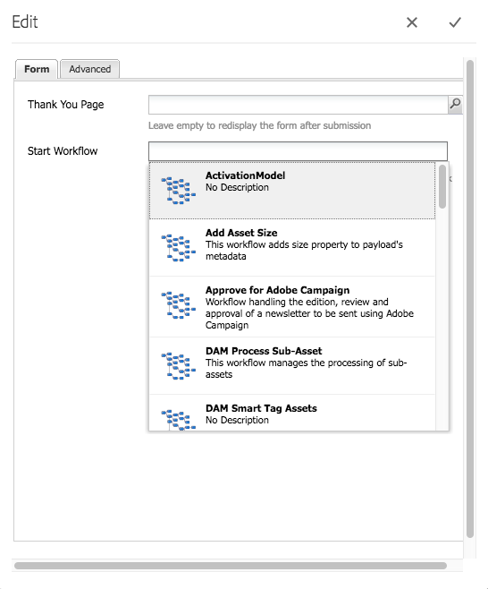
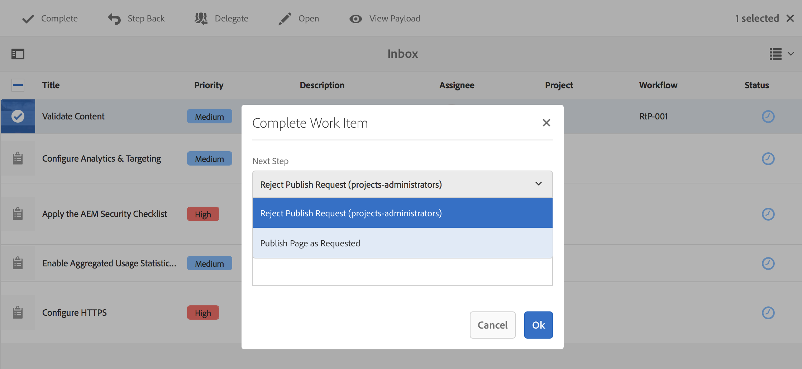

# Criação de modelos de fluxo de trabalho{#creating-workflow-models}

>[!CAUTION]
>
>Para usar a interface clássica, consulte a documentação [do](https://helpx.adobe.com/experience-manager/6-3/help/sites-developing/workflows-models.html) AEM 6.3 para obter referência.

Você cria um modelo [de](/help/sites-developing/workflows.md#model) fluxo de trabalho para definir a série de etapas executadas quando um usuário inicia o fluxo de trabalho. Você também pode definir propriedades de modelo, como se o fluxo de trabalho é temporário ou usa vários recursos.

Quando um usuário inicia um fluxo de trabalho, uma instância é iniciada; este é o modelo de tempo de execução correspondente, criado ao [sincronizar](#sync-your-workflow-generate-a-runtime-model) suas alterações.

## Criando um novo fluxo de trabalho {#creating-a-new-workflow}

Quando você cria um novo modelo de fluxo de trabalho, ele contém:

* As etapas, Início **do** fluxo e Fim **do**fluxo.
Elas representam o início e o fim do fluxo de trabalho. Essas etapas são obrigatórias e não podem ser editadas/removidas.
* Um exemplo de etapa **Participante** chamado **Etapa 1**.
Esta etapa está configurada para atribuir um item de trabalho ao iniciador do fluxo de trabalho. Edite ou exclua esta etapa e adicione as etapas conforme necessário.

Para criar um novo fluxo de trabalho com o editor:

1. Abra o console Modelos **de** fluxo de trabalho; por meio de **Ferramentas**, **Fluxo de trabalho**, **Modelos** ou, por exemplo: [https://localhost:4502/aem/workflow](https://localhost:4502/aem/workflow)
1. Select **Create**, then **Create Model**.
1. A caixa de diálogo **Adicionar modelo** de fluxo de trabalho é exibida. Insira o **Título** e o **Nome** (opcional) antes de selecionar **Concluído**.
1. O novo modelo é listado no console Modelos **de** fluxo de trabalho.
1. Selecione seu novo fluxo de trabalho e use [**Editar **para abri-lo para configuração](#editinganexistingworkflow):   

>[!NOTE]
>
>Se estiver criando modelos de forma programática (usando um pacote crx), você também poderá criar uma subpasta dentro de:
>
>`/var/workflow/models`
>
>Por exemplo, `/var/workflow/models/prototypes`
>
>Essa pasta pode ser usada para [gerenciar o acesso aos modelos dessa pasta](/help/sites-administering/workflows-managing.md#create-a-subfolder-in-var-workflow-models-and-apply-the-acl-to-that).

## Editar um fluxo de trabalho {#editing-a-workflow}

Você pode editar qualquer modelo de fluxo de trabalho existente para:

* [definir etapas](#addingasteptoamodel-) e seus [parâmetros](#configuring-a-workflow-step)
* configurar as propriedades do fluxo de trabalho, incluindo [estágios](#configuring-workflow-stages-that-show-workflow-progress), [se o fluxo de trabalho é temporário](#creatingatransientworkflow-) e/ou [usa vários recursos](#configuring-a-workflow-for-multi-resource-support)

A edição de um fluxo de trabalho [**padrão e/ou herdado **(pronto para uso) tem uma etapa adicional para garantir que uma cópia](#editing-a-default-or-legacy-workflow-for-the-first-time)[](/help/sites-developing/workflows-best-practices.md#locations-workflow-models)segura seja realizada antes de suas alterações serem feitas.

Quando as atualizações do seu fluxo de trabalho forem concluídas, você deverá usar **Sincronizar** para **Gerar um Modelo** de Tempo de Execução. Consulte [Sincronizar seu fluxo de trabalho](#sync-your-workflow-generate-a-runtime-model) para obter detalhes.

### Sincronizar seu fluxo de trabalho - Gerar um modelo de tempo de execução {#sync-your-workflow-generate-a-runtime-model}

**A sincronização** (à direita na barra de ferramentas do editor) gera um modelo [de](/help/sites-developing/workflows.md#runtime-model)tempo de execução. O modelo de tempo de execução é o modelo realmente usado quando um usuário inicia um fluxo de trabalho. Se você não **sincronizar** suas alterações, as alterações não estarão disponíveis em tempo de execução.

Quando você (ou qualquer outro usuário) faz alterações no fluxo de trabalho, é necessário usar **Sincronizar** para gerar um modelo de tempo de execução - mesmo quando as caixas de diálogo individuais (por exemplo, para etapas) têm suas próprias opções de gravação.

Quando as alterações são sincronizadas com o modelo de tempo de execução (salvo), a opção **Sincronizado** é exibida.

Algumas etapas têm campos obrigatórios e/ou validação integrada. Quando essas condições não estiverem satisfeitas, um erro será exibido quando você tentar **sincronizar** o modelo. Por exemplo, quando nenhum participante foi definido para uma etapa **Participante** :


### Editando um fluxo de trabalho padrão ou herdado pela primeira vez {#editing-a-default-or-legacy-workflow-for-the-first-time}

Ao abrir um modelo [](/help/sites-developing/workflows.md#workflow-types) Padrão e/ou Herdado para edição:

* O navegador de Etapas não está disponível (lado esquerdo).
* Há uma ação **Editar** disponível na barra de ferramentas (lado direito).
* Inicialmente, o modelo e suas propriedades são apresentados em modo somente leitura como:
   * Os fluxos de trabalho padrão estão localizados em `/libs`
   * Os fluxos de trabalho herdados estão localizados em `/etc`Selecionar **Editar** :
* fazer uma cópia do fluxo de trabalho em `/conf`
* disponibilizar o navegador de etapas
* permitir que você faça alterações

>[!NOTE]
>
>Consulte [Locais de modelos](/help/sites-developing/workflows-best-practices.md#locations-workflow-models) de fluxo de trabalho para obter mais informações.


### Adicionando uma Etapa a um Modelo {#adding-a-step-to-a-model}

Será necessário adicionar etapas ao modelo para representar a atividade a ser executada - cada etapa executa uma atividade específica. Uma seleção de componentes de etapa está disponível em uma instância padrão do AEM.

Quando você edita um modelo, as etapas disponíveis são exibidas nos vários grupos do navegador **de** Etapas. Por exemplo:


>[!NOTE]
>
>Para obter informações sobre os componentes de etapa primária instalados com o AEM, consulte Referência [de etapas do](/help/sites-developing/workflows-step-ref.md)fluxo de trabalho.

Para adicionar etapas ao modelo de fluxo de trabalho:

1. Abra um modelo de fluxo de trabalho existente para edição. No console Modelo **de** fluxos de trabalho, selecione o modelo necessário e, em seguida, **Editar**.
1. Abra o navegador Steps; usando **Alternar painel** lateral, na extremidade esquerda da barra de ferramentas superior. Aqui você pode:

   * **Filtre** por etapas específicas.
   * Use o seletor suspenso para limitar a seleção a um grupo específico de etapas.
   * Selecione o ícone Mostrar descrição  para mostrar mais detalhes sobre a etapa apropriada.
   

1. Arraste as etapas apropriadas para o local desejado no modelo.

   Por exemplo, uma Etapa **do** participante.

   Depois de adicionada ao fluxo, é possível [configurar a etapa](#configuring-a-workflow-step).

   

1. Adicione quantas etapas ou outras atualizações forem necessárias.

   Em tempo de execução, as etapas são executadas na ordem em que aparecem no modelo. Depois de adicionar componentes de etapa, você pode arrastá-los para um local diferente no modelo.

   Você também pode copiar, recortar, colar, agrupar ou excluir etapas existentes; como com o editor de [páginas.](/help/sites-authoring/editing-content.md)

   As etapas divididas também podem ser recolhidas/expandidas usando a opção da barra de ferramentas: 

1. Confirme as alterações com **Sincronizar** (barra de ferramentas do editor) para gerar o modelo de tempo de execução.

   Consulte [Sincronizar seu fluxo de trabalho](#sync-your-workflow-generate-a-runtime-model) para obter detalhes.

### Configuração de uma Etapa do Fluxo de Trabalho {#configuring-a-workflow-step}

Você pode **Configurar** e personalizar o comportamento de uma etapa do fluxo de trabalho usando as caixas de diálogo Propriedades **da** etapa.

1. Para abrir a caixa de diálogo Propriedades **da** etapa para uma etapa, faça o seguinte:

   * Clique/toque na etapa* *no modelo de fluxo de trabalho e selecione **Configurar** na barra de ferramentas do componente.

   * Clique duas vezes na etapa.
   >[!NOTE]
   >
   >Para obter informações sobre os componentes de etapa primária instalados com o AEM, consulte Referência [de etapas do](/help/sites-developing/workflows-step-ref.md)fluxo de trabalho.

1. Configure as propriedades **da** etapa conforme necessário; as propriedades disponíveis dependem do tipo de etapa, também pode haver várias guias disponíveis. Por exemplo, a Etapa **padrão do** participante, presente em um novo fluxo de trabalho como `Step 1`:

   

1. Confirme suas atualizações com a marca de verificação.
1. Confirme as alterações com **Sincronizar** (barra de ferramentas do editor) para gerar o modelo de tempo de execução.

   Consulte [Sincronizar seu fluxo de trabalho](#sync-your-workflow-generate-a-runtime-model) para obter detalhes.

### Criando um fluxo de trabalho temporário {#creating-a-transient-workflow}

Você pode criar um modelo de fluxo de trabalho [Transitório](/help/sites-developing/workflows.md#transient-workflows) ao criar um novo modelo ou ao editar um existente:

1. Abra o modelo de fluxo de trabalho para [edição](#editinganexistingworkflow).
1. Na barra de ferramentas, selecione Propriedades **do modelo de** fluxo de trabalho.
1. Na caixa de diálogo, ative Fluxo de trabalho **temporário** (ou desative se necessário):

   

1. Confirmar a alteração com o **Save &amp; Close**; seguido por **Sincronizar** (barra de ferramentas do editor) para gerar o modelo de tempo de execução.

   Consulte [Sincronizar seu fluxo de trabalho](#sync-your-workflow-generate-a-runtime-model) para obter detalhes.

>[!NOTE]
>
>Quando você executa um fluxo de trabalho no modo [transitório](/help/sites-developing/workflows.md#transient-workflows) , o AEM não armazena nenhum histórico de fluxo de trabalho. Portanto, a [Linha do tempo](/help/sites-authoring/basic-handling.md#timeline) não exibe nenhuma informação relacionada a esse fluxo de trabalho. [](/help/sites-authoring/basic-handling.md#timeline)

## Disponibilizar modelos de fluxo de trabalho na interface do usuário para toque {#classic2touchui}

Se um modelo de fluxo de trabalho estiver presente na interface clássica, mas estiver ausente no menu pop-up de seleção no painel **[!UICONTROL Linha]** do tempo da interface de usuário de toque, siga a configuração para disponibilizá-lo. As etapas a seguir ilustram o uso do modelo de fluxo de trabalho chamado **[!UICONTROL Solicitação de ativação]**.

1. Confirme se o modelo não está disponível na interface habilitada para toque. Acessar um ativo usando `/assets.html/content/dam` caminho. Selecione um ativo. Abra **[!UICONTROL Linha do tempo]** no painel esquerdo. Clique em **[!UICONTROL Iniciar fluxo de trabalho]** e confirme se o modelo **[!UICONTROL Solicitar ativação]** não está presente na lista suspensa.

1. Navegue por **[!UICONTROL Ferramentas > Geral > Marcação]**. Selecione **[!UICONTROL Fluxo de trabalho]**.

1. Selecione **[!UICONTROL Criar > Criar tag]**. Defina **[!UICONTROL Título]** como `DAM` e **[!UICONTROL Nome]** como `dam`. Selecione **[!UICONTROL Enviar]**.
   

1. Navegue até **[!UICONTROL Ferramentas > Fluxo de trabalho > Modelos]**. Selecione **[!UICONTROL Solicitar ativação]** e selecione **[!UICONTROL Editar]**.

1. Selecione **[!UICONTROL Editar]**, abra o menu Informações **[!UICONTROL da]** página e selecione **[!UICONTROL Abrir propriedades]** e vá para a guia **[!UICONTROL Básico]** (se ainda não estiver aberta).

1. Adicionar `Workflow : DAM` ao campo **[!UICONTROL Tags]** . Confirme a seleção com a verificação (marca de verificação).

1. Confirme a adição da tag com **[!UICONTROL Salvar e fechar]**.
   

1. Conclua o processo com a **[!UICONTROL sincronização]**. O fluxo de trabalho agora está disponível na interface habilitada para toque.

### Configuração de um fluxo de trabalho para suporte a vários recursos {#configuring-a-workflow-for-multi-resource-support}

Você pode configurar um modelo de fluxo de trabalho para o suporte [a](/help/sites-developing/workflows.md#multi-resource-support) vários recursos ao criar um novo modelo ou ao editar um existente:

1. Abra o modelo de fluxo de trabalho para [edição](#editinganexistingworkflow).
1. Na barra de ferramentas, selecione Propriedades **do modelo de** fluxo de trabalho.

1. Na caixa de diálogo, ative o suporte **** a vários recursos (ou desative se necessário):

   

1. Confirmar a alteração com o **Save &amp; Close**; seguido por **Sincronizar** (barra de ferramentas do editor) para gerar o modelo de tempo de execução.

   Consulte [Sincronizar seu fluxo de trabalho](#sync-your-workflow-generate-a-runtime-model) para obter detalhes.

### Configurando Estágios do Fluxo de Trabalho (que mostram o Progresso do Fluxo de Trabalho) {#configuring-workflow-stages-that-show-workflow-progress}

[As Etapas](/help/sites-developing/workflows.md#workflow-stages) do fluxo de trabalho ajudam a visualizar o progresso de um fluxo de trabalho ao manipular tarefas.

>[!CAUTION]
>
>Se os estágios do fluxo de trabalho forem definidos em Propriedades **da** página, mas não forem usados para nenhuma das etapas do fluxo de trabalho, a barra de progresso não mostrará nenhum progresso (independentemente da etapa do fluxo de trabalho atual).

As fases a disponibilizar são definidas nos modelos de fluxo de trabalho; os modelos de fluxo de trabalho existentes podem ser atualizados para incluir definições de estágio. É possível definir qualquer número de estágios para o modelo de fluxo de trabalho.

Para definir **Estágios** para seu fluxo de trabalho:

1. Abra o modelo de fluxo de trabalho para edição.
1. Na barra de ferramentas, selecione Propriedades **do modelo de** fluxo de trabalho. Em seguida, abra a guia **Estágios** .
1. Adicione (e posicione) seus **Estágios** necessários. É possível definir qualquer número de estágios para o modelo de fluxo de trabalho.

   Por exemplo:

   

1. Clique em **Salvar e fechar** para salvar as propriedades.
1. Atribua um estágio a cada uma das etapas no modelo de fluxo de trabalho. Por exemplo:

   

   Uma etapa pode ser atribuída a mais de uma etapa. Por exemplo:

   | **Etapa** | **Estágio** |
   |---|---|
   | Etapa 1 | Criar |
   | Etapa 2 | Criar |
   | Etapa 3 | Análise |
   | Etapa 4 | Aprovar |
   | Etapa 5 | Aprovar |
   | Etapa 6 | Concluir |

1. Confirme as alterações com **Sincronizar** (barra de ferramentas do editor) para gerar o modelo de tempo de execução.

   Consulte [Sincronizar seu fluxo de trabalho](#sync-your-workflow-generate-a-runtime-model) para obter detalhes.

## Exportar um modelo de fluxo de trabalho em um pacote {#exporting-a-workflow-model-in-a-package}

Para exportar um modelo de fluxo de trabalho em um pacote:

1. Crie um novo pacote usando o Gerenciador [de pacotes](/help/sites-administering/package-manager.md#package-manager):

   1. Navegue até o Gerenciador de pacotes por meio de **Ferramentas**, **Implantação** e **Pacotes**.

   1. Clique em **Criar pacote**.
   1. Especifique o Nome **do** pacote e quaisquer outros detalhes, conforme necessário.
   1. Clique em **OK**.

1. Clique em **Editar** na barra de ferramentas do novo pacote.

1. Open the **Filters** tab.

1. Selecione **Adicionar filtro** e especifique o caminho do *design* do modelo de fluxo de trabalho:

   `/conf/global/settings/workflow/models/<*your-model-name*>`

   Clique em **Concluído**.

1. Selecione **Adicionar filtro** e especifique o caminho do modelo de fluxo de trabalho do *tempo* de execução:

   `/var/workflow/models/<*your-model-name*>`

   Clique em **Concluído**.

1. Adicione filtros adicionais para quaisquer scripts personalizados usados pelo seu modelo.
1. Clique em **Salvar** para confirmar as definições do filtro.
1. Selecione **Criar** na barra de ferramentas da definição do seu pacote.
1. Selecione **Download** na barra de ferramentas do pacote.

## Uso de fluxos de trabalho para processar envios de formulário {#using-workflows-to-process-form-submissions}

Você pode configurar um formulário a ser processado pelo fluxo de trabalho selecionado. Quando os usuários enviam o formulário, uma nova instância do fluxo de trabalho é criada com os dados do envio do formulário como carga.

Para configurar o fluxo de trabalho a ser usado com o formulário:

1. Crie uma nova página e abra-a para edição.
1. Adicione um componente de **formulário** à página.
1. **Configure** o componente **Form Start** que apareceu na página.
1. Use **Iniciar fluxo de trabalho** para selecionar o fluxo de trabalho desejado dentre os disponíveis:

   

1. Confirme a nova configuração do formulário com a marca de verificação.

## Teste de fluxos de trabalho {#testing-workflows}

É uma boa prática testar um fluxo de trabalho para usar diversos tipos de carga útil. incluindo tipos diferentes daqueles para os quais foi desenvolvido. Por exemplo, se você pretende que seu fluxo de trabalho lida com os Ativos, teste-o configurando uma Página como carga e certifique-se de que ela não apresenta erros.

Por exemplo, teste seu novo fluxo de trabalho da seguinte maneira:

1. [Inicie seu modelo](/help/sites-administering/workflows-starting.md) de fluxo de trabalho no console.
1. Defina a **Carga** e confirme.

1. Execute as ações necessárias para que o fluxo de trabalho continue.
1. Monitore os arquivos de registro enquanto o fluxo de trabalho estiver em execução.

Você também pode configurar o AEM para exibir mensagens **DEBUG** nos arquivos de registro. Consulte [Registro](/help/sites-deploying/configure-logging.md) para obter mais informações e quando o desenvolvimento estiver concluído, defina o Nível **do** registro novamente como **Informações**.

## Exemplos {#examples}

### Exemplo: Criando um fluxo de trabalho (simples) para aceitar ou rejeitar uma solicitação de publicação {#example-creating-a-simple-workflow-to-accept-or-reject-a-request-for-publication}

Para ilustrar algumas das possibilidades de criação de um fluxo de trabalho, o exemplo a seguir cria uma variação do `Publish Example` fluxo de trabalho.

1. [Crie um novo modelo](#creating-a-new-workflow)de fluxo de trabalho.

   O novo fluxo de trabalho conterá:

   * **Início do fluxo**
   * `Step 1`
   * **Final do fluxo**

1. Excluir `Step 1` (pois é o tipo de etapa errado para este exemplo):

   * Clique na etapa e selecione **Excluir** na barra de ferramentas do componente. Confirme a ação.

1. Na seleção **Fluxo de trabalho** do navegador de etapas, arraste uma Etapa **do** participante para o fluxo de trabalho e posicione-a entre Início **do** fluxo e Fim **do** fluxo.
1. Para abrir a caixa de diálogo de propriedades:

   * Clique na etapa participante e selecione **Configurar** na barra de ferramentas do componente.
   * Clique duas vezes na etapa participante.

1. Na guia **Comum** , digite `Validate Content` para o **Título** e a **Descrição**.
1. Abra a guia **Usuário/Grupo** :

   * Activate **Notify user via email**.
   * Selecione `Administrator` ( `admin`) para o campo **Usuário/Grupo** .
   >[!NOTE]
   >
   >Para que emails sejam enviados, [os detalhes do serviço de email e da conta do usuário precisam ser configurados](/help/sites-administering/notification.md).

1. Confirme as atualizações com a marca de verificação.

   Você voltará à visão geral do modelo de fluxo de trabalho, onde a etapa do participante será renomeada para `Validate Content`.

1. Arraste uma **ou divide** no fluxo de trabalho e posicione-o entre `Validate Content` e o Final **** do fluxo.
1. Abra a **opção Ou divida** para obter a configuração.
1. Configurar:

   * **Frequentes**: especifique o nome da divisão.
   * **Ramificação 1**: selecione Rota **padrão**.

   * **Ramificação 2**: verifique se a Rota **** padrão não está selecionada.

1. Confirme suas atualizações na **OU Dividir**.
1. Arraste uma Etapa **do** participante para a ramificação à esquerda, abra as propriedades, especifique os seguintes valores e confirme as alterações:

   * **Título**: `Reject Publish Request`

   * **Usuário/Grupo**:por exemplo, `projects-administrators`

   * **Notificar o usuário por email**: Ative para que o usuário seja notificado por email.

1. Arraste uma Etapa **do** processo para a ramificação direita, abra as propriedades, especifique os seguintes valores e confirme as alterações:

   * **Título**: `Publish Page as Requested`

   * **Processo**: selecione `Activate Page`. Esse processo publica a página selecionada nas instâncias do editor.

1. Clique em **Sincronizar** (barra de ferramentas do editor) para gerar o modelo de tempo de execução.

   Consulte [Sincronizar seu fluxo de trabalho](#sync-your-workflow-generate-a-runtime-model) para obter detalhes.

   Seu novo modelo de fluxo de trabalho terá a seguinte aparência:

   

1. Aplique esse fluxo de trabalho à sua página para que, quando o usuário passar para **Concluir** a etapa **Validar conteúdo** , ele possa selecionar se deseja **Publicar página como solicitado** ou **Rejeitar solicitação** de publicação.

   

### Exemplo: Definição de uma regra para uma divisão OR usando script ECMA {#defineruleecmascript}

**OU As etapas divididas** permitem que você introduza caminhos de processamento condicional no seu fluxo de trabalho.

Para definir uma regra OU, proceda da seguinte forma:

1. Crie dois scripts e salve-os no repositório, por exemplo, em:

   `/apps/myapp/workflow/scripts`

   >[!NOTE]
   >
   >Os scripts devem ter uma [função `check()`](#function-check) que retorne um booleano.

1. Edite o fluxo de trabalho e adicione **OU Dividir** ao modelo.
1. Edite as propriedades da **Ramificação 1** da **OU Dividir**:

   * Defina isso como a Rota **** padrão definindo o **Valor** como `true`.

   * Como **Regra**, defina o caminho para o script. Por exemplo:
      `/apps/myapp/workflow/scripts/myscript1.ecma`
   >[!NOTE]
   >
   >Você pode trocar a ordem de ramificação, se necessário.

1. Edite as propriedades da **Ramificação 2** da Divisão **OU**.

   * Como **Regra**, defina o caminho para o outro script. Por exemplo:
      `/apps/myapp/workflow/scripts/myscript2.ecma`

1. Defina as propriedades das etapas individuais em cada ramificação. Verifique se **Usuário/Grupo** está definido.
1. Clique em **Sincronizar** (barra de ferramentas do editor) para persistir suas alterações no modelo de tempo de execução.

   Consulte [Sincronizar seu fluxo de trabalho](#sync-your-workflow-generate-a-runtime-model) para obter detalhes.

#### Function Check() {#function-check}

>[!NOTE]
>
>Consulte [Uso do ECMAScript](/help/sites-developing/workflows-customizing-extending.md#using-ecmascript).

O script de amostra a seguir retornará `true` se o nó estiver `JCR_PATH` localizado em `/content/we-retail/us/en`:

```
function check() {
    if (workflowData.getPayloadType() == "JCR_PATH") {
      var path = workflowData.getPayload().toString();
      var node = jcrSession.getItem(path);

      if (node.getPath().indexOf("/content/we-retail/us/en") >= 0) {
       return true;
      } else {
       return false;
      }
     } else {
      return false;
     }
}
```

### Exemplo: Solicitação personalizada para ativação {#example-customized-request-for-activation}

Você pode personalizar qualquer fluxo de trabalho predefinido. Para ter um comportamento personalizado, sobreponha os detalhes do fluxo de trabalho apropriado.

Por exemplo, **Solicitar ativação**. Esse fluxo de trabalho é usado para publicar páginas nos **Sites** e é acionado automaticamente quando um autor de conteúdo não tem os direitos de replicação apropriados. Consulte [Personalização da criação de página - Personalização do fluxo de trabalho](/help/sites-developing/customizing-page-authoring-touch.md#customizing-the-request-for-activation-workflow) de solicitação de ativação para obter mais detalhes.
