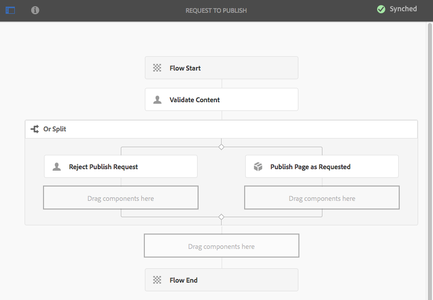

# Criação de modelos de fluxo de trabalho{#creating-workflow-models}

>[!CAUTION]
>
>Para usar a interface clássica, consulte a documentação do [AEM 6.3](https://helpx.adobe.com/experience-manager/6-3/help/sites-developing/workflows-models.html) para referência.

Você cria um [modelo de fluxo de trabalho](/help/sites-developing/workflows.md#model) para definir a série de etapas executadas quando um usuário inicia o fluxo de trabalho. Você também pode definir propriedades de modelo, como se o fluxo de trabalho é transitório ou usa vários recursos.

Quando um usuário inicia um workflow, uma instância é iniciada; esse é o modelo de tempo de execução correspondente, criado ao [Sincronizar](#sync-your-workflow-generate-a-runtime-model) suas alterações.

## Criação de um novo workflow {#creating-a-new-workflow}

Ao criar um novo modelo de fluxo de trabalho pela primeira vez, ele contém:

* As etapas, **Início do fluxo** e **Fim do fluxo**.
Elas representam o início e o fim do workflow. Essas etapas são obrigatórias e não podem ser editadas/removidas.
* Um exemplo da etapa **Participante** chamada **Etapa 1**.
Essa etapa é configurada para atribuir um item de trabalho ao iniciador do fluxo de trabalho. Edite ou exclua esta etapa e adicione as etapas conforme necessário.

Para criar um novo workflow com o editor:

1. Abra o console **Modelos de fluxo de trabalho**; por meio de **Ferramentas**, **Fluxo de trabalho**, **Modelos** ou, por exemplo: [https://localhost:4502/aem/workflow](https://localhost:4502/aem/workflow)
1. Selecione **Criar** e **Criar Modelo**.
1. A caixa de diálogo **Adicionar modelo de fluxo de trabalho** é exibida. Insira o **Título** e **Nome** (opcional) antes de selecionar **Concluído**.
1. O novo modelo é listado no console **Modelos de fluxo de trabalho**.
1. Selecione seu novo workflow e use [**Edit** para abri-lo para configuração](#editinganexistingworkflow):
   

>[!NOTE]
>
>Se estiver criando modelos programaticamente (usando um pacote crx), você também poderá criar uma subpasta em:
>
>`/var/workflow/models`
>
>Por exemplo, `/var/workflow/models/prototypes`
>
>Essa pasta pode ser usada para [gerenciar o acesso aos modelos nessa pasta](/help/sites-administering/workflows-managing.md#create-a-subfolder-in-var-workflow-models-and-apply-the-acl-to-that).

## Editar um fluxo de trabalho {#editing-a-workflow}

Você pode editar qualquer modelo de fluxo de trabalho existente para:

* [definir ](#addingasteptoamodel-) etapas e seus  [parâmetros](#configuring-a-workflow-step)
* configure as propriedades do workflow, incluindo [stage](#configuring-workflow-stages-that-show-workflow-progress), [se o workflow é transitório](#creatingatransientworkflow-) e/ou [usa vários recursos](#configuring-a-workflow-for-multi-resource-support)

A edição de um workflow [**Padrão e/ou Herdado** (pronto para uso)](#editing-a-default-or-legacy-workflow-for-the-first-time) tem uma etapa adicional, para garantir que uma [cópia segura](/help/sites-developing/workflows-best-practices.md#locations-workflow-models) seja realizada antes que suas alterações sejam feitas.

Quando as atualizações do seu fluxo de trabalho forem concluídas, você deverá usar **Sync** para **Gerar um Modelo de Tempo de Execução**. Consulte [Sincronizar seu fluxo de trabalho](#sync-your-workflow-generate-a-runtime-model) para obter detalhes.

### Sincronizar o fluxo de trabalho - Gerar um modelo de tempo de execução {#sync-your-workflow-generate-a-runtime-model}

**Sync**  (à direita na barra de ferramentas do editor) gera um modelo de  [tempo de execução](/help/sites-developing/workflows.md#runtime-model). O modelo de tempo de execução é o modelo realmente usado quando um usuário inicia um fluxo de trabalho. Se você não **Sincronizar** suas alterações, as alterações não estarão disponíveis no tempo de execução.

Quando você (ou qualquer outro usuário) faz alterações no fluxo de trabalho, é necessário usar **Sync** para gerar um modelo de tempo de execução - mesmo quando caixas de diálogo individuais (por exemplo, para etapas) têm suas próprias opções de salvamento.

Quando as alterações são sincronizadas com o modelo de tempo de execução (salvo), **Synched** é exibido.

Algumas etapas têm campos obrigatórios e/ou validação incorporada. Quando essas condições não forem atendidas, um erro será mostrado quando você tentar **Sincronizar** o modelo. Por exemplo, quando nenhum participante foi definido para uma etapa **Participante**:


### Editar um fluxo de trabalho padrão ou herdado pela primeira vez {#editing-a-default-or-legacy-workflow-for-the-first-time}

Ao abrir um [Modelo padrão e/ou herdado](/help/sites-developing/workflows.md#workflow-types) para edição:

* O navegador Etapas não está disponível (lado esquerdo).
* Há uma ação **Edit** disponível na barra de ferramentas (lado direito).
* Inicialmente, o modelo e suas propriedades são apresentados no modo somente leitura como:
   * Os workflows padrão estão localizados em `/libs`
   * Os workflows herdados estão localizados em `/etc`
Selecionar 
**** A edição:
* faça uma cópia do fluxo de trabalho em `/conf`
* disponibilizar o navegador de etapas
* permitir que você faça alterações

>[!NOTE]
>
>Consulte [Locais de modelos de fluxo de trabalho](/help/sites-developing/workflows-best-practices.md#locations-workflow-models) para obter mais informações.


### Adicionar uma etapa a um modelo {#adding-a-step-to-a-model}

Será necessário adicionar etapas ao modelo para representar a atividade a ser executada - cada etapa executa uma atividade específica. Uma seleção de componentes de etapa está disponível em uma instância de AEM padrão.

Ao editar um modelo, as etapas disponíveis são exibidas nos vários grupos do **Navegador de etapas**. Por exemplo:


>[!NOTE]
>
>Para obter informações sobre os componentes da etapa principal instalados com o AEM, consulte [Referência de etapas do fluxo de trabalho](/help/sites-developing/workflows-step-ref.md).

Para adicionar etapas ao modelo de fluxo de trabalho:

1. Abra um modelo de fluxo de trabalho existente para edição. No console **Modelo de fluxos de trabalho**, selecione o modelo necessário e, em seguida, **Editar**.
1. Abra o navegador Etapas ; usando **Alternar painel lateral**, na extremidade esquerda da barra de ferramentas superior. Aqui você pode:

   * **** Filtro para etapas específicas.
   * Use o seletor suspenso para limitar a seleção a um grupo específico de etapas.
   * Selecione o ícone Mostrar descrição  para mostrar mais detalhes sobre a etapa apropriada.

   

1. Arraste as etapas apropriadas para o local desejado no modelo.

   Por exemplo, uma **Etapa do participante**.

   Depois de adicionado ao fluxo, você pode [configurar a etapa](#configuring-a-workflow-step).

   

1. Adicione quantas etapas ou outras atualizações forem necessárias.

   Em tempo de execução, as etapas são executadas na ordem em que aparecem no modelo. Depois de adicionar componentes da etapa, você pode arrastá-los para um local diferente no modelo.

   Também é possível copiar, recortar, colar, agrupar ou excluir etapas existentes; como no [editor de página.](/help/sites-authoring/editing-content.md)

   As etapas divididas também podem ser recolhidas/expandidas usando a opção da barra de ferramentas: 

1. Confirme as alterações com **Sync** (barra de ferramentas do editor) para gerar o modelo de tempo de execução.

   Consulte [Sincronizar seu fluxo de trabalho](#sync-your-workflow-generate-a-runtime-model) para obter detalhes.

### Configuração de uma etapa do fluxo de trabalho {#configuring-a-workflow-step}

Você pode **Configurar** e personalizar o comportamento de uma etapa de fluxo de trabalho usando as caixas de diálogo **Propriedades da etapa**.

1. Para abrir a caixa de diálogo **Propriedades da etapa** para uma etapa, faça o seguinte:

   * Clique/toque na etapa ** no modelo de fluxo de trabalho e selecione **Configurar** na barra de ferramentas do componente.

   * Clique duas vezes na etapa .
   >[!NOTE]
   >
   >Para obter informações sobre os componentes da etapa principal instalados com o AEM, consulte [Referência de etapas do fluxo de trabalho](/help/sites-developing/workflows-step-ref.md).

1. Configure as **Propriedades da etapa** conforme necessário; as propriedades disponíveis dependem do tipo de etapa, também pode haver várias guias disponíveis. Por exemplo, o padrão **Etapa do participante**, presente em um novo workflow como `Step 1`:

   

1. Confirme suas atualizações com a marca de verificação.
1. Confirme as alterações com **Sync** (barra de ferramentas do editor) para gerar o modelo de tempo de execução.

   Consulte [Sincronizar seu fluxo de trabalho](#sync-your-workflow-generate-a-runtime-model) para obter detalhes.

### Criação de um fluxo de trabalho transitório {#creating-a-transient-workflow}

Você pode criar um modelo de fluxo de trabalho [Transitório](/help/sites-developing/workflows.md#transient-workflows) ao criar um novo modelo ou editar um modelo existente:

1. Abra o modelo de fluxo de trabalho para [editing](#editinganexistingworkflow).
1. Selecione **Propriedades do modelo de fluxo de trabalho** na barra de ferramentas.
1. Na caixa de diálogo, ative **Transient Workflow** (ou desative se necessário):

   

1. Confirme a alteração com **Salvar e fechar**; seguido por **Sync** (barra de ferramentas do editor) para gerar o modelo de tempo de execução.

   Consulte [Sincronizar seu fluxo de trabalho](#sync-your-workflow-generate-a-runtime-model) para obter detalhes.

>[!NOTE]
>
>Quando você executa um workflow no modo [transient](/help/sites-developing/workflows.md#transient-workflows) AEM não armazena nenhum histórico de workflow. Portanto, [A Linha do tempo](/help/sites-authoring/basic-handling.md#timeline) não exibe nenhuma informação relacionada a esse fluxo de trabalho.

## Disponibilizar modelos de fluxo de trabalho na interface do usuário de toque {#classic2touchui}

Se um modelo de fluxo de trabalho estiver presente na interface clássica, mas estiver ausente no menu pop-up de seleção no painel **[!UICONTROL Linha do tempo]** da interface de toque, siga a configuração para disponibilizá-lo. As etapas a seguir ilustram o uso do modelo de fluxo de trabalho chamado **[!UICONTROL Solicitação de ativação]**.

1. Confirme se o modelo não está disponível na interface habilitada para toque. Acesse um ativo usando o caminho `/assets.html/content/dam`. Selecione um ativo. Abra **[!UICONTROL Linha do tempo]** no painel esquerdo. Clique em **[!UICONTROL Iniciar fluxo de trabalho]** e confirme se o modelo **[!UICONTROL Solicitação de ativação]** não está presente na lista pop-up.

1. Navegue por **[!UICONTROL Ferramentas > Geral > Marcação]**. Selecione **[!UICONTROL Workflow]**.

1. Selecione **[!UICONTROL Criar > Criar tag]**. Defina **[!UICONTROL Title]** como `DAM` e **[!UICONTROL Name]** como `dam`. Selecione **[!UICONTROL Enviar]**.
   

1. Navegue até **[!UICONTROL Ferramentas > Fluxo de trabalho > Modelos]**. Selecione **[!UICONTROL Solicitação de ativação]** e selecione **[!UICONTROL Editar]**.

1. Selecione **[!UICONTROL Editar]**, abra o menu **[!UICONTROL Informações da página]** e, a partir daí, selecione **[!UICONTROL Abrir propriedades]** e vá para a guia **[!UICONTROL Básico]** (se ainda não estiver aberta).

1. Adicione `Workflow : DAM` ao campo **[!UICONTROL Tags]**. Confirme a seleção com a verificação (marca de verificação).

1. Confirme a adição da tag com **[!UICONTROL Salvar e fechar]**.
   

1. Complete o processo com **[!UICONTROL Sync]**. O fluxo de trabalho agora está disponível na interface habilitada para toque.

### Configurar um fluxo de trabalho para suporte a vários recursos {#configuring-a-workflow-for-multi-resource-support}

Você pode configurar um modelo de fluxo de trabalho para [Suporte a vários recursos](/help/sites-developing/workflows.md#multi-resource-support) ao criar um novo modelo ou editar um modelo existente:

1. Abra o modelo de fluxo de trabalho para [editing](#editinganexistingworkflow).
1. Selecione **Propriedades do modelo de fluxo de trabalho** na barra de ferramentas.

1. Na caixa de diálogo, ative **Suporte a vários recursos** (ou desative se necessário):

   

1. Confirme a alteração com **Salvar e fechar**; seguido por **Sync** (barra de ferramentas do editor) para gerar o modelo de tempo de execução.

   Consulte [Sincronizar seu fluxo de trabalho](#sync-your-workflow-generate-a-runtime-model) para obter detalhes.

### Configurando Estágios do Fluxo de Trabalho (que mostram o Progresso do Fluxo de Trabalho) {#configuring-workflow-stages-that-show-workflow-progress}

[As ](/help/sites-developing/workflows.md#workflow-stages) Etapas do fluxo de trabalho visualizam o progresso de um fluxo de trabalho ao manipular tarefas.

>[!CAUTION]
>
>Se os estágios do fluxo de trabalho forem definidos em **Propriedades da página**, mas não forem usados para nenhuma das etapas do fluxo de trabalho, a barra de progresso não mostrará nenhum progresso (independentemente da etapa do fluxo de trabalho atual).

Os estágios a serem disponibilizados são definidos nos modelos de fluxo de trabalho; os modelos de fluxo de trabalho existentes podem ser atualizados para incluir definições de estágio. Você pode definir qualquer número de estágios para o modelo de workflow.

Para definir **Estágios** para o seu fluxo de trabalho:

1. Abra o modelo de fluxo de trabalho para edição.
1. Selecione **Propriedades do modelo de fluxo de trabalho** na barra de ferramentas. Em seguida, abra a guia **Stages**.
1. Adicione (e posicione) os **Estágios** necessários. Você pode definir qualquer número de estágios para o modelo de workflow.

   Por exemplo:

   

1. Clique em **Salvar e fechar** para salvar as propriedades.
1. Atribua um estágio a cada uma das etapas no modelo de fluxo de trabalho. Por exemplo:

   

   Um estágio pode ser atribuído a mais de uma etapa. Por exemplo:

   | **Etapa** | **Estágio** |
   |---|---|
   | Etapa 1 | Criar |
   | Etapa 2 | Criar |
   | Etapa 3 | Análise |
   | Etapa 4 | Aprovar |
   | Etapa 5 | Aprovar |
   | Etapa 6 | Concluir |

1. Confirme as alterações com **Sync** (barra de ferramentas do editor) para gerar o modelo de tempo de execução.

   Consulte [Sincronizar seu fluxo de trabalho](#sync-your-workflow-generate-a-runtime-model) para obter detalhes.

## Exportar um modelo de fluxo de trabalho em um pacote {#exporting-a-workflow-model-in-a-package}

Para exportar um modelo de fluxo de trabalho em um pacote:

1. Crie um novo pacote usando o [Gerenciador de Pacotes](/help/sites-administering/package-manager.md#package-manager):

   1. Navegue até o Gerenciador de Pacotes por **Ferramentas**, **Implantação**, **Pacotes**.

   1. Clique em **Criar pacote**.
   1. Especifique o **Nome do Pacote** e quaisquer outros detalhes conforme necessário.
   1. Clique em **OK**.

1. Clique em **Edit** na barra de ferramentas do novo pacote.

1. Abra a guia **Filters** .

1. Selecione **Adicionar filtro** e especifique o caminho do modelo de fluxo de trabalho *design*:

   `/conf/global/settings/workflow/models/<*your-model-name*>`

   Clique em **Concluído**.

1. Selecione **Adicionar Filtro** e especifique o caminho do seu *modelo de fluxo de trabalho de tempo de execução*:

   `/var/workflow/models/<*your-model-name*>`

   Clique em **Concluído**.

1. Adicione filtros adicionais para qualquer script personalizado usado pelo seu modelo.
1. Clique em **Save** para confirmar as definições de filtro.
1. Selecione **Build** na barra de ferramentas da definição de pacote.
1. Selecione **Download** na barra de ferramentas do pacote.

## Uso de fluxos de trabalho para processar envios de formulário {#using-workflows-to-process-form-submissions}

Você pode configurar um formulário a ser processado pelo workflow selecionado. Quando os usuários enviam o formulário, uma nova instância de fluxo de trabalho é criada com os dados do envio do formulário como carga útil.

Para configurar o workflow a ser usado com seu formulário:

1. Crie uma nova página e abra-a para edição.
1. Adicione um componente **Formulário** à página.
1. **** Configure o componente  **** Início do formulário que apareceu na página.
1. Use **Iniciar fluxo de trabalho** para selecionar o fluxo de trabalho desejado dentre os disponíveis:

   

1. Confirme a configuração do novo formulário com a marca de verificação.

## Teste de fluxos de trabalho {#testing-workflows}

Ao testar um fluxo de trabalho, é uma boa prática usar diversos tipos de carga útil. incluindo tipos diferentes daqueles para os quais foi desenvolvido. Por exemplo, se você pretende que seu fluxo de trabalho lida com Ativos, teste-o definindo uma Página como carga útil e verifique se ela não gera erros.

Por exemplo, teste seu novo fluxo de trabalho da seguinte maneira:

1. [Inicie seu ](/help/sites-administering/workflows-starting.md) modelo de fluxo de trabalho pelo console.
1. Defina o **Carga** e confirme.

1. Execute as ações conforme necessário para que o fluxo de trabalho continue.
1. Monitore os arquivos de log enquanto o workflow está em execução.

Você também pode configurar AEM para exibir mensagens **DEBUG** nos arquivos de log. Consulte [Registro](/help/sites-deploying/configure-logging.md) para obter mais informações e quando o desenvolvimento for concluído, defina o **Nível de Log** de volta para **Informações**.

## Exemplos {#examples}

### Exemplo: Criação de um fluxo de trabalho (simples) para aceitar ou rejeitar uma solicitação de publicação {#example-creating-a-simple-workflow-to-accept-or-reject-a-request-for-publication}

Para ilustrar algumas das possibilidades para criar um workflow, o exemplo a seguir cria uma variação do workflow `Publish Example`.

1. [Crie um novo modelo de fluxo de trabalho](#creating-a-new-workflow).

   O novo workflow conterá:

   * **Início do fluxo**
   * `Step 1`
   * **Final do fluxo**

1. Exclua `Step 1` (já que é o tipo de etapa errado para este exemplo):

   * Clique na etapa e selecione **Excluir** na barra de ferramentas do componente. Confirme a ação.

1. Na seleção **Workflow** do navegador de etapas, arraste uma **Etapa do Participante** para o workflow e a posicione entre **Início do Fluxo** e **Fim do Fluxo**.
1. Para abrir a caixa de diálogo de propriedades, faça o seguinte:

   * Clique na etapa do participante e selecione **Configurar** na barra de ferramentas do componente.
   * Clique duas vezes na etapa do participante.

1. Na guia **Comum**, digite `Validate Content` para o **Título** e **Descrição**.
1. Abra a guia **Usuário/Grupo** :

   * Ative **Notificar usuário por email**.
   * Selecione `Administrator` ( `admin`) para o campo **Usuário/Grupo**.

   >[!NOTE]
   >
   >Para enviar emails, [o serviço de email e os detalhes da conta de usuário precisam ser configurados](/help/sites-administering/notification.md).

1. Confirme as atualizações com a marca de verificação.

   Você retornará à visão geral do modelo de fluxo de trabalho, onde a etapa do participante terá sido renomeada para `Validate Content`.

1. Arraste um **ou Split** para o workflow e posicione-o entre `Validate Content` e **Fim do Fluxo**.
1. Abra o **ou Split** para configuração.
1. Configurar:

   * **Frequentes**: especifique o nome da divisão.
   * **Ramificação 1**: selecione Rota  **padrão**.

   * **Ramificação 2**: verifique se  **as** Rotas padrão não estão selecionadas.

1. Confirme suas atualizações no **OU Split**.
1. Arraste um **Etapa do participante** para a ramificação à esquerda, abra as propriedades, especifique os seguintes valores e confirme as alterações:

   * **Título**: `Reject Publish Request`

   * **Usuário/grupo**: por exemplo,  `projects-administrators`

   * **Notificar usuário por email**: Ative para que o usuário seja notificado por email.

1. Arraste um **Etapa do Processo** para a ramificação direita, abra as propriedades, especifique os seguintes valores e confirme as alterações:

   * **Título**: `Publish Page as Requested`

   * **Processo**: selecione  `Activate Page`. Esse processo publica a página selecionada nas instâncias do editor.

1. Clique em **Sync** (barra de ferramentas do editor) para gerar o modelo de tempo de execução.

   Consulte [Sincronizar seu fluxo de trabalho](#sync-your-workflow-generate-a-runtime-model) para obter detalhes.

   O novo modelo de fluxo de trabalho terá a seguinte aparência:

   

1. Aplique esse fluxo de trabalho à sua página, de modo que, quando o usuário mudar para **Complete** a etapa **Validar conteúdo**, possa selecionar se deseja **Publicar página como solicitado** ou **Rejeitar solicitação de publicação**.

   

### Exemplo: Definição de uma regra para uma divisão OR usando um script ECMA {#defineruleecmascript}

**OU** Spliteps permitem que você introduza caminhos de processamento condicional no seu fluxo de trabalho.

Para definir uma regra OU, proceda da seguinte maneira:

1. Crie dois scripts e salve-os no repositório, por exemplo, em:

   `/apps/myapp/workflow/scripts`

   >[!NOTE]
   >
   >Os scripts devem ter uma [função `check()`](#function-check) que retorne um booleano.

1. Edite o workflow e adicione o **OU Split** ao modelo.
1. Edite as propriedades de **Branch 1** do **OR Split**:

   * Defina isso como o **Rota padrão** definindo o **Valor** como `true`.

   * Como **Rule**, defina o caminho para o script. Por exemplo:
      `/apps/myapp/workflow/scripts/myscript1.ecma`
   >[!NOTE]
   >
   >Você pode alternar a ordem da ramificação, se necessário.

1. Edite as propriedades da **Ramificação 2** do **OU Split**.

   * Como **Rule**, defina o caminho para o outro script. Por exemplo:
      `/apps/myapp/workflow/scripts/myscript2.ecma`

1. Defina as propriedades das etapas individuais em cada ramificação. Verifique se **User/Group** está definido.
1. Clique em **Sincronizar** (barra de ferramentas do editor) para continuar suas alterações no modelo de tempo de execução.

   Consulte [Sincronizar seu fluxo de trabalho](#sync-your-workflow-generate-a-runtime-model) para obter detalhes.

#### Função Check() {#function-check}

>[!NOTE]
>
>Consulte [Usando ECMAScript](/help/sites-developing/workflows-customizing-extending.md#using-ecmascript).

O script de amostra a seguir retornará `true` se o nó for um `JCR_PATH` localizado em `/content/we-retail/us/en`:

```
function check() {
    if (workflowData.getPayloadType() == "JCR_PATH") {
      var path = workflowData.getPayload().toString();
      var node = jcrSession.getItem(path);

      if (node.getPath().indexOf("/content/we-retail/us/en") >= 0) {
       return true;
      } else {
       return false;
      }
     } else {
      return false;
     }
}
```

### Exemplo: Solicitação de ativação personalizada {#example-customized-request-for-activation}

Você pode personalizar qualquer fluxo de trabalho pronto para uso. Para ter um comportamento personalizado, você sobrepõe os detalhes do fluxo de trabalho apropriado.

Por exemplo, **Solicitação de ativação**. Esse workflow é usado para publicar páginas em **Sites** e é acionado automaticamente quando um autor de conteúdo não tem os direitos de replicação apropriados. Consulte [Personalização da criação de página - Personalização do fluxo de trabalho de solicitação de ativação](/help/sites-developing/customizing-page-authoring-touch.md#customizing-the-request-for-activation-workflow) para obter mais detalhes.
