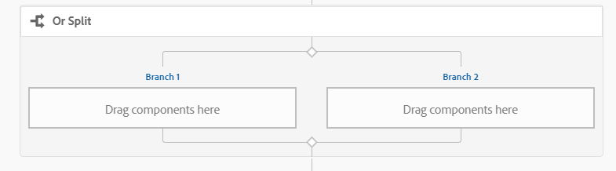
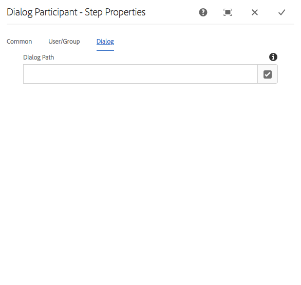
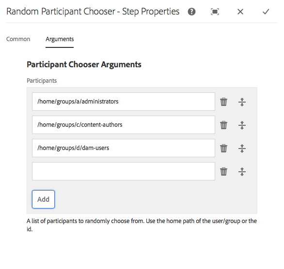

# Referência da Etapa do fluxo de trabalho {#workflow-step-reference}

Os modelos de fluxo de trabalho consistem em uma série de etapas de vários tipos. De acordo com o tipo , essas etapas podem ser configuradas e estendidas com parâmetros e scripts para fornecer a funcionalidade e o controle necessários.

>[!NOTE]
>
>Esta seção aborda as etapas padrão do fluxo de trabalho.
>
>Para ver as etapas específicas do módulo, consulte também:
>
>* [Referência em etapas do fluxo de trabalho do AEM Forms](/help/forms/using/aem-forms-workflow-step-reference.md)
>* [Processamento de ativos usando manipuladores de mídia e fluxos de trabalho](/help/assets/media-handlers.md)

>


## Propriedades da etapa {#step-properties}

Cada componente da etapa tem uma caixa de diálogo **Propriedades da etapa** que permite definir e editar as propriedades necessárias.

### Propriedades da etapa - guia Comum {#step-properties-common-tab}

Uma combinação das seguintes propriedades está disponível para a maioria dos componentes da etapa do fluxo de trabalho, na guia **Common** da caixa de diálogo de propriedades:

* ****
TítuloO título da etapa.

* ****
DescriçãoUma descrição da etapa.

* **Estágio do fluxo de trabalho**

   Um seletor suspenso para aplicar um [Stage](/help/sites-developing/workflows.md#workflow-stages) à etapa.

* **Tempo limite**

   O período após o qual a etapa será &quot;atingida&quot;.
Você pode selecionar entre: **Desligado**, **Imediato**, **1h**, **6h**, **12h**, **24h**.

* **Tempo limite do Handler**

   O manipulador que controlará o fluxo de trabalho quando a etapa expirar; por exemplo:
   `Auto Advancer`

* **Handler avançado**

   Selecione essa opção para avançar automaticamente o workflow para a próxima etapa após a execução. Se não estiver selecionado, o script de implementação deve lidar com a evolução do fluxo de trabalho.

### Propriedades da etapa - guia Usuário/Grupo {#step-properties-user-group-tab}

As seguintes propriedades estão disponíveis para vários componentes de etapa do fluxo de trabalho, na guia **Usuário/Grupo** da caixa de diálogo de propriedades:

* **Notificar usuário via e-mail**

   * Você pode notificar o(s) participante(s) enviando um email quando o workflow atingir a etapa .
   * Se estiver habilitado, um email será enviado para o usuário definido pela propriedade **Usuário/Grupo** ou para cada membro do grupo, se um grupo estiver definido.

* **Usuário/Grupo**

   * Uma caixa de seleção suspensa permitirá que você navegue e selecione um usuário ou grupo.
   * Se você atribuir a etapa a um usuário específico, somente esse usuário poderá realizar uma ação na etapa .
   * Se você atribuir a etapa a um grupo inteiro, então quando o fluxo de trabalho atingir essa etapa, todos os usuários desse grupo terão a ação em sua **Caixa de entrada do fluxo de trabalho**.
   * Consulte [Participar em fluxos de trabalho](/help/sites-authoring/workflows-participating.md) para obter mais informações.

## E dividir {#and-split}

O **AND Split** cria uma divisão no fluxo de trabalho, após a qual ambas as ramificações estarão ativas. Adicione etapas de fluxo de trabalho a cada ramificação, conforme necessário. Essa etapa permite introduzir vários caminhos de processamento no fluxo de trabalho. Por exemplo, você pode permitir que determinadas etapas de revisão ocorram em paralelo, economizando tempo.


### AND Split - Configuração {#and-split-configuration}

Para configurar a divisão:

* Edite as **AND Split Properties**:

   * **Nome** da divisão: atribuir um nome para fins explicativos
   * Selecione o número de ramificações necessárias; 2, 3, 4 ou 5.

* Adicione etapas de fluxo de trabalho às ramificações, conforme necessário.

   

## Etapa do contêiner {#container-step}

Uma etapa do contêiner inicia outro modelo de fluxo de trabalho executado como um fluxo de trabalho filho.

Esse contêiner pode permitir que você reutilize modelos de fluxo de trabalho para implementar sequências de etapas comuns. Por exemplo, um modelo de fluxo de trabalho de tradução pode ser usado em vários fluxos de trabalho de edição.


### Etapa do contêiner - Configuração {#container-step-configuration}

Para configurar a etapa, edite e use as seguintes guias:

* [Comum](#step-properties-common-tab)
* **Container**

   * **Sub-fluxo de trabalho**: Selecione o workflow a ser iniciado.

## Etapa Ir para {#goto-step}

O **Etapa Ir para** permite especificar a próxima etapa a ser executada no modelo de fluxo de trabalho. Você pode especificar uma definição de regra, um script externo ou um script ECMA como a expressão de roteamento para avaliar a próxima etapa do modelo de workflow.

* Se a condição especificada for verdadeira, a **Etapa Ir para** será concluída e o mecanismo de workflow executará a etapa especificada.
* Se a condição especificada não for verdadeira, a **Etapa Ir para** será concluída e a lógica normal de roteamento determinará a próxima etapa a ser executada.

O **Etapa Ir para** permite implementar estruturas de roteamento avançadas em seus modelos de workflow. Por exemplo, para implementar um loop, o **Etapa Ir para** pode ser definido para executar uma etapa anterior no workflow, com a expressão de roteamento avaliando uma condição de loop.

### Etapa Ir - Configuração {#goto-step-configuration}

Para configurar a etapa, edite e use as seguintes guias:

* [Comum](#step-properties-common-tab)
* **Processo**

   * **Etapa** do Target: Selecione a etapa a ser executada após avaliar a condição da expressão de roteamento.
   * **Expressão** de Roteamento: Selecione Definição de regra, Script externo ou um script ECMA que determina se a Etapa  **de destino deve ser executada**.

      * **Definição de regra:** use o editor de  [expressão ](/help/forms/using/variable-in-aem-workflows.md#use-expression-editor) para definir a regra.
      * **Script externo:** o caminho do script externo.
      * **Script** ECMA: O script que determina se a Etapa  **Ir para será executada**.

#### Simular um para Loop {#simulating-a-for-loop}

A simulação de um loop for requer que você mantenha uma contagem do número de iterações de loop que ocorreram:

* A contagem geralmente representa um índice de itens que são ativados no fluxo de trabalho.
* A contagem é avaliada como o critério de saída do loop.

Por exemplo, para implementar um workflow que executa uma ação em vários nós JCR, você pode usar um contador de loop como um índice para os nós. Para manter a contagem, armazene um valor `integer` no mapa de dados da instância do workflow. Use o script da **Etapa Ir para** para incrementar a contagem, bem como para comparar a contagem com os critérios de saída.

```
function check(){
   var count=0;
   var keyname="loopcount"
   try{
      if (workflowData.getMetaDataMap().containsKey(keyname)){
        log.info("goto script: found loopcount key");
        count= parseInt(workflowData.getMetaDataMap().get(keyname))+1;
      }

     workflowData.getMetaDataMap().put(keyname,count);

     }catch(err) {
         log.info(err.message);
         return false;
    }
   if (parseInt(count) <7){
       return true;
   } else {
      return false;
   }
}
```

### Simular um loop for usando a Definição de Regra {#simulateforloop}

Também é possível simular um loop for usando a Definição de regra como a expressão de roteamento. [Crie uma variável  **** ](/help/forms/using/variable-in-aem-workflows.md#create-a-variable) contável do tipo de dados Long . Use **Expression** como modo de mapeamento na etapa **[Definir Variável](/help/sites-developing/using-variables-in-aem-workflows.md#set-a-variable)** para definir o valor da variável **count** para **count + 1** em cada execução da etapa **Definir Variável**.


Na **Etapa Ir para**, use **Definir Variável** como a **Etapa de Destino** e **count &lt; 5** como a expressão de roteamento.


A etapa **Definir variável** é executada repetidamente, incrementando o valor da variável **count** em 1 em cada execução até que o valor atinja 5.

## OU dividir {#or-split}

O **OU Split** cria uma divisão no fluxo de trabalho, depois disso apenas uma ramificação estará ativa. Essa etapa permite introduzir caminhos de processamento condicional no fluxo de trabalho. Adicione etapas de fluxo de trabalho a cada ramificação, conforme necessário.

>[!NOTE]
>
>Para obter informações adicionais sobre como criar uma divisão OU, consulte: [https://helpx.adobe.com/experience-manager/using/aem64_workflow_servlet.html](https://helpx.adobe.com/experience-manager/using/aem64_workflow_servlet.html)



### OU Dividir - Configuração {#or-split-configuration}

Para configurar a divisão:

* Edite as **OU propriedades de divisão**:

   * **Comum**

      * Especifique o nome da divisão.
   * **Ramificações (*x)***

      * **Adicionar ramificação:** adicione mais ramificações à etapa.
      * **Selecione Expressão** de Roteamento: Selecione a expressão de roteamento para avaliar a ramificação ativa. Os valores possíveis incluem: Definição de regra, script externo e script ECMA.
      * **Clique em Adicionar expressão**: Adicione a expressão para avaliar a ramificação ativa se você selecionar  **Definição de regra** na expressão de roteamento.
      * **Caminho** do script: O caminho para um arquivo que contém o script para avaliar a ramificação ativa se você selecionar  **Scripts** externos como a expressão de roteamento.
      * **Script**: Adicione o script na caixa para avaliar a ramificação ativa se você selecionar  **ECMA** Script como a expressão de roteamento.
      * **Rota** padrão: A ramificação padrão é seguida no caso de várias ramificações. Você pode especificar apenas uma ramificação como padrão.

   >[!NOTE]
   >
   >    * Uma ramificação é avaliada de cada vez com base na expressão de roteamento.
   >    * As ramificações são avaliadas de cima para baixo.
   >    * O primeiro script que resulta em true é executado.
   >    * Se nenhuma ramificação for avaliada como true, o workflow não será adiantado.


   >[!NOTE]
   >
   >Consulte [Definindo uma Regra para um OU Split](/help/sites-developing/workflows-models.md#defineruleecmascript).

* Adicione etapas de fluxo de trabalho às ramificações, conforme necessário.

## Etapas e opções do participante {#participant-steps-and-choosers}

### Etapa do participante {#participant-step}

Uma **Etapa do Participante** permite que você atribua a propriedade de uma ação específica. O fluxo de trabalho só continuará quando o usuário tiver confirmado manualmente a etapa. Isso é usado quando você deseja que alguém execute uma ação no fluxo de trabalho; por exemplo, uma etapa de revisão.

Embora não esteja diretamente relacionada, a autorização do utilizador deve ser considerada ao atribuir uma ação; o usuário deve ter acesso à página que é a carga do fluxo de trabalho.

#### Etapa do participante - Configuração {#participant-step-configuration}

Para configurar a etapa, edite e use as seguintes guias:

* [Comum](#step-properties-common-tab)
* [Usuário/Grupo](#step-properties-user-group-tab)

>[!NOTE]
>
>O iniciador do workflow é sempre notificado quando:
>
>* O fluxo de trabalho é concluído (concluído).
>* O workflow é abortado (encerrado).

>


>[!NOTE]
>
>Algumas propriedades precisam ser configuradas para ativar as notificações por email. Você também pode personalizar o modelo de email ou adicionar um modelo de email para um novo idioma. Consulte [Configuração da notificação por email](/help/sites-administering/notification.md#configuringemailnotification) para configurar as notificações por email no AEM.

### Etapa do participante do diálogo {#dialog-participant-step}

Use uma **Etapa do Participante da Caixa de Diálogo** para coletar informações do usuário que recebe o item de trabalho. Essa etapa é útil para coletar pequenas quantidades de dados usadas posteriormente no workflow.

Ao concluir a etapa, a caixa de diálogo **Concluir item de trabalho** contém os campos definidos na caixa de diálogo. Os dados coletados nos campos são armazenados em nós da carga do workflow. As etapas de fluxo de trabalho subsequentes podem ler o valor do repositório.

Para configurar a etapa, especifique o grupo ou usuário ao qual o item de trabalho será atribuído e o caminho para a caixa de diálogo.

#### Etapa da caixa de diálogo do participante - Configuração {#dialog-participant-step-configuration}

Para configurar a etapa, edite e use as seguintes guias:

* [Comum](#step-properties-common-tab)
* [Usuário/Grupo](#step-properties-user-group-tab)
* **Caixa de diálogo**

   * **Caminho** da caixa de diálogo: O caminho para o nó da caixa de  [diálogo criada](#dialog-participant-step-creating-a-dialog).

#### Etapa da caixa de diálogo do participante - Criação de uma caixa de diálogo {#dialog-participant-step-creating-a-dialog}

Para criar uma caixa de diálogo, é necessário criar a caixa de diálogo:

* Decida onde os dados resultantes serão [armazenados no payload](#dialog-participant-step-storing-data-in-the-payload).
* [Definir a caixa de diálogo; isso inclui a definição dos campos usados para coletar (e salvar) os dados](#dialog-participant-step-dialog-definition).

#### Etapa da caixa de diálogo do participante - Armazenamento de dados na carga {#dialog-participant-step-storing-data-in-the-payload}

Você pode armazenar dados de widget na carga do fluxo de trabalho ou nos metadados do item de trabalho. O formato da propriedade `name` do nó do widget determina onde os dados são armazenados.

* **Armazenar dados com a carga**

   * Para armazenar dados de widget como uma propriedade do payload do workflow, use o seguinte formato para o valor da propriedade name do nó do widget:
      `./jcr:content/nodename`

   * Os dados são armazenados na propriedade `nodename` do nó de carga. Se o nó não contiver essa propriedade, a propriedade será criada.
   * Quando armazenados com a carga, os usos subsequentes da caixa de diálogo com a mesma carga substitui o valor da propriedade.

* **Armazenar dados com o item de trabalho**

   * Para armazenar dados de widget como uma propriedade dos metadados do item de trabalho, use o seguinte formato para o valor da propriedade name :
      `nodename`

   * Os dados são armazenados na propriedade `nodename` do item de trabalho `metadata`. Os dados são preservados se a caixa de diálogo for posteriormente usada com a mesma carga útil.

#### Etapa da caixa de diálogo do participante - Definição da caixa de diálogo {#dialog-participant-step-dialog-definition}

1. **Estrutura de diálogo**

   As caixas de diálogo para Etapas do participante na caixa de diálogo são semelhantes às caixas de diálogo criadas para os componentes da criação. São armazenadas em:

   `/apps/myapp/workflow/dialogs`

   As caixas de diálogo da interface de usuário padrão e habilitada para toque têm a seguinte estrutura de nó:

   ```xml
   newComponent (cq:Component)
     |- cq:dialog (nt:unstructured)
       |- content
         |- layout
           |- items
             |- column
               |- items
                 |- component0
                 |- component1
                 |- ...
   ```

   >[!NOTE]
   >
   >Para obter mais informações, consulte [Criação e configuração de uma caixa de diálogo](/help/sites-developing/developing-components.md#creating-and-configuring-a-dialog).

1. **Propriedade do caminho de diálogo**

   A **Etapa do Participante da Caixa de Diálogo** tem a propriedade **Caminho da Caixa de Diálogo** (juntamente com as propriedades de uma [Etapa do Participante](#participant-step)). O valor da propriedade **Dialog Path** é o caminho para o nó `dialog` da caixa de diálogo.

   Por exemplo, a caixa de diálogo está contida em um componente chamado `EmailWatch` que está armazenado no nó :

   `/apps/myapp/workflows/dialogs`

   Para a interface habilitada para toque, o seguinte valor é usado para a propriedade **Caminho da caixa de diálogo**:

   `/apps/myapp/workflow/dialogs/EmailWatch/cq:dialog`

   

1. **Exemplo de definição de caixa de diálogo**

   O trecho de código XML a seguir representa uma caixa de diálogo que armazena um valor `String` no nó `watchEmail` do conteúdo do payload. O nó title representa o componente [TextField](https://helpx.adobe.com/experience-manager/6-5/sites/developing/using/reference-materials/granite-ui/api/jcr_root/libs/granite/ui/components/coral/foundation/form/textfield/index.html):

   ```xml
   jcr:primaryType="nt:unstructured"
       jcr:title="Watcher Email Address Dialog"
       sling:resourceType="cq/gui/components/authoring/dialog">
       <content jcr:primaryType="nt:unstructured"
           sling:resourceType="granite/ui/components/foundation/container">
           <layout jcr:primaryType="nt:unstructured"
               margin="false"
               sling:resourceType="granite/ui/components/foundation/layouts/fixedcolumns"
           />
           <items jcr:primaryType="nt:unstructured">
               <column jcr:primaryType="nt:unstructured"
                   sling:resourceType="granite/ui/components/foundation/container">
                   <items jcr:primaryType="nt:unstructured">
                       <title jcr:primaryType="nt:unstructured"
                           fieldLabel="Notification Email Address"
                           name="./jcr:content/watchEmails"
                           sling:resourceType="granite/ui/components/foundation/form/textfield"
                       />
                   </items>
               </column>
           </items>
       </content>
   </cq:dialog>
   ```

   Esse exemplo, no caso da interface habilitada para toque, resultará em uma caixa de diálogo, como:

   

### Etapa dinâmica do participante {#dynamic-participant-step}

O componente **Etapa dinâmica do participante** é semelhante a **[Etapa do participante](#participant-step)** com a diferença de que o participante é selecionado automaticamente em tempo de execução.

Para configurar a etapa, selecione um **Seletor de Participante** que identifique o participante ao qual atribuir o item de trabalho, junto com uma caixa de diálogo.

#### Etapa dinâmica do participante - Configuração {#dynamic-participant-step-configuration}

Para configurar a etapa, edite e use as seguintes guias:

* [Comum](#step-properties-common-tab)
* **Seletor de participantes**

   * **Seletor de participante**: O nome do seletor de  [participantes que você criar](#developingtheparticipantchooser).
   * **Argumentos**: Qualquer argumento necessário.
   * **Email**: Se uma notificação por email deve ser enviada ao usuário.

* **Caixa de diálogo**

   * **Caminho** da caixa de diálogo: O caminho para o nó da caixa de  [diálogo criada (como na Etapa do Participante da  **Caixa de Diálogo**)](#dialog-participant-step-creating-a-dialog).

#### Etapa dinâmica do participante - Desenvolvimento do seletor de participantes {#dynamic-participant-step-developing-the-participant-chooser}

Crie o seletor de participantes. Portanto, você pode usar qualquer lógica ou critério de seleção. Por exemplo, o seletor de participantes pode selecionar o usuário (em um grupo) que tem menos itens de trabalho. Você pode criar qualquer número de opções de participantes para usar com instâncias diferentes do componente **Etapa dinâmica do participante** em seus modelos de fluxo de trabalho.

Crie um serviço OSGi ou um ECMAScript que selecione um usuário para atribuir o item de trabalho.

* **ECMAscript**

   Os scripts devem incluir uma função chamada getParticipant que retorna uma ID de usuário como um valor `String`. Armazene seus scripts personalizados na pasta `/apps/myapp/workflow/scripts`, por exemplo, ou em uma subpasta.

   Um script de amostra é incluído em uma instância de AEM padrão:

   `/libs/workflow/scripts/initiator-participant-chooser.ecma`

   >[!CAUTION]
   >
   >Você ***não deve*** alterar nada no caminho `/libs`.
   >
   >
   >Isso ocorre porque o conteúdo de `/libs` é substituído na próxima vez que você atualizar sua instância (e pode ser substituído quando você aplicar um hotfix ou pacote de recursos).

   Este script seleciona o iniciador do workflow como o participante:

   ```
   function getParticipant() {
       return workItem.getWorkflow().getInitiator();
   }
   ```

   >[!NOTE]
   >
   >O componente **Seletor de participante do iniciador do fluxo de trabalho** estende o **Passo do participante dinâmico** e usa esse script como a implementação da etapa.

* **Serviço OSGi**

   Os serviços devem implementar a interface [com.day.cq.workflow.exec.ParticipantStepChooser](https://helpx.adobe.com/experience-manager/6-5/sites/developing/using/reference-materials/javadoc/com/day/cq/workflow/exec/ParticipantStepChooser.html). A interface define os seguintes membros:

   * `SERVICE_PROPERTY_LABEL` campo : Use este campo para especificar o nome do seletor de participantes. O nome aparece em uma lista de seletores de participantes disponíveis nas propriedades **Etapa dinâmica do participante**.

   * `getParticipant` método : Retorna a ID Principal resolvida dinamicamente como um  `String` valor.
   >[!CAUTION]
   >
   >O método `getParticipant` retorna o ID Principal resolvido dinamicamente. Pode ser uma id de grupo ou uma id de usuário.
   >
   >
   >No entanto, uma id de grupo só pode ser usada para uma **Etapa do Participante**, quando uma lista de participantes é retornada. Para uma **Etapa dinâmica do participante** uma lista vazia é retornada e não pode ser usada para delegação.

   Para disponibilizar sua implementação para os componentes **Dynamic Participant Step**, adicione sua classe Java a um pacote OSGi que exporta o serviço e implante o pacote no servidor AEM.

   >[!NOTE]
   >
   >**O Random Participant** Chooseris é um exemplo de serviço que seleciona um usuário aleatório (  `com.day.cq.workflow.impl.process.RandomParticipantChooser`). A amostra do componente da etapa **Random Participant Choose** r estende a **Etapa dinâmica do participante** e usa esse serviço como a implementação da etapa.

#### Etapa dinâmica do participante - Exemplo de serviço do seletor de participante {#dynamic-participant-step-example-participant-chooser-service}

A classe Java a seguir implementa a interface `ParticipantStepChooser`. A classe retorna o nome do participante que iniciou o fluxo de trabalho. O código usa a mesma lógica que o script de amostra (`initiator-participant-chooser.ecma`) usa.

A anotação `@Property` define o valor do campo `SERVICE_PROPERTY_LABEL` como `Workflow Initiator Participant Chooser`.

```java
package com.adobe.example;

import org.apache.felix.scr.annotations.Component;
import org.apache.felix.scr.annotations.Properties;
import org.apache.felix.scr.annotations.Property;
import org.apache.felix.scr.annotations.Service;
import org.osgi.framework.Constants;
import org.slf4j.Logger;
import org.slf4j.LoggerFactory;

import com.adobe.granite.workflow.WorkflowException;
import com.adobe.granite.workflow.WorkflowSession;
import com.adobe.granite.workflow.exec.ParticipantStepChooser;
import com.adobe.granite.workflow.exec.WorkItem;
import com.adobe.granite.workflow.metadata.MetaDataMap;

@Component
@Service
@Properties({
        @Property(name = Constants.SERVICE_DESCRIPTION, value = "An example implementation of a dynamic participant chooser."),
        @Property(name = ParticipantStepChooser.SERVICE_PROPERTY_LABEL, value = "Workflow Initiator Participant Chooser (service)") })
public class InitiatorParticipantChooser implements ParticipantStepChooser {

 private Logger logger = LoggerFactory.getLogger(this.getClass());

 public String getParticipant(WorkItem arg0, WorkflowSession arg1,
   MetaDataMap arg2) throws WorkflowException {

  String initiator = arg0.getWorkflow().getInitiator();
  logger.info("Assigning Dynamic Participant Step work item to {}",initiator);

  return initiator;
 }
}
```

Na caixa de diálogo de propriedades **Etapa dinâmica do participante**, a lista **Seletor de participante** inclui o item `Workflow Initiator Participant Chooser (script)`, que representa esse serviço.

Quando o modelo de fluxo de trabalho é iniciado, o log indica a ID do usuário que iniciou o fluxo de trabalho e a quem foi atribuído o item de trabalho. Neste exemplo, o usuário `admin` iniciou o workflow.

`13.09.2015 15:48:53.037 *INFO* [10.176.129.223 [1347565733037] POST /etc/workflow/instances HTTP/1.1] com.adobe.example.InitiatorParticipantChooser Assigning Dynamic Participant Step work item to admin`

### Etapa de participante do formulário {#form-participant-step}

O **Etapa do Participante do Formulário** apresenta um formulário quando o item de trabalho é aberto. Quando o usuário preenche e envia o formulário, os dados do campo são armazenados nos nós da carga útil do workflow.

Para configurar a etapa, especifique o grupo ou usuário ao qual o item de trabalho será atribuído e o caminho para o formulário.

>[!CAUTION]
>
>Esta seção trata da seção [Forms dos Componentes de Base para Criação de Página](/help/sites-authoring/default-components-foundation.md#form).

#### Etapa do participante do formulário - Configuração {#form-participant-step-configuration}

Para configurar a etapa, edite e use as seguintes guias:

* [Comum](#step-properties-common-tab)
* [Usuário/Grupo](#step-properties-user-group-tab)
* **Formulário**

   * **Caminho** do formulário: O caminho para o  [formulário criado](#form-participant-step-creating-the-form).

#### Etapa do participante do formulário - Criação do formulário {#form-participant-step-creating-the-form}

Crie um formulário para usar com uma **Etapa do participante do formulário** normalmente. No entanto, os formulários para uma etapa do participante do formulário devem ter as seguintes configurações:

* O componente **Início do formulário** deve ter a propriedade **Tipo de ação** definida como `Edit Workflow Controlled Resource(s)`.
* O componente **Início do formulário** deve ter um valor para a propriedade `Form Identifier`.
* Os componentes do formulário devem ter a propriedade **Nome do elemento** definida para o caminho do nó onde os dados do campo são armazenados. O caminho deve localizar um nó no conteúdo do payload do workflow. O valor usa o seguinte formato:

   `./jcr:content/path_to_node`

* O formulário deve incluir um componente **Botão(ões) de envio de fluxo de trabalho**. Você não configura nenhuma propriedade do componente.

Os requisitos do fluxo de trabalho determinam onde você deve armazenar dados de campo. Por exemplo, os dados de campo podem ser usados para configurar as propriedades do conteúdo da página. O seguinte valor de uma propriedade **Nome do elemento** armazena dados de campo como o valor da propriedade `redirectTarget` do nó `jcr:content`:

`./jcr:content/redirectTarget`

No exemplo a seguir, os dados do campo são usados como o conteúdo de um componente **Text** na página de carga:

`./jcr:content/par/text_3/text`

O primeiro exemplo pode ser usado para qualquer página que o componente `cq:Page` renderize. O segundo exemplo só pode ser usado quando a página de carga inclui um componente **Text** que tem uma ID de `text_3`.

O formulário pode ser localizado em qualquer lugar no repositório, no entanto, os usuários do workflow devem estar autorizados a ler o formulário.

### Seletor de participante aleatório {#random-participant-chooser}

A etapa **Seletor de participante aleatório** é um seletor de participante que atribui o item de trabalho gerado a um usuário que é selecionado aleatoriamente de uma lista.



#### Seletor de participante aleatório - Configuração {#random-participant-chooser-configuration}

Para configurar a etapa, edite e use as seguintes guias:

* [Comum](#step-properties-common-tab)
* **Argumentos**

   * **Participantes**: Especifica a lista de usuários disponíveis para seleção. Para adicionar um usuário à lista, clique em **Adicionar Item** e digite o caminho inicial do nó do usuário ou a ID do usuário. A ordem dos usuários não afeta a probabilidade de receber um item de trabalho.

### Seletor do participante iniciador do fluxo de trabalho {#workflow-initiator-participant-chooser}

A etapa **Seletor de participante do iniciador do fluxo de trabalho** é um seletor de participante que atribui o item de trabalho gerado ao usuário que iniciou o fluxo de trabalho. Não há propriedades a serem configuradas além das propriedades **Common**.

#### Seletor de Participante Iniciador do Fluxo de Trabalho - Configuração {#workflow-initiator-participant-chooser-configuration}

Para configurar a etapa, edite usando as seguintes guias:

* [Comum](#step-properties-common-tab)

## Etapa do processo {#process-step}

Um **Process Step** executa um ECMAScript ou chama um serviço OSGi para executar processamento automático.


### Etapa do processo - Configuração {#process-step-configuration}

Para configurar a etapa, edite e use as seguintes guias:

* [Comum](#step-properties-common-tab)
* **Processo**

   * **Processo**: A implementação do processo a ser executada. Use o menu suspenso para selecionar o serviço ECMAScript ou OSGi. Para obter informações sobre:

      * Os serviços ECMAScripts e OSGi padrão, consulte [Processos incorporados para etapas do processo](/help/sites-developing/workflows-process-ref.md).
      * Criação de ECMAScripts para uma etapa do processo, consulte [Implementando uma etapa do processo com um ECMAScript](/help/sites-developing/workflows-customizing-extending.md#using-ecmascript).
      * Criando serviços OSGi para uma etapa do Processo, consulte [Implementando uma etapa do processo com uma classe Java](/help/sites-developing/workflows-customizing-extending.md#implementing-a-process-step-with-a-java-class).
   * **Avanço** do manipulador: Selecione essa opção para avançar automaticamente o workflow para a próxima etapa após a execução. Se não estiver selecionado, o script de implementação deve lidar com a evolução do fluxo de trabalho.
   * **Argumentos**: Argumentos a serem passados para o processo.


## Definir variável {#set-variable}

A etapa Definir variável permite definir o valor de uma variável e a ordem em que os valores são definidos. A variável é definida na ordem em que os mapeamentos de variável são listados na etapa Definir variável .


### Definir variável - Configuração {#setvariable}

Para configurar a etapa, edite e use as seguintes guias:

* [Comum](/help/sites-developing/workflows-step-ref.md#step-properties-common-tab)
* **Mapeamento**

   * **Selecionar variável:** use esta opção para selecionar uma variável para definir seu valor.
   * **Selecionar modo de mapeamento:** selecione um modo de mapeamento para definir o valor da variável. Dependendo do tipo de dados da variável, você pode usar as seguintes opções para definir o valor de uma variável:

      * **Literal:** use a opção quando souber o valor exato a ser especificado.
      * **Expressão:** use a opção quando o valor a ser usado for calculado com base em uma expressão. A expressão é criada no editor de expressão fornecido.
      * **Notação de ponto JSON:** use a opção para recuperar um valor de uma variável do tipo JSON ou FDM.
      * **XPATH:** use a opção para recuperar um valor de uma variável do tipo XML.
      * **Em relação à carga útil:** use a opção quando o valor a ser salvo na variável estiver disponível em um caminho relativo à carga útil.
      * **Caminho absoluto:** use a opção quando o valor a ser salvo na variável estiver disponível em um caminho absoluto.
   * **Especificar valor:** especifique um valor a ser mapeado para a variável. O valor especificado nesse campo depende do modo de mapeamento.
   * **Adicionar mapeamento:** use esta opção para adicionar mais mapeamentos para definir um valor para a variável.
